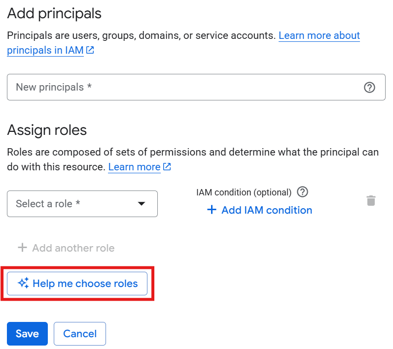
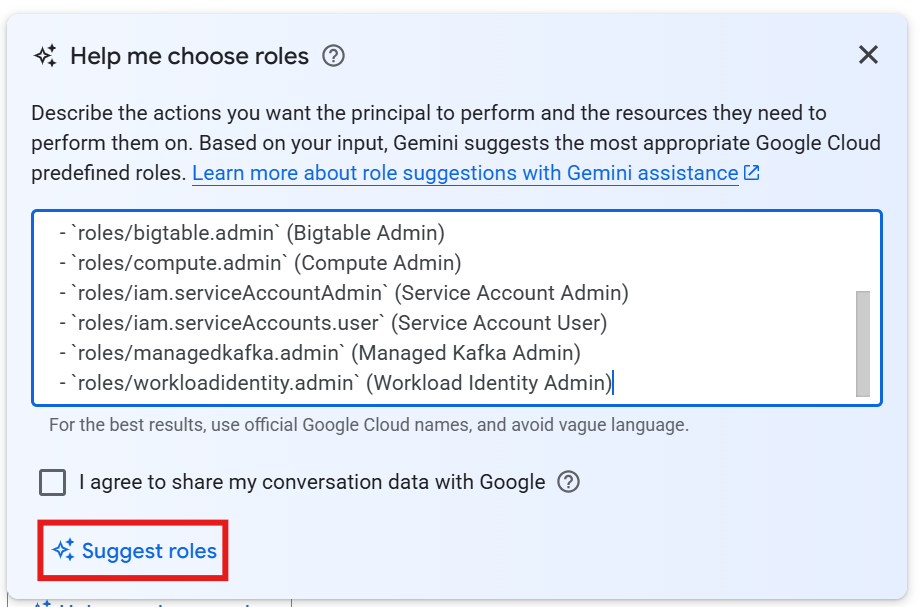
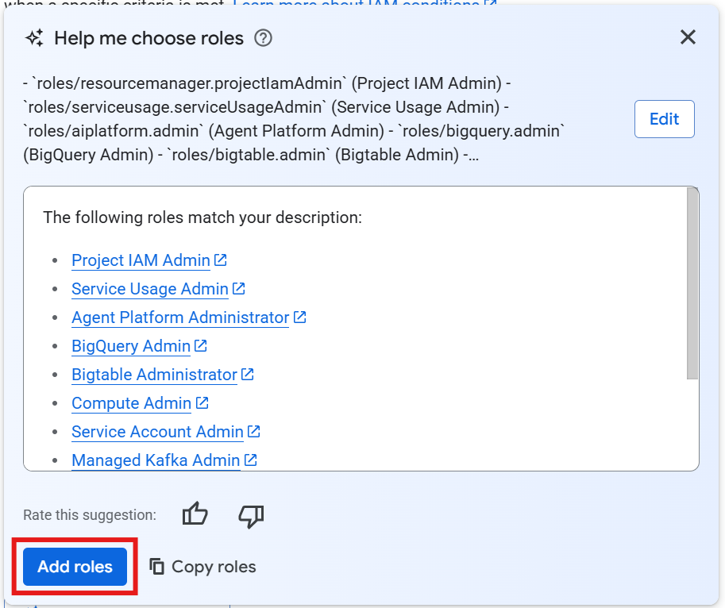

# Module 0 Lab Setup Guide

These steps are intended to be performed at the end of Module 0 / Day 1 to initiate the long-running provisioning operations to prepare your learner Argolis environment for the hands-on activities in subsequent modules.

## Pre-requisites

- **Prepare and configure your Cloudtop**:
  - You should already have a Cloudtop by the time you are attending this training. If not, get one at [go/cloudtop-request](https://goto.google.com/cloudtop-request).
  - Install Terraform and `venv` in your Cloudtop, if you do not already have them installed.
  ```bash
  sudo apt-get update
  sudo apt-get install -y virtualenv python3-venv

  # Installing Terraform on Cloudtop
  mkdir -p $HOME/.terraform/bin
  cd ~/.terraform
  curl -Os https://releases.hashicorp.com/terraform/1.15.8/terraform_1.15.8_linux_amd64.zip
  unzip terraform_1.15.8_linux_amd64.zip
  mv terraform bin/
  grep -o '\.terraform/bin' <<< $PATH \
      || grep -H '\.terraform/bin' ~/.bashrc \
      || echo 'export PATH=${PATH}:~/.terraform/bin' >> ~/.bashrc

  # Verify Terraform installation
  source ~/.bashrc
  terraform -v
  ```
- **An Argolis project**: A freshly created project is recommended, though any project will do.
- **gcloud authentication**: Be authenticated to `gcloud` and have the following IAM roles on the project (or the `Owner` role) to provision the resources:
  - Agent Platform Administrator (`roles/aiplatform.admin`)
  - BigLake Admin (`roles/biglake.admin`)
  - BigQuery Admin (`roles/bigquery.admin`)
  - Bigtable Administrator (`roles/bigtable.admin`)
  - Cloud Run Developer (`roles/run.developer`)
  - Composer Administrator (`roles/composer.admin`)
  - Compute Admin (`roles/compute.admin`)
  - Data Catalog Admin (`roles/datacatalog.admin`)
  - Data Lineage Viewer (`roles/datalineage.viewer`)
  - Dataplex Administrator (`roles/dataplex.admin`)
  - Dataproc Administrator (`roles/dataproc.admin`)
  - Gemini Data Analytics Admin (`roles/geminidataanalytics.admin`)
  - Gemini Enterprise User (`roles/discoveryengine.agentspaceUser`)
  - Logs Configuration Writer (`roles/logging.configWriter`)
  - Managed Kafka Admin (`roles/managedkafka.admin`)
  - Project IAM Admin (`roles/resourcemanager.projectIamAdmin`)
  - Secret Manager Admin (`roles/secretmanager.admin`)
  - Service Account Admin (`roles/iam.serviceAccountAdmin`)
  - Service Account Token Creator (`roles/iam.serviceAccountTokenCreator`)
  - Service Account User (`roles/iam.serviceAccountUser`)
  - Service Usage Admin (`roles/serviceusage.serviceUsageAdmin`)
  - Storage Admin (`roles/storage.admin`)
  - Tag Administrator (`roles/resourcemanager.tagAdmin`)
  - Tag User (`roles/resourcemanager.tagUser`)
  - Workload Identity Admin (`roles/workloadidentity.admin`)
```bash
# Authenticate gcloud
gcloud auth login
gcloud auth application-default login

# Set the active project
gcloud config set project <PROJECT_ID>
```

> [!TIP]
> You can use the "Help me choose roles" option in IAM & Admin page to add the required roles for each service, following the three screenshots below.
> 
> Select "Help me choose roles" when adding a principal.
> 
> 
> 
> Copy and paste the list of roles into the dialog.
> 
> 
> 
> Add all suggested roles, and check if any have been missed out and need to be manually added.
> 
> 

- **Terraform state storage**: Create a Google Cloud Storage (GCS) bucket to store Terraform state (e.g. `<PROJECT_ID>-tfstate`).
  - If the bucket name for your project ID is already taken, choose a different, unique bucket name. Be sure to note this name and use it consistently in the steps below, and during module 2 hands-on activities on day 3.
  - This bucket can be in the same project that resources are deployed to, or in a different project.
  - You can disable the soft delete policy on this bucket to reduce storage cost.
  - The deploying identity must have the `storage.objectAdmin` role on this bucket.
```bash
# Create the Terraform state bucket, set uniform bucket access
# and disable soft delete policy
gcloud storage buckets create gs://<PROJECT_ID>-tfstate --project=<PROJECT_ID> --location=<YOUR_REGION> --soft-delete-duration=0 -b
```

---

### Step 1: Create local `terraform.tfvars`
> [!IMPORTANT]
> All steps must be run in the folder that contains this instructions file. Navigate to the folder using `cd /<REPOSITORY_ROOT>/module_0/starter`.
 
To provide the required variables for Terraform:
1. Make a copy of the sample variables file:
   ```bash
   cp terraform.tfvars.sample terraform.tfvars
   ```
2. Open [terraform.tfvars](./terraform.tfvars) (copied from [terraform.tfvars.sample](./terraform.tfvars.sample)) and replace the default values for `project_id` and `gcp_region` with your actual Google Cloud Project ID and desired region.

> [!NOTE]
> The Terraform configuration files, especially ([infra.tf](./infra.tf)) and ([variables.tf](./variables.tf)) can be read as a reference but should **not** be edited.

---

### Step 2: Initialize Terraform

Initialize the Terraform working directory. Since we are using a remote Cloud Storage bucket to store the state, you must specify the backend configuration dynamically using your project ID:

```bash
terraform init -backend-config="bucket=<PROJECT_ID>-tfstate"
```

*Replace `<PROJECT_ID>` with your actual Google Cloud Project ID.*

---

### Step 3: Run Terraform Apply

Execute the configuration deployment. Using the background command provided is recommended if you are using the terminal on your local machine.

```bash
# Background command option (recommended)
nohup terraform apply -auto-approve > bootstrap_output.txt 2> bootstrap_errors.txt &

# Foreground command option
# Review the planned resources and confirm by typing `yes` when prompted.
# terraform apply
```

> [!IMPORTANT]
> The initial deployment provisions a VPC network and subnets (including Cloud NAT), IAM Service Accounts with project-level roles, BigQuery datasets, a GCS bucket, a BigQuery Connection and an Iceberg table, a Cloud Composer environment, a Bigtable instance, a Managed Kafka cluster and topic, and registers/deploys ML models to Vertex AI. This operation can take **up to 2 hours** to complete. You do not need to monitor the execution; you can let it run in the background.

---

## Deployment Verification

After `terraform apply` finishes (or when checking output logs in `bootstrap_output.txt`), verify that the following key resources have been successfully provisioned in your project.

- **IAM & Service Accounts: [Workshop Service Account](https://console.cloud.google.com/iam-admin/iam)** `cymbal-sa-data@<PROJECT_ID>.iam.gserviceaccount.com`.
- **[Cloud Storage Bucket](https://console.cloud.google.com/storage/browser?forceOnBucketsSortingFiltering=true&bucketType=live)** `gs://<PROJECT_ID>-module1-bucket` with pre-staged data directories:
  - `warranty_generic/` containing 26 PDFs.
  - `store_pos_manual_generic/` containing 6 PDFs.
  - `gold_inventory_reconciliation_ledger/` for Iceberg Managed table data.
- **[BigQuery](https://console.cloud.google.com/bigquery) Cloud Resource Connection** `biglake-iceberg-connection`with connection service account granted `roles/storage.objectUser`, `roles/storage.bucketViewer` and `roles/aiplatform.user` at the [project level](https://console.cloud.google.com/iam-admin/iam).
- **BigQuery Datasets:**
  - Empty datasets:
    - `cymbal_bronze`
    - `cymbal_silver`
    - `module1_unstructureddata`
    - `cymbal_governance`
  - `cymbal_gold` containing:
    - `gold_inventory_reconciliation_ledger` (BigLake Iceberg table linked to `gs://<PROJECT_ID>-module1-bucket/gold_inventory_reconciliation_ledger/`, zero rows).
    - `historical_transactional_data` - native table, 22,390 rows.
      - Data governance tags are applied to `card_number` column to demonstrate column level security (data masking).
    - `cashier_abuse_model` (BQML model).
    - `order_anomaly_model` (BQML model).
    - `mask_card_number` (custom routine for column masking).
- **[Lakehouse Runtime Catalog](https://console.cloud.google.com/biglake/metastore/catalogs):** `cymbal-lakehouse` linked to AWS Glue.
- **[BigQuery Slot Reservation](https://console.cloud.google.com/bigquery/admin/reservations):** Enterprise Edition reservation `gql-query-reservation` with `QUERY` job type assignment.
- **[Composer 3 Environment](https://console.cloud.google.com/managed-airflow/environments):** `cymbal-airflow-env` with state = **Running** (Green checkmark).
- **[Bigtable Instance](https://console.cloud.google.com/bigtable/instances):** `operations-db`.
- **Managed Service for Apache [Kafka Cluster](https://console.cloud.google.com/managedkafka/clusters):** `kafka-cluster` with 3 vCPUs and 12 GiB RAM.
  - Contains topic `pos-transactions`  with 5 partitions and replication factor 3. and `connect-*` internal topics used by Kafka Connect.
- **[Kafka Connect Cluster](https://console.cloud.google.com/managedkafka/connectClusters):** `kafka-connect-cluster` with 3 vCPUs and 3 GiB RAM.
- **[Agent Platform Endpoints](https://console.cloud.google.com/agent-platform/online-prediction/endpoints):**
  - Order anomaly detection endpoint (ID `order-anomaly-endpoint`) with 1 deployed model `model-order-anomaly-deployed`.
  - Cashier abuse detection endpoint (ID `cashier-abuse-endpoint`) with 1 deployed model `model-cashier-abuse-deployed`.

If any resources are missing, check for errors in `bootstrap_errors.txt`, resolve them and run `terraform apply` again. If you see errors regarding model deployment, refer to the section below.

---

### Common Errors

#### Agent Platform Model Deployment Failure

The initial deployment runs a script to copy prepared BQML models to your project, register them to Model Registry and deploy them to the provisioned endpoints. If this script fails, you can run the following commands in your terminal or Cloud Shell to perform this step manually:

```bash
# Replace <YOUR_PROJECT> with your project ID and 
# <MODEL_NAME> with the model names "cashier_abuse_model" and "order_anomaly_model"

# Copy models to your project
bq cp -f --project_id=<YOUR_PROJECT> elevate-dev-kaijun:da_elevate_models.<MODEL_NAME> <YOUR_PROJECT>:cymbal_gold.<MODEL_NAME>

# Register models to Model Registry
bq update -m --project_id=<YOUR_PROJECT> --vertex_ai_model_id '<MODEL_NAME>' <YOUR_PROJECT>:cymbal_gold.<MODEL_NAME>

# Deploy models to endpoints
# Replace <ENDPOINT_ID> with "order-anomaly-endpoint" or "cashier-abuse-endpoint"
gcloud ai endpoints deploy-model <ENDPOINT_ID> \
--project=<YOUR_PROJECT> \
--region=<YOUR_REGION> \
--model=<MODEL_NAME> \
--display-name=<MODEL_NAME>-deployed \
--machine-type=n1-standard-2
```

---

## IMPORTANT: Register Your BigLake Service Account

You **must** register your BigLake service account ID in [this sheet](https://docs.google.com/spreadsheets/d/1WgpDS8ibP0dFT3CfnFkx5kiU-bvCFon5w_xXGLbQ4Ek/edit?usp=sharing&resourcekey=0-OeWSZRUld35lFqmYRQWZ_w) after all resources have been successfully provisioned to be able to complete the hands-on activities on day 2.

Retrieve your BigLake service account ID using the command below, and fill in your LDAP and service account ID in the sheet:

```bash
# Retrieve your BigLake service account ID
terraform output biglake_service_account_id
```

---

## Cleanup Note

> [!WARNING]
> Due to a known issue with GKE ([b/438261587](https://b.corp.google.com/issues/438261587)), deleting the Kafka Connect cluster can leave behind orphaned Private Service Connect (PSC) network attachments, which prevents subnet deletion when you run `terraform destroy`. You must manually delete the network attachments before running `terraform destroy` again.
> 
> It is safe to attempt to delete all network attachments - only unused attachments are allowed to be deleted.
