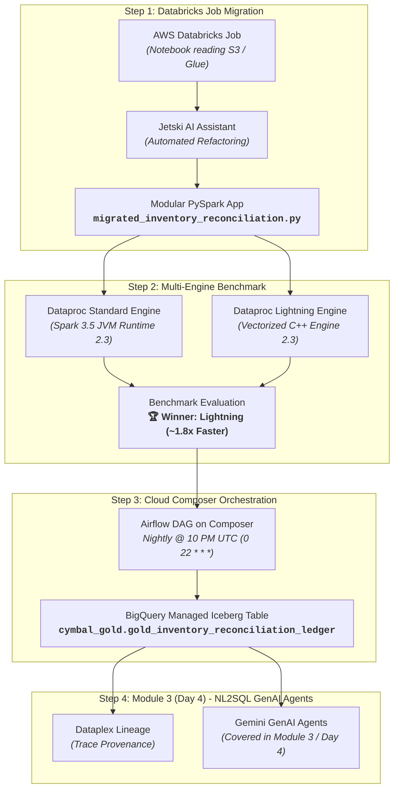

# Module 1 Lab Guide: Cross-Cloud Spark Modernization (Databricks to Dataproc Serverless & Cloud Composer Orchestration)

---

## 🏢 Business Scenario: Cymbal Retail Enterprise Modernization

**Cymbal Retail** is a premier multinational omnichannel retailer with a global presence across 25 international flagship cities (including Tokyo, London, New York, Paris, Berlin, Madrid, Dubai, Singapore, Sydney, Toronto, São Paulo, and Mumbai). Currently, Cymbal Retail runs its mission-critical daily batch workloads—specifically its **Intraday Time-Series Inventory Reconciliation & Depletion Ledger Engine**—on **Databricks on AWS** (reading from AWS S3 and AWS Glue Data Catalog).

### 🎯 The Modernization Goal: Enabling Conversational NL2SQL with Gemini
Cymbal Retail's leadership wants to enable **Conversational Analytics and NL2SQL (Natural Language to SQL)** for store managers, inventory controllers, and regional executives. 

Using Google Cloud's **Gemini Data Analytics Agents**, business users will be able to "chat with store data" directly in natural language (e.g., *"Which stores in Europe are at imminent risk of stockouts for high-velocity items within the next 6 hours?"* or *"Compare gross revenue vs. depleted inventory for Tokyo Ginza flagship on Friday"*).

To power these NL2SQL GenAI agents, the reconciled daily inventory positions and depletion risk metrics must be available in **BigQuery**.

---

## 🏛️ Simplified 4-Step Architecture Flow

The end-to-end modernization journey is structured into 4 straightforward steps:



### 🗺️ Overview of the 4 Modernization Steps:
1. **Step 1: Databricks Job Migration** — Migrate the existing Databricks PySpark notebook ([01a_databricks_spark_inventory_reconciliation.ipynb](./01a_databricks_spark_inventory_reconciliation.ipynb)) into a standalone, modular PySpark application (`migrated_inventory_reconciliation_pipeline.py`) using **Jetski**.
2. **Step 2: Multi-Engine Dataproc Benchmark (Standard vs. Lightning Engine)** — Benchmark the best way of running the job on Google Cloud Dataproc Serverless (version 2.3), comparing the **Standard JVM Spark Engine** against Google Cloud's vectorized **Lightning Engine** (`spark.dataproc.engine=lightningEngine`).
3. **Step 3: Production Orchestration on the Winning Engine** — Whichever engine wins the benchmark (Lightning Engine: ~1.8x faster, ~45% cheaper), orchestrate that winning job in **Google Cloud Composer** (Apache Airflow) on a nightly schedule at **10:00 PM UTC (`0 22 * * *`)**.
4. **Step 4: Conversational NL2SQL Agents *(Module 3 / Day 4 Preview)*** — While this Module 1 lab focuses on the cross-cloud Spark migration, benchmarking, lineage tracking, and orchestration, the conformed BigQuery Gold ledger table you produce here will directly serve as the data backbone for **Module 3 (Day 4)**, where you will build autonomous **Gemini GenAI Agents** for conversational analytics (*this lab establishes the data foundation and will not cover building the agent itself*).

---

## 🔑 Lab Prerequisites & Assumptions

> [!NOTE]
> **Pre-Requisite Setup (Lakehouse in BigQuery)**:
> The base infra setup on day 1 has established federated Lakehouse access using **BigQuery Lakehouse Iceberg REST Catalog (IRC)** ([Read BigQuery Lakehouse Overview](https://docs.cloud.google.com/bigquery/docs/lakehouse-in-bigquery)).
> 
> As a result, the source Lakehouse datasets (`elevate_data`) originating from AWS Glue and S3 are federated and accessible directly in BigQuery dataset (`<PROJECT_ID>.cymbal-lakehouse.elevate_data`), ready for Dataproc Serverless execution without requiring separate ETL data movement.

---

## 📊 Cymbal Retail Dataset Footprint & Lab Scope

Before executing the migration, review the data profile present in Cymbal Retail's federated Lakehouse:

| Dataset | Table / Entity | Total Records | Scope & Entities in Available Data |
| :--- | :--- | :---: | :--- |
| **Store Directory** | `store_nodes` | **50** | **50 global flagship stores** across **25 international cities** (Tokyo, London, New York, Paris, Berlin, Madrid, Dubai, Singapore, Sydney, Toronto, São Paulo, Mumbai, etc.). |
| **POS Transactions** | `bronze_pos_stream_events` | **~90.8K** | **90,816 streaming POS transactions** in the federated Lakehouse across global flagship stores. |
| **Active Baseline Inventory** | `silver_store_inventory` | **400** | **20 active flagship stores** (`STORE_001`–`STORE_020`) tracked across **20 high-velocity SKUs** (`prod_0`–`prod_19`), yielding **400 distinct store-SKU inventory pairs**. |

> [!IMPORTANT]
> **Lab Reconciliation Scope**:
> While Cymbal Retail's master store directory contains 50 store locations globally, in this modernization lab we are specifically evaluating the **20 active flagship stores** and **20 high-velocity SKUs** configured in the `silver_store_inventory` baseline (400 active store $\times$ SKU positions per day).
> 
> Across the 21 business dates in the evaluation window, the reconciliation engine evaluates:
> $$\mathbf{21 \text{ business dates} \times 400 \text{ store-SKU pairs} = 8,400 \text{ conformed ledger position records}}$$

---

## 📊 Data Contracts & Schemas

### 1. Federated Dataset (`cymbal-lakehouse.elevate_data`)

Your pipeline should read three tables from the federated dataset:

#### A. POS Transaction Stream (`bronze_pos_stream_events`)
Raw POS streaming transactions (90,816 records).

| # | Column Name | Physical Data Type | Pipeline Usage | Description & Transformation Role |
| :---: | :--- | :--- | :---: | :--- |
| **1** | `transaction_id` | `STRING` | ✅ **USED** | Transaction deduplication key (`Window.partitionBy("transaction_id")`) |
| **2** | `event_timestamp` | `STRING` | ✅ **USED** | Converted to timestamp (`event_ts`) as fallback for business date |
| **3** | `business_date` | `STRING` | ✅ **USED** | Filtered by evaluation horizon (`start_date` to `until_date`) & grid grouping |
| **4** | `store_id` | `STRING` | ✅ **USED** | Join key to match stores with baseline inventory & dimensions |
| **5** | `store_name` | `STRING` | ⚪ *Ignored* | Raw POS store string (authoritative name taken from `store_nodes`) |
| **6** | `global_region` | `STRING` | ⚪ *Ignored* | Raw territory code |
| **7** | `pos_terminal_id` | `STRING` | ⚪ *Ignored* | Checkout terminal register ID |
| **8** | `cashier_id` | `STRING` | ⚪ *Ignored* | Associate cashier operator ID |
| **9** | `customer_id` | `STRING` | ⚪ *Ignored* | Customer entity ID |
| **10** | `customer_name` | `STRING` | ⚪ *Ignored* | Customer full name |
| **11** | `customer_loyalty_tier` | `STRING` | ⚪ *Ignored* | Loyalty level (`Platinum`, `Gold`, `Silver`, `Standard`) |
| **12** | `payment_method` | `STRING` | ⚪ *Ignored* | Tender type (`Credit Card`, `Debit Card`, `Digital Wallet`) |
| **13** | `payment_network` | `STRING` | ⚪ *Ignored* | Payment processor network (`Visa`, `Mastercard`, `Amex`) |
| **14** | `card_bin` | `STRING` | ⚪ *Ignored* | Card Issuer Identification Number |
| **15** | `card_number` | `STRING` | ⚪ *Ignored* | Masked tokenized card number |
| **16** | `is_contactless` | `BOOLEAN` | ⚪ *Ignored* | NFC / Contactless payment flag |
| **17** | `currency` | `STRING` | ⚪ *Ignored* | Local currency code |
| **18** | `item_count` | `INTEGER` | ⚪ *Ignored* | Total line item count |
| **19** | `total_item_quantity` | `INTEGER` | ⚪ *Ignored* | Transaction unit quantity |
| **20** | `subtotal_amount` | `DOUBLE` | ⚪ *Ignored* | Subtotal in local currency |
| **21** | `subtotal_amount_usd` | `DOUBLE` | ⚪ *Ignored* | Subtotal in USD |
| **22** | `discount_amount` | `DOUBLE` | ⚪ *Ignored* | Discount deductions ($ USD) |
| **23** | `tax_amount` | `DOUBLE` | ⚪ *Ignored* | Sales tax / VAT ($ USD) |
| **24** | `total_amount` | `DOUBLE` | ⚪ *Ignored* | Final gross transaction total in local currency |
| **25** | `total_amount_usd` | `DOUBLE` | ✅ **USED** | Summed per store per business date for `intraday_gross_revenue_usd` |
| **26** | `promo_code_applied` | `STRING` | ⚪ *Ignored* | Promotional coupon code |
| **27** | `manual_discount_flag` | `BOOLEAN` | ⚪ *Ignored* | Cashier override flag |
| **28** | `items` | `ARRAY<STRUCT>` / `STRING` | ✅ **USED** | Exploded to extract `item_id` and line `quantity` for daily SKU depletion |
| **29** | `_ingested_at` | `STRING` | ✅ **USED** | Metadata timestamp used as primary tiebreaker in deduplication window |
| **30** | `_source_file` | `STRING` | ⚪ *Ignored* | Ingestion source audit path |
| **31** | `_batch_id` | `STRING` | ⚪ *Ignored* | Batch chunk identifier |
| **32** | `_msk_message_id` | `STRING` | ✅ **USED** | Secondary tiebreaker for deduplication ordering |

##### 📦 Nested Schema Contract for `items` Array / JSON

| # | Field Name | Physical Data Type | Pipeline Usage | Description & Transformation Role |
| :---: | :--- | :--- | :---: | :--- |
| **1** | `line_seq` | `INTEGER` | ⚪ *Ignored* | Line item sequence number |
| **2** | `item_id` | `STRING` | ✅ **USED** | Product SKU identifier for position grid |
| **3** | `item_name` | `STRING` | ⚪ *Ignored* | Product title (provided by inventory baseline) |
| **4** | `category` | `STRING` | ⚪ *Ignored* | Item department / category |
| **5** | `quantity` | `INTEGER` | ✅ **USED** | Aggregated into `daily_units` for intraday burn |
| **6** | `unit_price` | `DOUBLE` | ⚪ *Ignored* | Unit price in local currency |
| **7** | `total` | `DOUBLE` | ⚪ *Ignored* | Total line item price |
| **8** | `discount` | `DOUBLE` | ⚪ *Ignored* | Line item discount deductions |
| **9** | `item_net_amount` | `DOUBLE` | ⚪ *Ignored* | Net transaction line amount |

---

#### B. Store Inventory Baseline (`silver_store_inventory`)
Opening inventory and replenishment snapshots for the 20 monitored stores across 20 SKUs (400 active store-SKU baseline pairs).

| # | Column Name | Physical Data Type | Pipeline Usage | Description & Transformation Role |
| :---: | :--- | :--- | :---: | :--- |
| **1** | `store_id` | `STRING` | ✅ **USED** | Primary join key to form `(business_date x store_id x item_id)` grid |
| **2** | `store_name` | `STRING` | ⚪ *Ignored* | Store title (authoritative descriptor pulled from `store_nodes`) |
| **3** | `global_region` | `STRING` | ⚪ *Ignored* | Geographic region string |
| **4** | `country` | `STRING` | ⚪ *Ignored* | Operating country |
| **5** | `item_id` | `STRING` | ✅ **USED** | Primary SKU key to form `(business_date x store_id x item_id)` grid |
| **6** | `item_name` | `STRING` | ⚪ *Ignored* | Product descriptive commercial title |
| **7** | `category` | `STRING` | ⚪ *Ignored* | Product department / category |
| **8** | `unit_price` | `DOUBLE` | ⚪ *Ignored* | Retail unit price in local currency |
| **9** | `unit_price_usd` | `DOUBLE` | ✅ **USED** | Conformed retail unit price ($ USD) mapped into Gold ledger |
| **10** | `opening_qty` | `INTEGER` | ✅ **USED** | Baseline opening inventory quantity mapped into Gold ledger |
| **11** | `shelf_qty` | `INTEGER` | ✅ **USED** | Front-of-store shelf stock (summed with `backroom_qty` for `on_hand`) |
| **12** | `backroom_qty` | `INTEGER` | ✅ **USED** | Warehouse backroom stock (summed with `shelf_qty` for `on_hand`) |
| **13** | `currency` | `STRING` | ⚪ *Ignored* | Local currency code |
| **14** | `image_url` | `STRING` | ⚪ *Ignored* | Product thumbnail CDN URL |
| **15** | `snapshot_date` | `STRING` | ⚪ *Ignored* | Baseline snapshot date |

---

#### C. Store Dimension Nodes (`store_nodes`)
Store master metadata across 50 global retail store locations.

| # | Column Name | Physical Data Type | Pipeline Usage | Description & Transformation Role |
| :---: | :--- | :--- | :---: | :--- |
| **1** | `store_id` | `STRING` | ✅ **USED** | Store identifier broadcast join key |
| **2** | `store_name` | `STRING` | ✅ **USED** | Authoritative store name carried into Gold reconciliation ledger |
| **3** | `city` | `STRING` | ✅ **USED** | Physical store municipality carried into Gold reconciliation ledger |
| **4** | `country` | `STRING` | ⚪ *Fallback* | Used only as fallback if city column is missing |
| **5** | `region` | `STRING` | ⚪ *Fallback* | Used only as fallback if city column is missing |
| **6** | `manager_name` | `STRING` | ⚪ *Ignored* | Store general manager name |
| **7** | `overnight_cash_float_usd` | `DOUBLE` | ⚪ *Ignored* | Overnight store vault cash baseline |

---

### 2. Output Target Table: Gold Inventory Reconciliation Ledger `cymbal_gold.gold_inventory_reconciliation_ledger`
This table has been pre-created as a Managed Iceberg table, with the schema defined below.

| # | Column Name | Type | Description |
| :---: | :--- | :--- | :--- |
| **1** | `business_date` | `DATE` | Reconciled calendar business date |
| **2** | `store_id` | `STRING` | Store identifier (e.g. `STORE_001` to `STORE_020`) |
| **3** | `store_name` | `STRING` | Store human-readable name |
| **4** | `city` | `STRING` | Physical store municipality (e.g. Tokyo, Madrid, New York) |
| **5** | `item_id` | `STRING` | Product SKU identifier (e.g. `prod_0` to `prod_19`, `prod_8532`) |
| **6** | `unit_price_usd` | `DOUBLE` | Conformed product unit retail price ($ USD) |
| **7** | `opening_qty` | `DOUBLE` | Baseline opening inventory quantity |
| **8** | `shelf_qty` | `DOUBLE` | Front-of-store shelf inventory quantity |
| **9** | `backroom_qty` | `DOUBLE` | Backroom warehouse inventory quantity |
| **10** | `intraday_gross_revenue_usd` | `DOUBLE` | Aggregated intraday gross revenue for store on date |
| **11** | `est_cover_hours_remaining` | `DOUBLE` | Estimated hours of stock remaining before stockout breach |
| **12** | `reconciliation_status` | `STRING` | Risk classification tier (see criteria below) |

#### 🚦 Reconciliation Risk Classification Rules
- 🔴 **`CRITICAL BURN SPIKE - STOCKOUT RISK`**: `est_cover_hours_remaining <= 6.0` hours (immediate replenishment priority).
- 🟡 **`MONITOR VELOCITY`**: `6.0 < est_cover_hours_remaining <= 12.0` hours (velocity watching).
- 🟢 **`RECONCILED NORMAL HEALTH`**: `est_cover_hours_remaining > 12.0` hours (healthy supply cover).

---

## 🛠️ Step-by-Step Hands-On Instructions

---

## 🏷️ Step 1: Databricks Job Migration (with Jetski)

### Challenge 1.1: Refactor Databricks Notebook into a Modular PySpark Application

#### 🎯 Objective
Modernize the legacy Databricks notebook [`01a_databricks_spark_inventory_reconciliation.ipynb`](./01a_databricks_spark_inventory_reconciliation.ipynb) into a standalone, modular Python script (`migrated_inventory_reconciliation_pipeline.py`) runnable on Google Cloud Dataproc Serverless.

#### ⚙️ Requirements & Constraints
1. **Remove Proprietary Databricks APIs**:
   - Replace all `dbutils.widgets` parameters with Python's standard `argparse` module.
   - Replace Databricks-specific `display()` calls with standard PySpark `DataFrame.show()` or logging statements.
2. **Preserve the 7-Stage Vectorized Pipeline Logic**:
   - **`[1/7 READ]`**: Read source datasets from the parameterized Lakehouse Federated Catalog (`--catalog`).
   - **`[2/7 SILVER POS]`**: POS transaction deduplication on `transaction_id`, nested `items` parsing (handling both stringified JSON and pre-parsed arrays), and aggregation of intraday revenue and daily SKU units.
   - **`[3/7 POSITIONS]`**: Build daily Cartesian position grid `(business_date x store_id x item_id)` joined with store dimensions (400 positions per day across the 20 active stores $\times$ 20 SKUs).
   - **`[4/7 FABRIC]`**: Expand intraday time fabric into 288 5-minute calculation slots per day.
   - **`[5/7 PROJECT]`**: Apply 5:00 PM peak demand smoothing ($\cos^4$ curve) and SHA-256 cryptographic audit hash.
   - **`[6/7 WINDOW]`**: Track cumulative inventory depletion against safety stock boundary ($\le 3$ units).
   - **`[7/7 COLLAPSE]`**: Synthesize conformed 12-column daily ledger and assign risk classification status.
3. **Sink Destination**: Write the conformed output directly to the BigQuery Managed Iceberg table `<PROJECT_ID>.cymbal_gold.gold_inventory_reconciliation_ledger`.
4. **Parameter CLI Contract**: Your Python script must accept the following command-line arguments:
   - `--catalog`: BigQuery Lakehouse Federated Catalog dataset (default: `<PROJECT_ID>.cymbal-lakehouse.elevate_data`).
   - `--target-table`: BigQuery target destination table (default: `<PROJECT_ID>.cymbal_gold.gold_inventory_reconciliation_ledger`).
   - `--gcs-staging-bucket`: GCS temporary staging bucket for Iceberg commits (default: `<PROJECT_ID>-module1-bucket`).
   - `--start-date`: Evaluation start date (default: `2025-01-01`).
   - `--until-date`: Evaluation end date (default: `2026-09-10`).
   - `--write-mode`: Write mode (default: `overwrite`).

#### 💡 Jetski Prompting Blueprint for Step 1
Use Jetski to assist you in refactoring the notebook:

> [!TIP]
> **Prompt Blueprint for Jetski:**
> - Provide the path to the legacy Databricks notebook.
> - Specify that you are targeting **Google Cloud Dataproc Serverless (Spark 3.5 / Version 2.3)**.
> - Instruct the agent to replace `dbutils.widgets` with `argparse`.
> - Detail the required 12-column schema contract and the 3 risk classification tiers.
> - Instruct the agent to ensure robust schema handling for the `items` column (supporting both JSON strings and ArrayTypes).
> - Explain that the baseline inventory covers 20 stores and 20 SKUs (400 positions/day), producing 8,400 rows over the evaluated date horizon.
> - Ask the agent to include clean contract assertion checks (verifying 12 conformed columns and row count preservation).

---

## 🏷️ Step 2: Dataproc Multi-Engine Benchmarking & Data Lineage

### Challenge 1.2: Benchmark Standard vs. Lightning Engine on Serverless 2.3 & Verify Lineage

#### 🎯 Objective
1. Submit and execute your migrated PySpark script on **Dataproc Serverless Runtime 2.3** using the **Standard Spark Engine**.
2. Submit and execute the exact same workload using the **Lightning Engine** ([Google Cloud Lightning Engine Documentation](https://docs.cloud.google.com/managed-spark/docs/guides/lightning-engine#gcloud-cli)).
3. Enable **Data Lineage** so that the transformation from raw lakehouse files to the BigQuery Managed Iceberg table is recorded in **Dataplex Data Lineage**.
4. Capture and compare benchmark metrics (Execution duration, DCU consumption, Total cost, Mathematical record parity) to determine the winning engine.

---

### Step 2.1: Upload Your Script to Cloud Storage
Upload your refactored Python application to your lakehouse code bucket:
```bash
gcloud storage cp migrated_inventory_reconciliation_pipeline.py gs://<PROJECT_ID>-module1-bucket/code/
```

---

### Step 2.2: Submit Batch Job with Standard Engine
Submit a Dataproc Serverless batch job targeting runtime **version 2.3**.

> [!NOTE]
> **Gcloud CLI Hints for Dataproc Serverless Batch Submission:**
> - Use command `gcloud dataproc batches submit pyspark`.
> - Specify `--version=2.3`.
> - Specify your dedicated service account: `cymbal-sa-data@${PROJECT_ID}.iam.gserviceaccount.com`.
> - Specify the subnet: `projects/${PROJECT_ID}/regions/${REGION}/subnetworks/cymbal-retail-subnet-${REGION}`.
> - Pass your script arguments after the `--` delimiter (`--catalog=${PROJECT_ID}.cymbal-lakehouse.elevate_data`, `--target-table=${PROJECT_ID}.cymbal_gold.gold_inventory_reconciliation_ledger`, `--gcs-staging-bucket=${PROJECT_ID}-module1-bucket`, `--start-date=2025-01-01`, `--until-date=2026-09-10`).

---

### Step 2.3: Submit Batch Job with Lightning Engine
Submit the second batch job using the **Lightning Engine**.

> [!IMPORTANT]
> **Enabling the Lightning Engine:**
> To enable Google's C++ vectorized execution engine on Dataproc Serverless 2.3, include the following Spark property in your `gcloud` batch submission command:
> ```bash
> --properties="spark.dataproc.engine=lightningEngine"
> ```

---

### Step 2.4: Enable & Track Data Lineage in Dataplex
To enable compliance tracking and allow business users to trace the lineage of `gold_inventory_reconciliation_ledger`:
1. Ensure the **Dataplex API** (`dataplex.googleapis.com`) and **Data Lineage API** (`datalineage.googleapis.com`) are active in your project.
2. Enable data lineage on your Dataproc Serverless batch workloads by passing the Spark property:
   ```bash
   --properties="spark.dataproc.lineage.enabled=true"
   ```
3. After the job completes, navigate to **Dataplex** > **Manage** (or search for table `gold_inventory_reconciliation_ledger` in BigQuery) and click the **Lineage** tab to view the visual graph linking your Lakehouse datasets, the Dataproc batch execution, and the final BigQuery Gold table.

---

### Step 2.5: Complete the Dataproc Multi-Engine Benchmark Matrix
Record your run metrics from both Dataproc Serverless batch runs on version 2.3 to evaluate the performance advantage and determine the winning engine:

| Evaluation Metric | Dataproc Serverless (Standard JVM Engine) | Dataproc Serverless (Lightning Engine) | Winner / Advantage |
| :--- | :--- | :--- | :--- |
| **Runtime Version** | Dataproc Serverless 2.3 | Dataproc Serverless 2.3 | **Identical Environment** |
| **Execution Architecture** | Standard Java Virtual Machine (JVM) | Vectorized Columnar C++ Engine (`spark.dataproc.engine=lightningEngine`) | ⚡ **Lightning Engine** |
| **Duration (Seconds)** | *Record your result (e.g. ~135s)* | *Record your result (e.g. ~74s)* | *Determine speedup factor* |
| **Total Reconciled Rows** | *Record your result* | *Record your result* | **Exact Parity (8,400 rows)** |
| **Status Distribution** | *Record your result* | *Record your result* | **Exact Parity (51 Crit / 84 Mon / 8265 Norm)** |
| **Allocated Compute Units** | 6.0 DCUs (2 Driver + 4 Executors) | 6.0 DCUs (2 Driver + 4 Executors) | **Equal Footprint** |
| **Estimated Compute Cost ($)** | *Record your result* | *Record your result* | ⚡ **Cost Advantage** |
| **Benchmark Decision** | Baseline Standard | **🏆 WINNER (Proceed to Step 3)** | **Orchestrate Lightning in Composer** |

---

## 🏷️ Step 3: Production Cloud Composer Orchestration

### Challenge 1.3: Author and Deploy Nightly Airflow Orchestration DAG on Winning Engine

#### 🎯 Objective
Take your **winning engine configuration** (Lightning Engine) and orchestrate it in **Google Cloud Composer** (Managed Apache Airflow) to run automatically **every night at 10:00 PM UTC** (`0 22 * * *`).

#### ⚙️ Requirements & Constraints
1. **DAG ID**: `cymbal_nightly_inventory_reconciliation`
2. **Schedule Interval**: Nightly at 10:00 PM UTC (`0 22 * * *`).
3. **Reconciliation Task ID & Operator**: Use task ID `run_inventory_reconciliation_lightning` with the official Google Cloud provider operator `DataprocCreateBatchOperator` (from `airflow.providers.google.cloud.operators.dataproc`).
4. **Engine Specification**: Configure the operator payload to use `spark.dataproc.engine: lightningEngine` on version `2.3`.
5. **Dynamic Batch ID**: Dataproc batch IDs must be globally unique per execution. Use Jinja templating (e.g. `recon-nightly-{{ ds_nodash }}-{{ execution_date.strftime('%H%M%S') }}` or `recon-lakehouse-{{ ts_nodash | lower }}-{{ ti.try_number }}`).
6. **Data Quality Verification Task ID**: Add downstream task `validate_gold_table_parity` using `BigQueryCheckOperator` to assert that the gold table contains exactly **8,400 reconciled rows** upon batch completion (`COUNT(*) = 8400`).
7. **DAG Deployment**: Deploy the Python DAG file to your Cloud Composer environment's DAGs bucket.

#### 💡 Jetski Prompting Blueprint for Step 3
Instruct Jetski to draft your Cloud Composer Airflow DAG:

> [!TIP]
> **Prompt Blueprint for Jetski:**
> - Request an Apache Airflow DAG script targeting Cloud Composer with DAG ID `cymbal_nightly_inventory_reconciliation`.
> - Specify the start date, nightly cron schedule (`0 22 * * *`), and tags.
> - Instruct the agent to create task `run_inventory_reconciliation_lightning` using `DataprocCreateBatchOperator` with parameters for your PySpark script, lakehouse bucket, BigQuery Gold table, subnet URI, service account, and the `spark.dataproc.engine: lightningEngine` runtime property on version `2.3`.
> - Ask for downstream task `validate_gold_table_parity` using `BigQueryCheckOperator` verifying `COUNT(*) = 8400`.

## 🔍 Validation & Acceptance Criteria (Preparation for Module 3 / Day 4 Agents)

To successfully complete the lab and verify that your pipeline has prepared the Gold Lakehouse table for downstream **Module 3 (Day 4) Gemini GenAI Agents**, confirm the following three checkpoints in Google Cloud Console:

### 1. BigQuery Data Parity Query
Run the validation SQL in the BigQuery Studio console:
```sql
SELECT 
    reconciliation_status,
    COUNT(*) as record_count,
    ROUND(SUM(intraday_gross_revenue_usd), 2) as total_revenue_usd,
    ROUND(AVG(est_cover_hours_remaining), 1) as avg_cover_hours
FROM `<PROJECT_ID>.cymbal_gold.gold_inventory_reconciliation_ledger`
GROUP BY reconciliation_status
ORDER BY record_count DESC;
```

#### ✅ Expected BigQuery Verification Table:
| reconciliation_status | record_count | total_revenue_usd | avg_cover_hours |
| :--- | :---: | :---: | :---: |
| **`RECONCILED NORMAL HEALTH`** | **8,265** | **2,040,364,262.34** | **767.7** |
| **`MONITOR VELOCITY`** | **84** | **32,973,687.42** | **7.7** |
| **`CRITICAL BURN SPIKE - STOCKOUT RISK`** | **51** | **24,305,211.74** | **5.1** |

---

### 2. Dataplex Lineage Graph Verification
1. Open **BigQuery** in Google Cloud Console.
2. Select table `cymbal_gold.gold_inventory_reconciliation_ledger`.
3. Open the **Lineage** tab.
4. Verify the visual DAG shows upstream Lakehouse Parquet files connecting through the Dataproc Serverless batch job into the Gold Iceberg table.

---

### 3. Cloud Composer DAG Run Verification
1. Open **Cloud Composer** in Google Cloud Console.
2. Click the **Airflow Webserver** link for `cymbal-composer-env`.
3. Locate `cymbal_nightly_inventory_reconciliation` and trigger an ad-hoc DAG run.
4. Confirm both `run_inventory_reconciliation_lightning` and `validate_gold_table_parity` succeed with green status.

---

## 🏁 Completion Checklist
- [ ] Standalone PySpark script (`migrated_inventory_reconciliation_pipeline.py`) refactored from the Databricks notebook.
- [ ] Completed Benchmark Matrix comparing Standard Engine vs. Lightning Engine.
- [ ] Verified Dataplex Lineage graph showing end-to-end table lineage.
- [ ] Cloud Composer Airflow DAG file (`cymbal_nightly_inventory_reconciliation.py`) deployed and verified.

