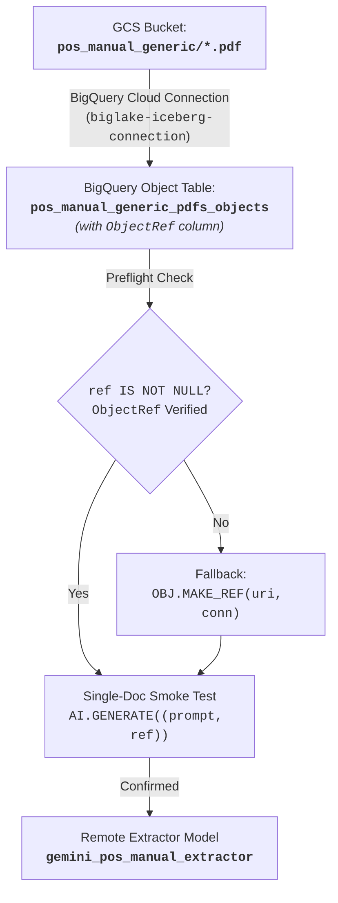
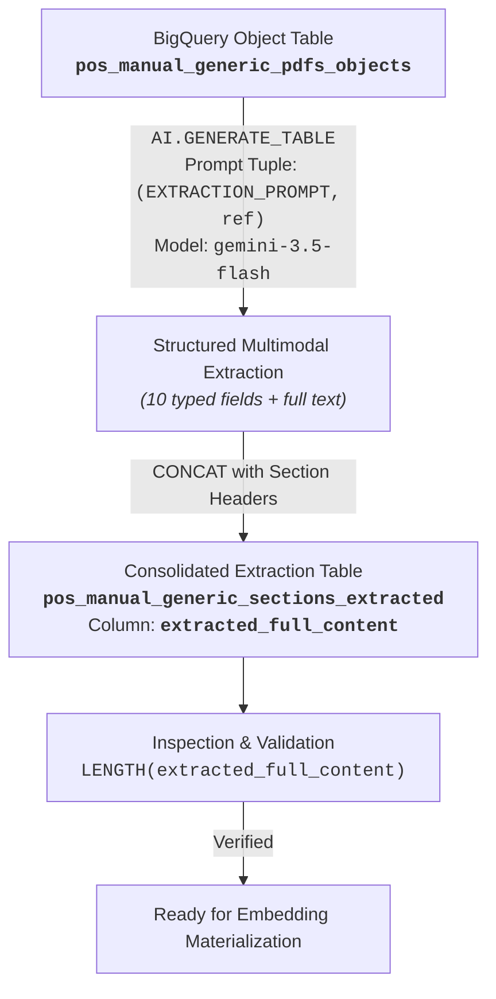
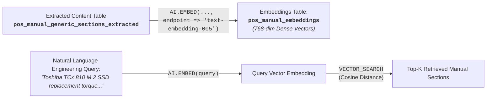
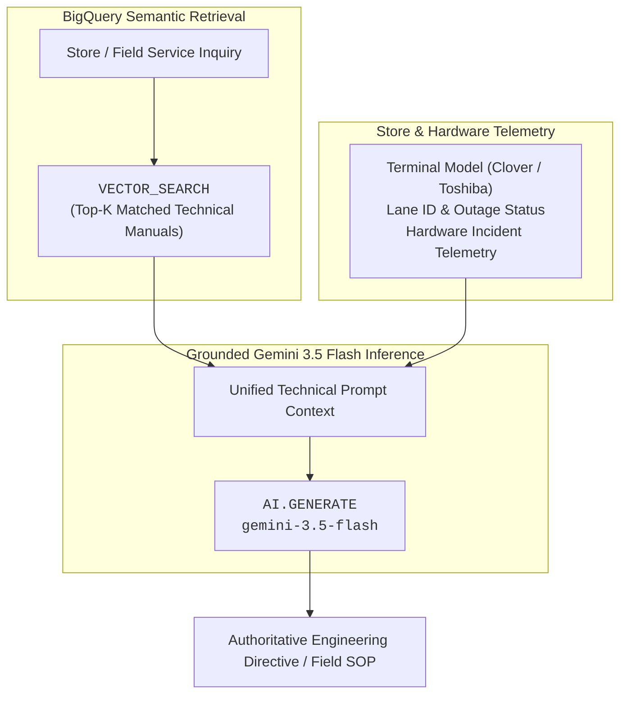

# Module 1 Lab 2 Guide: Multimodal POS Hardware Intelligence & Conversational RAG with BigQuery AI

---

## 📋 Pre-Flight Environment Context

Your environment is equipped with BigQuery native AI capabilities, Vertex AI Foundation Models, and Google Cloud Storage data assets for unstructured technical document intelligence:

- **Google Cloud Storage (GCS) Bucket:** `gs://${PROJECT_ID}-module1-bucket/store_pos_manual_generic/*`
  - Contains official Point of Sale (POS) terminal hardware & systems technical guides in PDF format (e.g., Toshiba TCx 810, HP Engage One Pro, Clover Station Solo).
- **BigQuery Cloud Resource Connection:** `biglake-iceberg-connection` (located in `{LOCATION}`).
  - Connects BigQuery directly to Cloud Storage and Vertex AI foundation models without data movement.
  - The connection's dedicated service account is granted `roles/storage.objectUser` and `roles/aiplatform.user` on the Google Cloud project.
- **BigQuery Datasets:**
  - `module1_unstructureddata`: Staging and intermediate multimodal extraction dataset.
  - `cymbal_gold`: Conformed analytical storage for vector embeddings and enterprise RAG tables.
- **Foundation Models (Vertex AI / BigQuery ML):**
  - **Extractor & Technical Parser:** `gemini-3.5-flash` (used for multimodal PDF layout parsing and typed technical specification extraction).
  - **Vector Embeddings:** `text-embedding-005` (768-dimensional dense vector embeddings).
  - **Grounded Conversational RAG:** `gemini-3.5-flash` (used for multi-source system telemetry synthesis, field engineering troubleshooting, and operational SOP synthesis).

### ⚙️ Environment Variables Setup

Before executing any commands or queries in this lab, export `PROJECT_ID` and `LOCATION` in your active Cloud Shell / terminal session:

```bash
export PROJECT_ID="$(gcloud config get-value project)" # or your specific project ID string
export LOCATION="us-central1"                          # replace with your assigned region
```

---

## 🛠️ Instructions & Pre-requisites

### Architecture Evolution: Legacy vs. Modern BigQuery Multimodal AI

| Pipeline Component | Legacy / Anti-Pattern | Modern BigQuery AI Architecture |
| :--- | :--- | :--- |
| **PDF Binary Access** | `uri` (STRING filename only — fails with `N/A` or hallucination) | `ref` (`ObjectRef`) enclosed inside a multimodal prompt tuple `(prompt_text, ref)` |
| **Document Preflight** | Manual OCR script / external vision API calls | `AI.GENERATE` single-doc smoke test with `(prompt, ref)` tuple |
| **Hardware Spec Extraction** | Python regex scraping / lossy text extraction | `AI.GENERATE_TABLE` with layout-aware prompting & typed `output_schema` |
| **Consolidated Semantic Text** | Fragmented field queries requiring multi-table joins | Single consolidated text column (`extracted_full_content`) with structured section headers |
| **Vector Embeddings** | Scheduled batch export jobs / external embedding services | In-database `AI.EMBED(extracted_full_content, endpoint => 'text-embedding-005')` |
| **Semantic Retrieval** | Keyword full-text matching | `VECTOR_SEARCH` with Cosine distance over 768-dimensional dense embeddings |
| **Reasoning Engine** | External LLM orchestration frameworks | In-database `AI.GENERATE` (`gemini-3.5-flash`) grounded on real-time store & lane telemetry |

---

## 🏷️ Part 1: Object Table Ingestion & Multimodal Verification



---

### Challenge 1.1: Create Object Table with Metadata Caching & `ObjectRef` Preflight

#### 🎯 Objective
Expose the Cloud Storage POS technical manual PDF binaries directly in BigQuery as an **Object Table** with automated directory metadata caching and verify the presence of the `ref` (`ObjectRef`) column.

#### ⚙️ Requirements & Constraints
1. **Object Table Definition:** Create an external object table `{PROJECT_ID}.module1_unstructureddata.pos_manual_generic_pdfs_objects` over `gs://${PROJECT_ID}-module1-bucket/store_pos_manual_generic/*`.
2. **Metadata Caching:** Set `metadata_cache_mode = 'AUTOMATIC'` and `max_staleness = INTERVAL 1 DAY`.
3. **Preflight Verification:** Query the table and confirm that the `ref` column is populated (`ref IS NOT NULL`) for all PDF documents.

#### 💡 Hints
- **`ObjectRef` vs `uri`:** BigQuery object tables expose a special `ref` column of type `ObjectRef`. Passing `uri` (a string) to Gemini only passes the text of the file path, whereas passing `ref` passes the actual binary content of the PDF.
- If querying an older object table without the native `ref` column, you can fall back to constructing the reference dynamically via `OBJ.MAKE_REF(uri, '${PROJECT_ID}.${LOCATION}.biglake-iceberg-connection')`.

```bash
# Challenge 1.1: Create Object Table with Metadata Caching & ObjectRef Preflight
bq query --use_legacy_sql=false --location="${LOCATION}" \
"
-- TODO: Challenge 1.1
"
```

---

### Challenge 1.2: Register Remote Gemini Extractor Model

#### 🎯 Objective
Register a BigQuery ML remote model endpoint pointing to `gemini-3.5-flash` using the Cloud Resource Connection.

#### ⚙️ Requirements & Constraints
1. **Model Name:** `{PROJECT_ID}.cymbal_gold.gemini_pos_manual_extractor`.
2. **Connection:** `{PROJECT_ID}.${LOCATION}.biglake-iceberg-connection`.
3. **Endpoint:** `gemini-3.5-flash`.

```bash
# Challenge 1.2: Register Remote Gemini Extractor Model
bq query --use_legacy_sql=false --location="${LOCATION}" \
"
-- TODO: Challenge 1.2
"
```

---

### Challenge 1.3: Single-Document Multimodal Smoke Test

#### 🎯 Objective
Perform an inexpensive single-document sanity test to verify that the Gemini model can open, read, and parse the PDF binary before executing batch extraction.

#### ⚙️ Requirements & Constraints
1. **Function:** Use `AI.GENERATE`.
2. **Prompt Tuple:** Pass `(instruction_string, ref)` as a 2-element tuple.
3. **Fail-Fast Assertion:** Assert that the output contains the document title, equipment covered, and part number without returning `CANNOT_READ_FILE`. Use the prompt:
```
"Read the attached POS guide PDF. Reply with ONLY the Document Title, Terminal Equipment Covered, and Document Part Number exactly as printed. If unreadable, reply CANNOT_READ_FILE."
```

```bash
# Challenge 1.3: Single-Document Multimodal Smoke Test
bq query --use_legacy_sql=false --location="${LOCATION}" \
"
-- TODO: Challenge 1.3
"
```

#### 📋 Sample Results:

| uri | smoke_test_result |
| :--- | :--- |
| `gs://${PROJECT_ID}-module1-bucket/store_pos_manual_generic/Toshiba_TCx_810_Guide.pdf` | Document Title: Toshiba TCx 810 POS Hardware, Diagnostics & Service Guide<br>Terminal Equipment Covered: Toshiba TCx 810 (TGCS Machine Type 6201: xxC, xx3, xx5, xx7)<br>Document Part Number: TGCS-DOC-6201-810 |

---

## 🏷️ Part 2: Multimodal Technical Extraction & Consolidated Semantic Column



---

### Challenge 2.1: Full Document Multimodal Extraction with `AI.GENERATE_TABLE` or `AI.GENERATE`

#### 🎯 Objective
Extract every technical specification, pinout diagram, FRU service step, diagnostic code, and compliance rule from every PDF manual using `AI.GENERATE_TABLE` or `AI.GENERATE` and consolidate all content into a single embedding-ready text column: `extracted_full_content`. The target table is `{PROJECT_ID}.module1_unstructureddata.pos_manual_generic_sections_extracted`.

#### ⚙️ Requirements & Constraints
1. **Extraction Schema:** Define a typed schema covering:
   - `document_title`: Full manual title.
   - `document_part_no`: Hardware manual part number (e.g. `POS-DOC-6201-TOSHIBA`).
   - `equipment_covered`: Specific terminal models (e.g. Toshiba TCx 810, HP Engage One Pro, Clover Station Solo).
   - `system_specifications`: CPU, RAM, display, IP water/dust ingress rating, operating thermals.
   - `ports_and_power_budgets`: Powered USB 24V/12V port allocations, cash drawer interfaces, wattage limits.
   - `fru_service_procedures`: Step-by-step FRU replacement, SSD replacement, torque specifications (N-cm), ESD safety.
   - `diagnostics_and_error_codes`: Beep codes, LED diagnostic patterns, POST failure codes, BIOS recovery.
   - `software_and_os_stacks`: Supported operating systems (TCx OS, Windows IoT, Clover AOSP Android), drivers, APIs.
   - `offline_and_compliance_rules`: Offline transaction ceilings, store-and-forward rules, PCI-DSS compliance, Whole-Unit Exchange (WUE) SOP.
   - `extracted_full_text`: Complete verbatim transcription of the PDF.
2. **Parameters:** Set `max_output_tokens = 45000` and `temperature = 0.0`.
3. **Consolidated Column:** Build `extracted_full_content` by concatenating all metadata, technical sections, and full text with explicit markdown section headers.

```bash
# Challenge 2.1: Full Document Multimodal Extraction with AI.GENERATE_TABLE
bq query --use_legacy_sql=false --location="${LOCATION}" \
"
-- TODO: Challenge 2.1
"
```

---

### Extraction Inspection & Validation

#### 🎯 Objective
Verify that all manuals were extracted successfully and that `extracted_full_content` holds comprehensive character density without missing fields or truncated sections.
**Note:** you should also use the preview in BigQuery Studio to view the contents of `pos_manual_generic_sections_extracted` table, making sure every row has data in every column. If any columns show `null`, you should run the extraction query again.

```bash
# Extraction Inspection & Validation
bq query --use_legacy_sql=false --location="${LOCATION}" \
"SELECT
    document_filename,
    document_part_no,
    SUBSTR(equipment_covered, 1, 40) AS equipment_preview,
    LENGTH(extracted_full_content) AS full_content_char_count
FROM \`${PROJECT_ID}.module1_unstructureddata.pos_manual_generic_sections_extracted\`
ORDER BY document_filename;"
```

#### 📋 Sample Results:

| document_filename | document_part_no | equipment_preview | full_content_char_count |
| :--- | :--- | :--- | :--- |
| Clover_Station_Solo_Guide | CLV-DOC-STATION-SOLO | Clover Station Solo (Countertop Terminal | 28450 |
| Diebold_Nixdorf_Beetle_A1150_Guide | DN-DOC-BEETLE-A1150 | Diebold Nixdorf BEETLE A1150 (15.6-inch | 24610 |
| HP_Engage_One_Pro_Guide | HP-DOC-ENGAGE-PRO-001 | HP Engage One Pro (G1, 15.6 G2, 19.5 G2) | 39331 |
| NCR_Voyix_RealPOS_XR7_Guide | NCR-DOC-REALPOS-XR7 | NCR Voyix RealPOS XR7 (Class 7702 15-inc | 30687 |
| Toshiba_TCx_810_Guide | TGCS-DOC-6201-810 | Toshiba TCx 810 (TGCS Machine Type 6201: | 31023 |

---

## 🏷️ Part 3: Dense Vector Embeddings & Native Semantic Retrieval



---

### Challenge 3.1: Materialize Dense Vector Embeddings (`AI.EMBED`)

#### 🎯 Objective
Compute 768-dimensional dense vector representations for `extracted_full_content` using `AI.EMBED` with `text-embedding-005` and materialize into `{PROJECT_ID}.cymbal_gold.pos_manual_embeddings`.

#### ⚙️ Requirements & Constraints
1. **Target Table:** `{PROJECT_ID}.cymbal_gold.pos_manual_embeddings`.
2. **Embedding Call:** `AI.EMBED(extracted_full_content, connection_id => '${PROJECT_ID}.${LOCATION}.biglake-iceberg-connection', endpoint => 'text-embedding-005').result AS embedding`.
3. **Dimensions:** Confirm `ARRAY_LENGTH(embedding) = 768`.

```bash
# Challenge 3.1: Materialize Dense Vector Embeddings (AI.EMBED)
bq query --use_legacy_sql=false --location="${LOCATION}" \
"
CREATE OR REPLACE TABLE ${PROJECT_ID}.cymbal_gold.pos_manual_embeddings AS (
  SELECT
    source_pdf_uri,
    document_filename,
    document_title,
    document_part_no,
    equipment_covered,
    system_specifications,
    ports_and_power_budgets,
    fru_service_procedures,
    diagnostics_and_error_codes,
    extracted_full_content,

    -- TODO: Challenge 3.1 ###
    -- Use `AI.EMBED(...).result AS embedding` to compute embeddings for `extracted_full_content`

  FROM \`${PROJECT_ID}.module1_unstructureddata.pos_manual_generic_sections_extracted\`
  WHERE extracted_full_content IS NOT NULL AND LENGTH(TRIM(extracted_full_content)) > 0
);
```

---

### Challenge 3.2: Execute Semantic Vector Search (`VECTOR_SEARCH`)

#### 🎯 Objective
Perform cosine similarity retrieval against the materialized vector embeddings table to find exact repair instructions and hardware parameters.

#### ⚙️ Requirements & Constraints
1. **Function:** `VECTOR_SEARCH`.
2. **Target Table:** `{PROJECT_ID}.cymbal_gold.pos_manual_embeddings`, `embedding` column.
3. **Query Embedding:** `query_value => AI.EMBED(<SAMPLE_QUERY>).result`. The sample query is:
  ```
  "What is the replacement procedure for M.2 SSD storage on a Toshiba TCx 810 terminal and what torque is required?"
  ```
4. **Distance & Top-K:** `distance_type => 'COSINE'`, `top_k => 3`.

```bash
# Challenge 3.2: Execute Semantic Vector Search (VECTOR_SEARCH)
bq query --use_legacy_sql=false --location="${LOCATION}" \
"
-- TODO: Challenge 3.2
"
```

#### 📋 Sample Results:

| distance | document_filename | document_title | equipment_covered | content_snippet |
| :--- | :--- | :--- | :--- | :--- |
| 0.277341 | Toshiba_TCx_810_Guide | Toshiba TCx 810 POS Hardware, Diagnostics & Service Guide | Toshiba TCx 810 (TGCS Machine Type 6201: xxC, xx3, xx5, xx7) | DOCUMENT: Toshiba TCx 810 POS Hardware, Diagnostics & Service Guide (Part No: TGCS-DOC-6201-810)<br>EQUIPMENT COVERED: Toshiba TCx 81 |
| 0.330770 | HP_Engage_One_Pro_Guide | HP Engage One Pro POS Hardware, Diagnostics & Service Guide | HP Engage One Pro (G1, 15.6 G2, 19.5 G2) | DOCUMENT: HP Engage One Pro POS Hardware, Diagnostics & Service Guide (Part No: HP-DOC-ENGAGE-PRO-001)<br>EQUIPMENT COVERED: HP Engag |
| 0.381793 | NCR_Voyix_RealPOS_XR7_Guide | NCR Voyix RealPOS XR7 Hardware, Diagnostics & Service Guide | NCR Voyix RealPOS XR7 (Class 7702 15-inch / Class 7703 18.5-inch) | DOCUMENT: NCR Voyix RealPOS XR7 Hardware, Diagnostics & Service Guide (Part No: NCR-DOC-REALPOS-XR7)<br>EQUIPMENT COVERED: NCR Voyix |

---

## 🏷️ [Optional] Part 4: Enterprise Conversational Analytics & Grounded Frontline RAG



---

### Challenge 4.1: Clover Station Solo Offline Outage & Recovery SOP

#### 🎯 Objective
Synthesize store network outage telemetry, lane status, and retrieved Clover Station Solo technical documentation to generate an authoritative troubleshooting directive for store operations.

#### ⚙️ Requirements & Constraints
- **Business Scenario (`user_case_1`):** *"A cashier at Store #412 has an error on their Clover Station Solo countertop terminal during a network outage — verify their offline transaction limits, and what is the recovery procedure?"*
- **Reasoning Engine:** `gemini-3.5-flash` via `AI.GENERATE`.
- **Outputs Required:**
  1. Offline Processing Limits (maximum offline duration, single transaction ceiling, aggregate store-and-forward queue cap).
  2. Cryptographic Queue Storage (hardware secure element buffering mechanism).
  3. Network Recovery Procedure (step-by-step actions once WAN is restored).
  4. Whole-Unit Exchange (WUE) SOP (procedure if terminal experiences hardware failure).

```bash
# Challenge 4.1: Clover Station Solo Offline Outage & Recovery SOP
bq query --use_legacy_sql=false --location="${LOCATION}" \
"
-- TODO: Challenge 4.1
"
```

#### 📋 Sample Results:

| grounded_resolution |
| :--- |
| **Subject: Urgent Support Request: Store #412, Lane 04 - Clover Station Solo Offline Mode & Recovery SOP**<br>**To:** Store Manager, Cymbal Michigan Avenue Plaza (#412)<br>**From:** Lead Store Systems Engineer & Technical Helpdesk Architect<br><br>### 1. Offline Processing Limits (Clover Platform)<br>* **Maximum Offline Duration:** 7 consecutive days.<br>* **Single Transaction Ceiling:** $250.00 maximum per offline transaction.<br>* **Aggregate Queue Cap:** $5,000.00 total queued offline transactions.<br><br>### 2. Cryptographic Queue Storage<br>Transactions are encrypted immediately in the hardware secure element (HSE) microprocessor.<br><br>### 3. Network Recovery Procedure<br>Automatic background synchronization upon WAN reconnection.<br><br>### 4. Whole-Unit Exchange (WUE) SOP<br>Contact Cymbal IT Helpdesk (1-800-CYM-HELP) for overnight replacement unit dispatch. |

---

### Challenge 4.2: Toshiba TCx 810 Field Service & Hardware Maintenance SOP

#### 🎯 Objective
Synthesize terminal telemetry and retrieved Toshiba TCx 810 technical documentation to produce a step-by-step engineering Standard Operating Procedure (SOP) for field replacement of M.2 NVMe SSD storage and power budget auditing.

#### ⚙️ Requirements & Constraints
- **Business Scenario (`user_case_2`):** *"A field engineer at Store #008 needs to replace the M.2 SSD on a Toshiba TCx 810 — what are the step-by-step removal instructions, torque specifications, and powered port limits?"*
- **Reasoning Engine:** `gemini-3.5-flash` via `AI.GENERATE`.
- **Outputs Required:**
  1. Safety & Power Discharge Protocol (pre-service steps, AC disconnect, power button discharge).
  2. Screen-Side-Up Service Access (hinge positioning and service hatch removal).
  3. Step-by-Step M.2 SSD Replacement & Exact Torque Specs (in N-cm).
  4. Powered USB Port Complement & Aggregate Power Budget (24V/12V limits and 90W total budget).

```bash
# Challenge 4.2: Toshiba TCx 810 Field Service & Hardware Maintenance SOP
bq query --use_legacy_sql=false --location="${LOCATION}" \
"
-- TODO: Challenge 4.2
"
```

#### 📋 Sample Results:

| field_resolution |
| :--- |
| **TO:** Field Service Engineer, Cymbal Store #008<br>**FROM:** Principal POS Hardware Systems Engineer<br>**SUBJECT:** **Field Service Guidance: Toshiba TCx 810 M.2 SSD Replacement & Power Budget Audit**<br><br>### 1. Safety & Power Discharge Protocol<br>1. Disconnect 180W external AC power.<br>2. Disconnect 24V PoweredUSB peripherals.<br>3. Press and hold power button for 10 seconds to discharge capacitors.<br>4. Wear anti-static ESD wrist strap.<br><br>### 2. Screen-Side-Up Service Access<br>Rotate display screen-side-up to ceiling; loosen single captive M3 thumbscrew to remove rear hatch.<br><br>### 3. Step-by-Step M.2 SSD Replacement & Torque Specification<br>1. Remove retention screw with Torx T8 driver.<br>2. Insert new FRU SSD (Part No: TGCS-SSD-M2-256G) at 15-degree angle.<br>3. Secure M2x3mm Torx screw to **exactly 35 N-cm (Newton-centimeters)** torque.<br><br>### 4. Powered USB Port Complement & Aggregate Power Budget Audit<br>* Max aggregate load across PoweredUSB ports: **90.0W**.<br>* 24V PoweredUSB (Red): 72.0W.<br>* 12V PoweredUSB 1 & 2 (Teal): 18.0W each.<br>* Standard USB 3.0 (x4): 4.5W per port. |

---

## 📚 Appendix

### Table Schemas

#### 1. Object Table: `module1_unstructureddata.pos_manual_generic_pdfs_objects`
| Column Name | Data Type | Description / Constraints |
| :--- | :--- | :--- |
| `uri` | STRING | GCS Object URI (`gs://${PROJECT_ID}-module1-bucket/store_pos_manual_generic/*.pdf`) |
| `ref` | ObjectRef | **Multimodal Binary Reference** used directly by Gemini functions |
| `size` | INT64 | File size in bytes |
| `content_type` | STRING | MIME type (`application/pdf`) |
| `updated` | TIMESTAMP | Last modification timestamp in GCS |

#### 2. Extracted Table: `module1_unstructureddata.pos_manual_generic_sections_extracted`
| Column Name | Data Type | Source / Calculation |
| :--- | :--- | :--- |
| `document_filename` | STRING | Filename extracted from GCS URI |
| `document_title` | STRING | Full manual title from cover page |
| `document_part_no` | STRING | Official part number (e.g. `POS-DOC-6201-TOSHIBA`) |
| `equipment_covered` | STRING | Terminal models covered by manual |
| `system_specifications` | STRING | Technical hardware architecture specs |
| `ports_and_power_budgets` | STRING | Powered USB 24V/12V & cash drawer load budgets |
| `fru_service_procedures` | STRING | Step-by-step FRU removal & torque specs |
| `diagnostics_and_error_codes` | STRING | LED codes, POST failure codes, BIOS recovery |
| `software_and_os_stacks` | STRING | Operating system support & device management |
| `offline_and_compliance_rules` | STRING | Offline store-and-forward & PCI-DSS compliance |
| `extracted_full_content` | STRING | **Single Consolidated Text Column (~7,000 chars)** |
| `source_pdf_uri` | STRING | Source Cloud Storage URI |

#### 3. Embeddings Table: `cymbal_gold.pos_manual_embeddings`
| Column Name | Data Type | Source / Calculation |
| :--- | :--- | :--- |
| `document_filename` | STRING | Filename identifier |
| `document_title` | STRING | Manual title |
| `document_part_no` | STRING | Document part number |
| `equipment_covered` | STRING | Terminal models covered |
| `extracted_full_content` | STRING | Source text payload |
| `embedding` | ARRAY<FLOAT64> | 768-dimensional dense vector (`text-embedding-005`) |

---

### Key POS Hardware Reference Guide

| Equipment Model | Key Specifications | Power & Interface Budget | Field Service & Compliance Notes |
| :--- | :--- | :--- | :--- |
| **Toshiba TCx 810** *(Machine Type 6201)* | Intel Core i5, IP53 spray-resistant enclosure, fanless passive cooling | Powered USB: 1x 24V (3.0A), 3x 12V (1.5A). **Total aggregate power limit: 90W** | Screen-side-up service access; M.2 SSD mounting screw torque: **35 N-cm**. Dual cash drawer RJ12. |
| **HP Engage One Pro** *(G1 / G2)* | Intel Core i7 vPro, anti-glare FHD touch, thermal throttling protection | Modular 140W USB-C Power Delivery hubs, Powered USB 24V/12V sleds | **HP Sure Start** self-healing BIOS recovery, tamper-evident chassis detection, clean cable routing base. |
| **Clover Station Solo** *(Android AOSP 10)* | 14.0-inch IPS display, Qualcomm Snapdragon, dedicated hardware secure element | Proprietary Hub: 4x USB-A (5V), 2x RJ12 cash drawer ports, GbE Ethernet | **Whole-Unit Exchange (WUE)** SOP; offline transactions capped at **$2,500 aggregate / 24-hour limit** with encrypted buffering. |

---

### Diagnostic & Troubleshooting Playbook

1. **Gemini returns `N/A` for all technical fields:**
   - **Root Cause:** The prompt passed the `uri` string instead of the `ref` (`ObjectRef`) column.
   - **Resolution:** Ensure `(EXTRACTION_PROMPT, ref)` is passed as a 2-element tuple in `AI.GENERATE_TABLE`.
2. **Permission Denied (`roles/storage.objectViewer` or `roles/aiplatform.user`):**
   - **Root Cause:** The BigQuery Cloud Resource Connection service account lacks access to the bucket or Vertex AI.
   - **Resolution:** Verify service account permissions using `bq show --connection ${PROJECT_ID}.${LOCATION}.biglake-iceberg-connection`.
3. **`VECTOR_SEARCH` returns 0 results:**
   - **Root Cause:** Embeddings column in `pos_manual_embeddings` contains NULL or empty arrays.
   - **Resolution:** Verify that `AI.EMBED` executed successfully and `ARRAY_LENGTH(embedding)` equals 768 for all rows.
