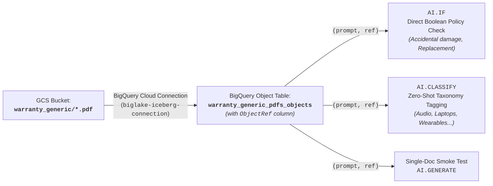
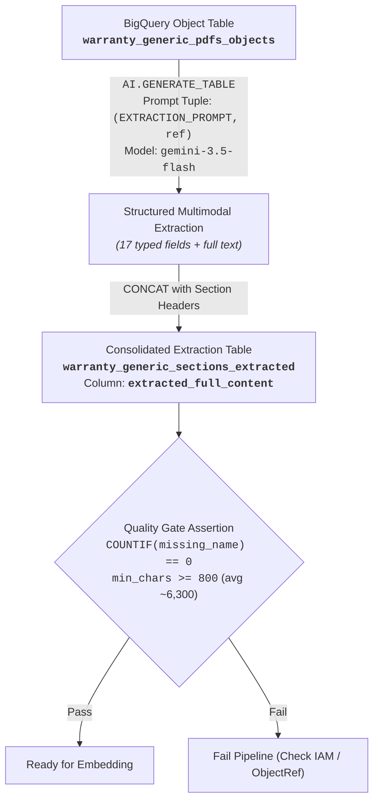
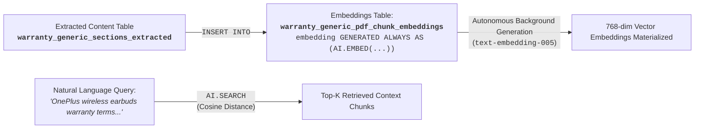

# Module 1 Lab 2 Guide: Multimodal Document RAG & Conversational Analytics with BigQuery AI

---

## 📋 Pre-Flight Environment Context

Your environment is equipped with BigQuery native AI capabilities, Vertex AI Foundation Models, and Google Cloud Storage data assets for unstructured multimodal analytics:

- **Google Cloud Storage (GCS) Bucket:** `gs://${PROJECT_ID}-module1-bucket/warranty_generic/*`
  - Contains 26 SKU-level official product warranty certificates in PDF format (`warranty_prod_*.pdf`).
- **BigQuery Cloud Resource Connection:** `biglake-iceberg-connection`.
  - Connects BigQuery directly to Cloud Storage and Vertex AI foundation models without data movement.
- **BigQuery Datasets:**
  - `module1_unstructureddata`: Staging and intermediate extraction dataset.
  - `cymbal_gold`: Conformed analytical storage for vector embeddings and enterprise RAG tables.
- **Foundation Models (Vertex AI / BigQuery ML):**
  - **Extractor & Classifier:** `gemini-3.5-flash` (used for multimodal PDF parsing, zero-shot classification, and boolean policy evaluation).
  - **Vector Embeddings:** `text-embedding-005` (768-dimensional dense vector embeddings).
  - **Grounded Conversational RAG:** `gemini-3.5-flash` (used for multi-hop complex reasoning, policy arbitration, and customer care synthesis).

### ⚙️ Environment Variables Setup

Before executing any commands or queries in this lab, export `PROJECT_ID` and `LOCATION` in your active Cloud Shell / terminal session:

```bash
export PROJECT_ID="$(gcloud config get-value project)" # or your specific project ID string
export LOCATION="us-central1"                          # replace with your assigned region
```

---

## 🛠️ Instructions & Pre-requisites

### Architecture Evolution: Legacy vs. Modern BigQuery Multimodal AI

| Pipeline Component | Legacy / Anti-Pattern | Modern BigQuery AI Architecture |
| :--- | :--- | :--- |
| **PDF Binary Access** | `uri` (STRING filename only — fails with `N/A` or hallucination) | `ref` (`ObjectRef`) enclosed inside a multimodal prompt tuple `(prompt_text, ref)` |
| **Fast Policy Checks** | OCR extraction pipelines + regex parsing | `AI.IF((prompt, ref))` direct binary zero-shot evaluation |
| **Document Taxonomy** | Keyword heuristics or separate classifier microservices | `AI.CLASSIFY((prompt, ref), categories => [...])` direct zero-shot classification |
| **Full PDF Extraction** | Python PDF scrapers / unstructured text dumps | `AI.GENERATE_TABLE` with layout-aware prompting & typed `output_schema` |
| **Vector Embeddings** | Scheduled batch export jobs / external embedding services | `GENERATED ALWAYS AS (AI.EMBED(...)) STORED OPTIONS(asynchronous = TRUE)` |
| **Semantic Retrieval** | `VECTOR_SEARCH` requiring manual query embedding generation | `AI.SEARCH(TABLE, 'column', query_text)` with native string search |
| **Reasoning Engine** | External LLM orchestration frameworks | In-database `AI.GENERATE` with `gemini-3.5-flash` grounded on Lakehouse telemetry |

---

## 🏷️ Part 1: Object Table Ingestion & Direct Multimodal AI Evaluation



---

### Challenge 1.1: Create Object Table with Metadata Caching & `ObjectRef` Preflight

#### 🎯 Objective
Expose the Cloud Storage warranty PDF binaries directly in BigQuery as an **Object Table** with automated directory metadata caching and verify the presence of the `ref` (`ObjectRef`) column.

#### ⚙️ Requirements & Constraints
1. **Object Table Definition:** Create an external object table `{PROJECT_ID}.module1_unstructureddata.warranty_generic_pdfs_objects` over `gs://${PROJECT_ID}-module1-bucket/warranty_generic/*`.
2. **Metadata Caching:** Set `metadata_cache_mode = 'AUTOMATIC'` and `max_staleness = INTERVAL 1 DAY`.
3. **Preflight Verification:** Query the table and confirm that the `ref` column is populated (`ref IS NOT NULL`) for all PDF documents.

#### 💡 Hints
- **`ObjectRef` vs `uri`:** BigQuery object tables expose a special `ref` column of type `ObjectRef`. Passing `uri` (a string) to Gemini only passes the text of the file path, whereas passing `ref` passes the actual binary content of the PDF.
- If querying an older object table without the native `ref` column, you can fall back to constructing the reference dynamically via `OBJ.MAKE_REF(uri, '${PROJECT_ID}.${LOCATION}.biglake-iceberg-connection')`.

```bash
# Challenge 1.1: Create Object Table with Metadata Caching & ObjectRef Preflight
bq query --use_legacy_sql=false --location="${LOCATION}" \
"
-- TODO: Challenge 1.1
"
```

---

### Challenge 1.2: Direct Zero-Shot Boolean Policy Evaluation (`AI.IF`)

#### 🎯 Objective
Evaluate natural-language warranty policies (accidental damage coverage and unit replacement options) directly over raw PDF binaries without prior table extraction or text pre-processing.

#### ⚙️ Requirements & Constraints
1. **Function:** Use `AI.IF`.
2. **Prompt Tuple:** Pass the prompt as a 2-element tuple: `(instruction_string, ref)`.
3. **Evaluations:**
   - Check if the warranty policy covers accidental damage, drops, or liquid spills (`has_accidental_damage_coverage`).
   - Check if the policy offers full replacement for defective units or only repair service (`offers_replacement_option`).

```bash
# Challenge 1.2: Direct Zero-Shot Boolean Policy Evaluation (AI.IF)
bq query --use_legacy_sql=false --location="${LOCATION}" \
"
-- TODO: Challenge 1.2
"
```

#### 📋 Sample Results:

| document_name | has_accidental_damage_coverage | offers_replacement_option |
| :--- | :--- | :--- |
| warranty_prod_5839 | false | true |
| warranty_prod_8532 | false | true |
| warranty_prod_3901 | false | true |
| warranty_prod_155 | false | true |
| warranty_prod_1954 | false | true |

---

### Challenge 1.3: Zero-Shot Multimodal Taxonomy Classification (`AI.CLASSIFY`)

#### 🎯 Objective
Automatically categorize incoming warranty certificate PDFs into retail product taxonomy classes directly in SQL without training or fine-tuning a custom model.

#### ⚙️ Requirements & Constraints
1. **Function:** Use `AI.CLASSIFY`.
2. **Categories:** Define target retail categories:
   - `Smartphones & Tablets`
   - `Laptops & Computing`
   - `Audio & Headphones`
   - `Wearables & Smartwatches`
   - `Home & Kitchen Appliances`
   - `Cameras & Imaging`
3. **Execution:** Pass the prompt tuple `(instruction_string, ref)` to classify each certificate.

```bash
# Challenge 1.3: Zero-Shot Multimodal Taxonomy Classification (AI.CLASSIFY)
bq query --use_legacy_sql=false --location="${LOCATION}" \
"
-- TODO: Challenge 1.3
"
```

#### 📋 Sample Results:

| document_name | product_category |
| :--- | :--- |
| warranty_prod_5839 | Wearables & Smartwatches |
| warranty_prod_155 | Audio & Headphones |
| warranty_prod_1954 | Wearables & Smartwatches |
| warranty_prod_3901 | Audio & Headphones |
| warranty_prod_8532 | Smartphones & Tablets |

---

## 🏷️ Part 2: Multimodal Full-Information Extraction & Quality Assertion



---

### Challenge 2.1: Full Document Multimodal Extraction with `AI.GENERATE_TABLE` or `AI.GENERATE`

#### 🎯 Objective
Extract every field, clause, table row, and complete transcription from every PDF certificate using `AI.GENERATE_TABLE` or `AI.GENERATE` and consolidate all content into a single embedding-ready text column: `extracted_full_content` in table `{PROJECT_ID}.module1_unstructureddata.warranty_generic_sections_extracted`.

#### ⚙️ Requirements & Constraints
1. **Model Definition:** Register a remote model `{PROJECT_ID}.cymbal_gold.gemini_generic_warranty_extractor` pointing to `gemini-3.5-flash`.
2. **Layout-Aware Extraction:** Craft the extraction prompt targeting the exact layout of the Cymbal Warranty Certificate:
   - Header SKU band (`product_id`)
   - Product model, brand, category, retail price (`retail_price_usd`), warranty period (`warranty_duration_months`), warranty start, coverage type, service level, service region.
   - Section 1: Warranty Coverage & Protection Terms (`coverage_scope_details`).
   - Section 2: Exclusions & Operating Limitations (`exclusions_and_limitations`).
   - Section 3: Official Authorized Retailer Guarantee & Seal (`official_retailer_guarantee_and_sla`).
   - Support, Claims & Statutory Rights (`support_and_claims_process`, `support_url`, `support_email`).
   - Complete verbatim transcription (`extracted_full_text`).
3. **Generation Parameters:** Set `max_output_tokens = 45000` and `temperature = 0.0` to avoid truncation.
4. **Single Consolidated Column:** Build `extracted_full_content` by concatenating all extracted metadata, section headers, terms, and transcription into a structured text document.

```bash
# Challenge 2.1: Register Model & Perform Full Multimodal Extraction
bq query --use_legacy_sql=false --location="${LOCATION}" \
"
-- TODO: Challenge 2.1
"
```

---

### Automated Extraction Quality Gate & Assertions

#### 🎯 Objective
Execute quality checks to guarantee that all certificates were read and parsed successfully, preventing downstream failures or hallucinated embeddings.

#### ⚙️ Requirements & Constraints
1. **Zero Missing Names:** `COUNTIF(product_name IS NULL OR product_name = 'N/A') == 0`.
2. **Character Density Assertion:** Minimum character length `min_content_chars >= 800` (valid certificates average ~6,300 characters).

```bash
# Automated Extraction Quality Gate & Assertions
bq query --use_legacy_sql=false --location="${LOCATION}" \
"SELECT
  COUNT(*)                                                AS total_rows,
  COUNTIF(product_name IS NULL OR product_name = 'N/A')   AS n_missing_name,
  COUNTIF(retail_price_usd IS NULL)                       AS n_missing_price,
  COUNTIF(warranty_duration_months IS NULL)               AS n_missing_duration,
  ROUND(AVG(LENGTH(extracted_full_content)))              AS avg_content_chars,
  MIN(LENGTH(extracted_full_content))                     AS min_content_chars,
  MAX(LENGTH(extracted_full_content))                     AS max_content_chars
FROM \`${PROJECT_ID}.module1_unstructureddata.warranty_generic_sections_extracted\`;"
```

#### 📋 Sample Results:

| total_rows | n_missing_name | n_missing_price | n_missing_duration | avg_content_chars | min_content_chars | max_content_chars |
| :--- | :--- | :--- | :--- | :--- | :--- | :--- |
| 26 | 0 | 0 | 0 | 5667.0 | 4998 | 6109 |

---

## 🏷️ Part 3: Autonomous Vector Embeddings & Native Semantic Retrieval



---

### Challenge 3.1: Materialize Autonomous Vector Embeddings (`GENERATED ALWAYS AS AI.EMBED`)

#### 🎯 Objective
Define a BigQuery table `{PROJECT_ID}.cymbal_gold.warranty_generic_pdf_chunk_embeddings` with a stored generated column that autonomously computes and maintains 768-dimensional dense vector embeddings (`text-embedding-005`) for `extracted_full_content`.

#### ⚙️ Requirements & Constraints
1. **Generated Stored Column:** Define `embedding STRUCT<result ARRAY<FLOAT64>, status STRING> GENERATED ALWAYS AS (AI.EMBED(extracted_full_content, connection_id => '${PROJECT_ID}.${LOCATION}.biglake-iceberg-connection', endpoint => 'text-embedding-005')) STORED OPTIONS(asynchronous = TRUE)`.
2. **Data Population:** Insert the extracted content records from `{PROJECT_ID}.module1_unstructureddata.warranty_generic_sections_extracted`.
3. **Status Polling:** Await background asynchronous embedding generation until all rows exhibit populated vectors (`ARRAY_LENGTH(embedding.result) = 768`).

```bash
# Challenge 3.1: Materialize Autonomous Vector Embeddings (GENERATED ALWAYS AS AI.EMBED)
bq query --use_legacy_sql=false --location="${LOCATION}" \
"
-- TODO: Challenge 3.1
"
```

---

### Challenge 3.2: Native Semantic Search Execution (`AI.SEARCH`)

#### 🎯 Objective
Execute vector similarity search across the warranty corpus using `AI.SEARCH`. The example query is:
```
'What are the warranty coverage terms, replacement entitlements, and exclusions for OnePlus wireless earbuds?'
```

#### ⚙️ Requirements & Constraints
1. **Direct Column Reference:** Pass the base text column `extracted_full_content` from `{PROJECT_ID}.cymbal_gold.warranty_generic_pdf_chunk_embeddings` directly into `AI.SEARCH`.
2. **Distance Metric:** Set `distance_type => 'COSINE'` and `top_k => 3`.
3. **No Query Embedding Generation:** Notice that `AI.SEARCH` accepts raw query text directly — BigQuery automatically handles the runtime query embedding.

```bash
# Challenge 3.2: Native Semantic Search Execution (AI.SEARCH)
bq query --use_legacy_sql=false --location="${LOCATION}" \
"
-- TODO: Challenge 3.2
"
```

#### 📋 Sample Results:

| distance | product_id | product_name | brand | warranty_duration_months | service_level | content_preview | source_pdf_uri |
| :--- | :--- | :--- | :--- | :--- | :--- | :--- | :--- |
| 0.204813 | prod_155 | OnePlus Nord Buds CE Bluetooth Truly Wireless in Ear Earbuds | OnePlus | 12 | Authorized Audio Lab Testing & Immediate Unit Replacement | DOCUMENT: Cymbal Global Retail Care - Official Product Warranty Certificate<br>SOURCE FILE: gs://.../warranty_prod_155.pdf | gs://${PROJECT_ID}-module1-bucket/warranty_generic/warranty_prod_155.pdf |
| 0.260269 | prod_546 | Oppo Enco Air 2 Pro Bluetooth Truly Wireless in Ear Earbuds | Oppo | 12 | Authorized Audio Lab Testing & Immediate Unit Replacement | DOCUMENT: Cymbal Global Retail Care - Official Product Warranty Certificate<br>SOURCE FILE: gs://.../warranty_prod_546.pdf | gs://${PROJECT_ID}-module1-bucket/warranty_generic/warranty_prod_546.pdf |
| 0.279220 | prod_3901 | realme Buds Wireless 2 Neo Bluetooth in Ear Earphones | Other Electronics | 12 | Authorized Audio Lab Testing & Immediate Unit Replacement | DOCUMENT: Cymbal Global Retail Care - Official Product Warranty Certificate<br>SOURCE FILE: gs://.../warranty_prod_3901.pdf | gs://${PROJECT_ID}-module1-bucket/warranty_generic/warranty_prod_3901.pdf |

---

## 📚 Appendix

### Table Schemas

#### 1. Object Table: `module1_unstructureddata.warranty_generic_pdfs_objects`
| Column Name | Data Type | Description / Constraints |
| :--- | :--- | :--- |
| `uri` | STRING | GCS Object URI (`gs://${PROJECT_ID}-module1-bucket/warranty_generic/warranty_prod_*.pdf`) |
| `ref` | ObjectRef | **Multimodal Binary Reference** used directly by Gemini functions |
| `size` | INT64 | File size in bytes |
| `content_type` | STRING | MIME type (`application/pdf`) |
| `updated` | TIMESTAMP | Last modification timestamp in GCS |

#### 2. Extracted Table: `module1_unstructureddata.warranty_generic_sections_extracted`
| Column Name | Data Type | Source / Calculation |
| :--- | :--- | :--- |
| `product_id` | STRING | Extracted SKU / Product ID (e.g. `prod_155`) |
| `product_name` | STRING | Full model name as printed on certificate |
| `brand` | STRING | Product brand |
| `category` | STRING | Product category |
| `retail_price_usd` | FLOAT64 | Clean numeric MSRP in USD |
| `warranty_duration_months` | INT64 | Warranty coverage duration in months |
| `warranty_start` | STRING | Warranty start terms |
| `coverage_type` | STRING | Component coverage scope |
| `service_level` | STRING | SLA description |
| `service_region` | STRING | Geographic validity footprint |
| `coverage_scope_details` | STRING | Section 1 verbatim terms |
| `exclusions_and_limitations` | STRING | Section 2 verbatim exclusion clauses (a, b, c, d) |
| `official_retailer_guarantee_and_sla` | STRING | Section 3 guarantee & seal text |
| `support_and_claims_process` | STRING | Customer support & claims instructions |
| `support_url` | STRING | Support web portal URL |
| `support_email` | STRING | Support email address |
| `extracted_full_content` | STRING | **Consolidated single document column (~6,300 chars)** |
| `source_pdf_uri` | STRING | Source Cloud Storage URI |

#### 3. Embeddings Table: `cymbal_gold.warranty_generic_pdf_chunk_embeddings`
| Column Name | Data Type | Source / Calculation |
| :--- | :--- | :--- |
| `product_id` | STRING | Primary product SKU identifier |
| `extracted_full_content` | STRING | Source text payload |
| `embedding` | STRUCT | **Autonomous Stored Embedding Column** |
| `embedding.result` | ARRAY<FLOAT64> | 768-dimensional dense vector (`text-embedding-005`) |
| `embedding.status` | STRING | Background asynchronous generation status |

---

### Diagnostic & Troubleshooting Playbook

1. **Gemini returns `N/A` for all fields or hallucinates product names:**
   - **Root Cause:** The prompt passed the `uri` string instead of the `ref` (`ObjectRef`) column, or the prompt tuple was missing.
   - **Resolution:** Verify that `(EXTRACTION_PROMPT, ref)` is passed as a tuple in `AI.GENERATE_TABLE`.
2. **Permission Denied (`roles/storage.objectViewer` or `roles/aiplatform.user`):**
   - **Root Cause:** The BigQuery Cloud Resource Connection service account lacks access to the bucket or Vertex AI.
   - **Resolution:** Retrieve the service account ID via `bq show --connection ${PROJECT_ID}.${LOCATION}.biglake-iceberg-connection` and grant required roles.
3. **Embeddings Table Status is Empty:**
   - **Root Cause:** Background embedding generation is asynchronous (`STORED OPTIONS(asynchronous = TRUE)`).
   - **Resolution:** Poll for 10–30 seconds after `INSERT` until `ARRAY_LENGTH(embedding.result)` equals 768.
