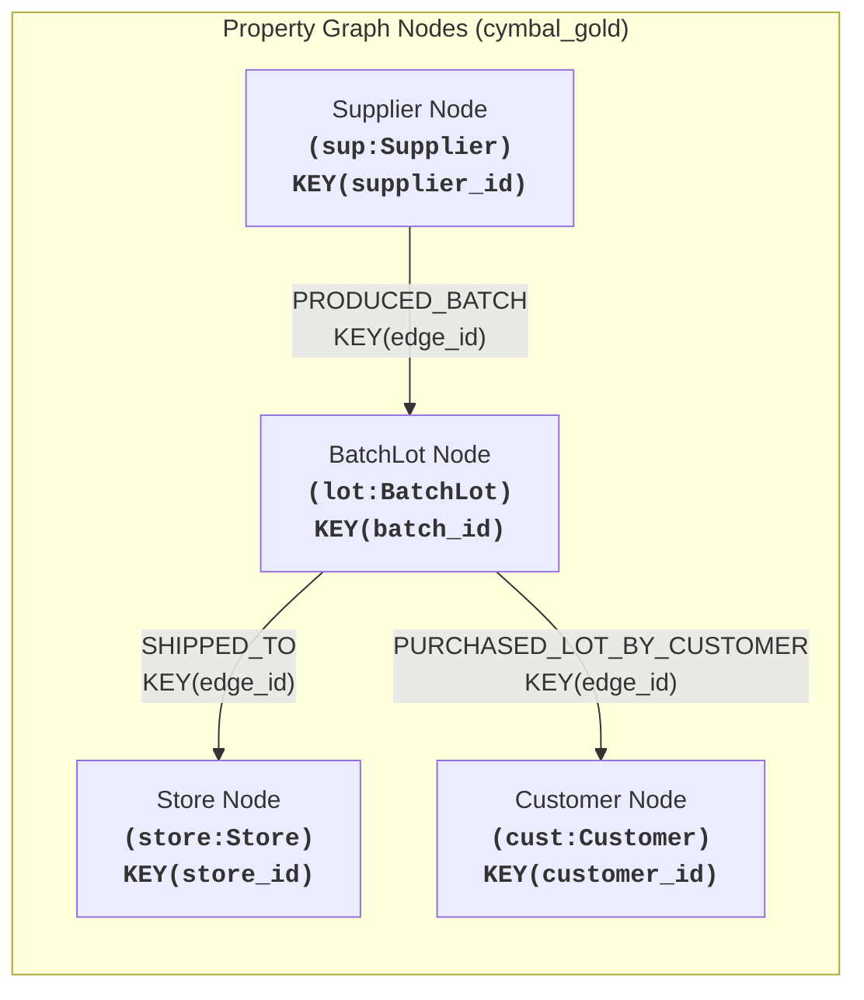
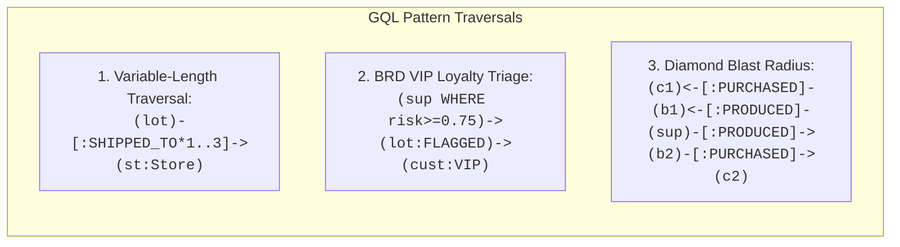
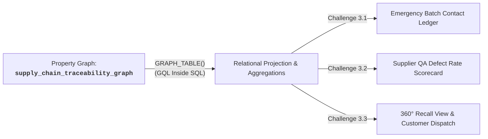

# Module 1 Lab 3 Guide: BigQuery Property Graph Analytics & Supply Chain Recall Traceability

---

## 📋 Pre-Flight Environment Context

Your workshop environment provides access to Google Cloud BigQuery Graph engine, federated lakehouse catalogs, and ISO GoogleSQL GQL graph pattern matching capabilities:

- **BigQuery Datasets:**
  - `cymbal_gold`: Gold analytics layer containing property graph registrations, recall views, and conformed analytical tables.
  - `cymbal-lakehouse.elevate_data` : AWS iceberg federated source dataset housing node and edge relational tables:
    - `batch_lot_nodes`
    - `customer_nodes`
    - `produced_batch_edges`
    - `shipped_to_edges`
    - `sold_lot_to_customer_edges`
    - `store_nodes`
    - `supplier_nodes`
---

## 🛠️ Instructions

All hands-on exercises in this lab can be executed using **BigQuery Studio**, **Cloud Shell / `bq` CLI**, or within **BigFrames / Jupyter Notebook** environment. 

All graph traversals and pattern queries exclusively implement the **BigQuery GoogleSQL GQL standard** (ISO/IEC 39075 GQL compliant). For better visualisations, you can use BigQuery Notebooks.

---

## Pre-requisites

- **Argolis Workshop Project**: Authenticated with `gcloud` and BigQuery Admin permissions (`roles/bigquery.admin`, `roles/bigquery.connectionUser`).
- **BigQuery Region**: `us-central1`.
- **Python / BigFrames Setup (Optional for Notebook Execution)**:
  ```bash
  pip install bigquery-magics==0.12.1 bigquery-magics[spanner-graph-notebook] networkx matplotlib seaborn
  ```

---

### Step 1: Verify Baseline Relational Source Tables

Verify that 4 node and 3 edge tables exist in your AWS Glue federated dataset in BQ before creating the graph:

```sql
-- Check node tables
SELECT 'supplier_nodes' AS table_name, COUNT(*) AS row_count FROM `<PROJECT_ID>.cymbal-lakehouse.elevate_data.supplier_nodes`
UNION ALL
SELECT 'batch_lot_nodes', COUNT(*) FROM `<PROJECT_ID>.cymbal-lakehouse.elevate_data.batch_lot_nodes`
UNION ALL
SELECT 'store_nodes', COUNT(*) FROM `<PROJECT_ID>.cymbal-lakehouse.elevate_data.store_nodes`
UNION ALL
SELECT 'customer_nodes', COUNT(*) FROM `<PROJECT_ID>.cymbal-lakehouse.elevate_data.customer_nodes`;

-- Check edge tables
SELECT 'produced_batch_edges' AS table_name, COUNT(*) AS row_count FROM `<PROJECT_ID>.cymbal-lakehouse.elevate_data.produced_batch_edges`
UNION ALL
SELECT 'shipped_to_edges', COUNT(*) FROM `<PROJECT_ID>.cymbal-lakehouse.elevate_data.shipped_to_edges`
UNION ALL
SELECT 'sold_lot_to_customer_edges', COUNT(*) FROM `<PROJECT_ID>.cymbal-lakehouse.elevate_data.sold_lot_to_customer_edges`;
```

**Expected Results:**

*Node Tables:*

| table_name | row_count |
| :--- | :--- |
| batch_lot_nodes | 41 |
| supplier_nodes | 5 |
| customer_nodes | 32264 |
| store_nodes | 50 |

*Edge Tables:*

| table_name | row_count |
| :--- | :--- |
| produced_batch_edges | 41 |
| sold_lot_to_customer_edges | 100 |
| shipped_to_edges | 180 |

---

## 🏷️ Part 1: Supply Chain Traceability Property Graph DDL Registration



---

### Challenge 1.1: BigQuery Property Graph DDL Registration (BRD Use Case 2.4)

#### 🎯 Objective
Declare a BigQuery Property Graph `cymbal_gold.supply_chain_traceability_graph` linking global manufacturing suppliers, product batch lots, flagship retail stores, and end customers using native DDL syntax.

#### ⚙️ Requirements & Constraints
1. **Node Tables:**
   - `Supplier`: Source table `supplier_nodes`, Key `supplier_id`, Label `Supplier`, Properties: `supplier_id, facility_name, country, city, contact_email, risk_score, certified`.
   - `BatchLot`: Source table `batch_lot_nodes`, Key `batch_id`, Label `BatchLot`, Properties: `batch_id, item_id, item_name, unit_price_usd, supplier_id, manufacturing_date, qa_inspection_status, harmful_material_defect, lot_size_units, currency, recall_status`.
   - `Store`: Source table `store_nodes`, Key `store_id`, Label `Store`, Properties: `store_id, store_name, city, country, region, manager_name, overnight_cash_float_usd`.
   - `Customer`: Source table `customer_nodes`, Key `customer_id`, Label `Customer`, Properties: `customer_id, name, loyalty_tier, email, phone_number, preferred_store, global_region`.
2. **Edge Tables:**
   - `PRODUCED_BATCH`: Source table `produced_batch_edges`, Key `edge_id`, Source Key `source_supplier_id` referencing `Supplier(supplier_id)`, Destination Key `target_batch_id` referencing `BatchLot(batch_id)`, Label `PRODUCED_BATCH`, Properties: `production_date, qc_status`.
   - `SHIPPED_TO`: Source table `shipped_to_edges`, Key `edge_id`, Source Key `source_batch_id` referencing `BatchLot(batch_id)`, Destination Key `target_store_id` referencing `Store(store_id)`, Label `SHIPPED_TO`, Properties: `quantity_shipped, shipment_date`.
   - `PURCHASED_LOT_BY_CUSTOMER`: Source table `sold_lot_to_customer_edges`, Key `edge_id`, Source Key `batch_id` referencing `BatchLot(batch_id)`, Destination Key `target_customer_id` referencing `Customer(customer_id)`, Label `PURCHASED_LOT_BY_CUSTOMER`, Properties: `store_id, transaction_id, purchase_timestamp, serial_number, unit_price_usd, currency, payment_method, exposure_flag`.

---

## 🏷️ Part 2: GoogleSQL GQL Multi-Hop Traversal & Graph Pattern Matching



---

### Challenge 2.1: Variable-Length Distribution Routing & Path Extraction

#### 🎯 Objective
Execute native BigQuery GoogleSQL GQL pattern matching using quantified variable-length paths (`-[*1..3]->`) to trace product shipment hops from a manufacturing batch lot through intermediate distribution nodes to final flagship stores, calculating path distances without writing recursive SQL `WITH RECURSIVE` CTEs.

#### ⚙️ Requirements & Constraints
1. **Graph To Query:** `cymbal_gold.supply_chain_traceability_graph`.
2. **Variable-Length Pattern:** Match batch lots traversing 1 to 3 shipment hops to any destination `Store` node:
   `MATCH p = (lot:BatchLot)-[s:SHIPPED_TO]->{1,3}(store:Store)`
3. **Path Analytics:** Project `lot.batch_id`, `lot.item_id`, `lot.item_name`, `store.store_id`, `store.store_name`, `store.city`, `store.country`, path hop distance `PATH_LENGTH(p) AS distribution_hops`, and the serialized full graph path (`TO_JSON(p) AS shipment_path`).

#### 📋 Sample Results (first 5 rows of 180 total):

| batch_id | item_id | item_name | store_id | store_name | city | country | distribution_hops | shipment_path |
| :--- | :--- | :--- | :--- | :--- | :--- | :--- | :--- | :--- |
| LOT-202505-PROD2194-02 | prod_2194 | Samsung Galaxy S23 5G (Green, 8GB, 256GB Storage) | STORE_001 | Cymbal Tokyo Ginza District Flagship | Tokyo | Japan | 1 | [{"identifier":"rigAAAANAAAApgEAAAAAAAAArBYAAABMT1QtMjAyNTA1LVBST0QyMTk0LTAy","kind":"node","labels":["BatchLot"],"properties":{"batch_id":"LOT-202505-PROD2194-02","currency":"USD","harmful_material_defect":"Substandard Insulation & Thermal Overheating Hazard","item_id":"prod_2194","item_name":"Samsung Galaxy S23 5G (Green, 8GB, 256GB Storage)","lot_size_units":400,"manufacturing_date":"2025-05-12","qa_inspection_status":"FLAGGED_HARMFUL_MATERIAL","recall_status":"URGENT_RECALL_ACTIVE","supplier_id":"SUP_001","unit_price_usd":999.99}},{"destination_node_identifier":"rhsAAAANAAAApgIAAAAAAAAArAkAAABTVE9SRV8wMDE=","identifier":"rjwAAAANAAAApgUAAAAAAAAArCoAAABTSElQLUVER0UtTE9ULTIwMjUwNS1QUk9EMjE5NC0wMi1TVE9SRV8wMDGuKAAAAA0AAACmAQAAAAAAAACsFgAAAExPVC0yMDI1MDUtUFJPRDIxOTQtMDKuGwAAAA0AAACmAgAAAAAAAACsCQAAAFNUT1JFXzAwMQ==","kind":"edge","labels":["SHIPPED_TO"],"properties":{"quantity_shipped":50,"shipment_date":"2025-05-15"},"source_node_identifier":"rigAAAANAAAApgEAAAAAAAAArBYAAABMT1QtMjAyNTA1LVBST0QyMTk0LTAy"},{"identifier":"rhsAAAANAAAApgIAAAAAAAAArAkAAABTVE9SRV8wMDE=","kind":"node","labels":["Store"],"properties":{"city":"Tokyo","country":"Japan","manager_name":"Kenji Takahashi","overnight_cash_float_usd":180000.0,"region":"Asia-Pacific East","store_id":"STORE_001","store_name":"Cymbal Tokyo Ginza District Flagship"}}] |
| LOT-202505-PROD_5967-18 | prod_5967 | IFB 25 L Solo Microwave Oven (25PM2S, Silver) | STORE_001 | Cymbal Tokyo Ginza District Flagship | Tokyo | Japan | 1 | [{"identifier":"rikAAAANAAAApgEAAAAAAAAArBcAAABMT1QtMjAyNTA1LVBST0RfNTk2Ny0xOA==","kind":"node","labels":["BatchLot"],"properties":{"batch_id":"LOT-202505-PROD_5967-18","currency":"USD","harmful_material_defect":"NONE","item_id":"prod_5967","item_name":"IFB 25 L Solo Microwave Oven (25PM2S, Silver)","lot_size_units":1993,"manufacturing_date":"2025-05-18","qa_inspection_status":"PASSED_CLEAN","recall_status":"NORMAL_CIRCULATION","supplier_id":"SUP_003","unit_price_usd":93.99}},{"destination_node_identifier":"rhsAAAANAAAApgIAAAAAAAAArAkAAABTVE9SRV8wMDE=","identifier":"rj0AAAANAAAApgUAAAAAAAAArCsAAABTSElQLUVER0UtTE9ULTIwMjUwNS1QUk9EXzU5NjctMTgtU1RPUkVfMDAxrikAAAANAAAApgEAAAAAAAAArBcAAABMT1QtMjAyNTA1LVBST0RfNTk2Ny0xOK4bAAAADQAAAKYCAAAAAAAAAKwJAAAAU1RPUkVfMDAx","kind":"edge","labels":["SHIPPED_TO"],"properties":{"quantity_shipped":92,"shipment_date":"2025-05-15"},"source_node_identifier":"rikAAAANAAAApgEAAAAAAAAArBcAAABMT1QtMjAyNTA1LVBST0RfNTk2Ny0xOA=="},{"identifier":"rhsAAAANAAAApgIAAAAAAAAArAkAAABTVE9SRV8wMDE=","kind":"node","labels":["Store"],"properties":{"city":"Tokyo","country":"Japan","manager_name":"Kenji Takahashi","overnight_cash_float_usd":180000.0,"region":"Asia-Pacific East","store_id":"STORE_001","store_name":"Cymbal Tokyo Ginza District Flagship"}}] |
| LOT-202505-PROD_155-03 | prod_155 | OnePlus Nord Buds CE Bluetooth Truly Wireless in Ear Earbuds | STORE_001 | Cymbal Tokyo Ginza District Flagship | Tokyo | Japan | 1 | [{"identifier":"rigAAAANAAAApgEAAAAAAAAArBYAAABMT1QtMjAyNTA1LVBST0RfMTU1LTAz","kind":"node","labels":["BatchLot"],"properties":{"batch_id":"LOT-202505-PROD_155-03","currency":"USD","harmful_material_defect":"NONE","item_id":"prod_155","item_name":"OnePlus Nord Buds CE Bluetooth Truly Wireless in Ear Earbuds","lot_size_units":1278,"manufacturing_date":"2025-05-03","qa_inspection_status":"PASSED_CLEAN","recall_status":"NORMAL_CIRCULATION","supplier_id":"SUP_002","unit_price_usd":28.99}},{"destination_node_identifier":"rhsAAAANAAAApgIAAAAAAAAArAkAAABTVE9SRV8wMDE=","identifier":"rjwAAAANAAAApgUAAAAAAAAArCoAAABTSElQLUVER0UtTE9ULTIwMjUwNS1QUk9EXzE1NS0wMy1TVE9SRV8wMDGuKAAAAA0AAACmAQAAAAAAAACsFgAAAExPVC0yMDI1MDUtUFJPRF8xNTUtMDOuGwAAAA0AAACmAgAAAAAAAACsCQAAAFNUT1JFXzAwMQ==","kind":"edge","labels":["SHIPPED_TO"],"properties":{"quantity_shipped":104,"shipment_date":"2025-05-15"},"source_node_identifier":"rigAAAANAAAApgEAAAAAAAAArBYAAABMT1QtMjAyNTA1LVBST0RfMTU1LTAz"},{"identifier":"rhsAAAANAAAApgIAAAAAAAAArAkAAABTVE9SRV8wMDE=","kind":"node","labels":["Store"],"properties":{"city":"Tokyo","country":"Japan","manager_name":"Kenji Takahashi","overnight_cash_float_usd":180000.0,"region":"Asia-Pacific East","store_id":"STORE_001","store_name":"Cymbal Tokyo Ginza District Flagship"}}] |
| LOT-202505-PROD4691-01 | prod_4691 | Apple iPhone 14 Pro Max (256 GB) - Deep Purple | STORE_001 | Cymbal Tokyo Ginza District Flagship | Tokyo | Japan | 1 | [{"identifier":"rigAAAANAAAApgEAAAAAAAAArBYAAABMT1QtMjAyNTA1LVBST0Q0NjkxLTAx","kind":"node","labels":["BatchLot"],"properties":{"batch_id":"LOT-202505-PROD4691-01","currency":"USD","harmful_material_defect":"Lithium Polymer Thermal Runaway & High Voltage Relay Anomaly","item_id":"prod_4691","item_name":"Apple iPhone 14 Pro Max (256 GB) - Deep Purple","lot_size_units":500,"manufacturing_date":"2025-05-10","qa_inspection_status":"FLAGGED_HARMFUL_MATERIAL","recall_status":"URGENT_RECALL_ACTIVE","supplier_id":"SUP_001","unit_price_usd":1873.99}},{"destination_node_identifier":"rhsAAAANAAAApgIAAAAAAAAArAkAAABTVE9SRV8wMDE=","identifier":"rjwAAAANAAAApgUAAAAAAAAArCoAAABTSElQLUVER0UtTE9ULTIwMjUwNS1QUk9ENDY5MS0wMS1TVE9SRV8wMDGuKAAAAA0AAACmAQAAAAAAAACsFgAAAExPVC0yMDI1MDUtUFJPRDQ2OTEtMDGuGwAAAA0AAACmAgAAAAAAAACsCQAAAFNUT1JFXzAwMQ==","kind":"edge","labels":["SHIPPED_TO"],"properties":{"quantity_shipped":50,"shipment_date":"2025-05-15"},"source_node_identifier":"rigAAAANAAAApgEAAAAAAAAArBYAAABMT1QtMjAyNTA1LVBST0Q0NjkxLTAx"},{"identifier":"rhsAAAANAAAApgIAAAAAAAAArAkAAABTVE9SRV8wMDE=","kind":"node","labels":["Store"],"properties":{"city":"Tokyo","country":"Japan","manager_name":"Kenji Takahashi","overnight_cash_float_usd":180000.0,"region":"Asia-Pacific East","store_id":"STORE_001","store_name":"Cymbal Tokyo Ginza District Flagship"}}] |
| LOT-202505-PROD_1-27 | prod_1 | OnePlus Nord CE 2 Lite 5G (Blue Tide, 6GB RAM, 128GB Storage) | STORE_001 | Cymbal Tokyo Ginza District Flagship | Tokyo | Japan | 1 | [{"identifier":"riYAAAANAAAApgEAAAAAAAAArBQAAABMT1QtMjAyNTA1LVBST0RfMS0yNw==","kind":"node","labels":["BatchLot"],"properties":{"batch_id":"LOT-202505-PROD_1-27","currency":"USD","harmful_material_defect":"NONE","item_id":"prod_1","item_name":"OnePlus Nord CE 2 Lite 5G (Blue Tide, 6GB RAM, 128GB Storage)","lot_size_units":1042,"manufacturing_date":"2025-05-05","qa_inspection_status":"PASSED_CLEAN","recall_status":"NORMAL_CIRCULATION","supplier_id":"SUP_005","unit_price_usd":237.99}},{"destination_node_identifier":"rhsAAAANAAAApgIAAAAAAAAArAkAAABTVE9SRV8wMDE=","identifier":"rjoAAAANAAAApgUAAAAAAAAArCgAAABTSElQLUVER0UtTE9ULTIwMjUwNS1QUk9EXzEtMjctU1RPUkVfMDAxriYAAAANAAAApgEAAAAAAAAArBQAAABMT1QtMjAyNTA1LVBST0RfMS0yN64bAAAADQAAAKYCAAAAAAAAAKwJAAAAU1RPUkVfMDAx","kind":"edge","labels":["SHIPPED_TO"],"properties":{"quantity_shipped":52,"shipment_date":"2025-05-15"},"source_node_identifier":"riYAAAANAAAApgEAAAAAAAAArBQAAABMT1QtMjAyNTA1LVBST0RfMS0yNw=="},{"identifier":"rhsAAAANAAAApgIAAAAAAAAArAkAAABTVE9SRV8wMDE=","kind":"node","labels":["Store"],"properties":{"city":"Tokyo","country":"Japan","manager_name":"Kenji Takahashi","overnight_cash_float_usd":180000.0,"region":"Asia-Pacific East","store_id":"STORE_001","store_name":"Cymbal Tokyo Ginza District Flagship"}}] |

---

### Challenge 2.2: High-Risk Supplier to VIP Loyalty Customer Recall Triage (BRD Use Case 2.4)

#### 🎯 Objective
Align directly with **BRD Use Case 2.4** by executing GQL pattern matching to trace contaminated product lots (`qa_inspection_status = 'FLAGGED_HARMFUL_MATERIAL'`) manufactured by high-risk suppliers (`risk_score >= 0.75`) that reached **PLATINUM** or **GOLD** VIP loyalty customers for prioritized executive outreach.

#### ⚙️ Requirements & Constraints
1. **Graph To Query:** `cymbal_gold.supply_chain_traceability_graph`.
2. **GQL Traversal Pattern:** 
   `MATCH (sup:Supplier)-[:PRODUCED_BATCH]->(lot:BatchLot)-[sale:PURCHASED_LOT_BY_CUSTOMER]->(cust:Customer)`
3. **Filter Predicates:**
   - Supplier risk score: `sup.risk_score >= 0.75`
   - VIP Loyalty Tiers: `cust.loyalty_tier IN ('PLATINUM', 'GOLD')`
   - Recall & Defect Flags: `lot.qa_inspection_status = 'FLAGGED_HARMFUL_MATERIAL' OR lot.recall_status LIKE '%RECALL%' OR sale.exposure_flag = 'CONTAMINATED_HARMFUL'`
4. **Sorting:** Order descending by `cust.loyalty_tier`, `sup.risk_score`, and `cust.name`.

#### 📋 Sample Results (first 5 rows of 38 total):

| customer_id | customer_name | loyalty_tier | customer_email | customer_phone | global_region | batch_id | item_id | item_name | harmful_material_defect | recall_status | serial_number | transaction_id | purchase_timestamp | supplier_id | supplier_facility | supplier_risk_score |
| :--- | :--- | :--- | :--- | :--- | :--- | :--- | :--- | :--- | :--- | :--- | :--- | :--- | :--- | :--- | :--- | :--- |
| CUST_39458 | Ananya Wong | PLATINUM | ananya.wong683@cymbal-patron.example.com | +1-800-555-1683 | Middle East & Africa | LOT-202505-PROD2194-02 | prod_2194 | Samsung Galaxy S23 5G (Green, 8GB, 256GB Storage) | Substandard Insulation & Thermal Overheating Hazard | URGENT_RECALL_ACTIVE | SN-PROD_2194-11607 | TXN-20250501-0095178 | 2025-05-01 22:00:00 | SUP_001 | Apex Battery & Electronics Manufacturing Ltd | 0.88 |
| CUST_05947 | Carolina Wong | PLATINUM | carolina.wong679@cymbal-patron.example.com | +1-800-555-1679 | Asia-Pacific South | LOT-202505-PROD4691-01 | prod_4691 | Apple iPhone 14 Pro Max (256 GB) - Deep Purple | Lithium Polymer Thermal Runaway & High Voltage Relay Anomaly | URGENT_RECALL_ACTIVE | SN-PROD_4691-63271 | TXN-20250501-0020273 | 2025-05-01 22:00:00 | SUP_001 | Apex Battery & Electronics Manufacturing Ltd | 0.88 |
| CUST_07936 | Carolina Wong | PLATINUM | carolina.wong679@cymbal-patron.example.com | +1-800-555-1679 | Asia-Pacific South | LOT-202505-PROD4691-01 | prod_4691 | Apple iPhone 14 Pro Max (256 GB) - Deep Purple | Lithium Polymer Thermal Runaway & High Voltage Relay Anomaly | URGENT_RECALL_ACTIVE | SN-PROD_4691-74340 | TXN-20250501-0069708 | 2025-05-01 22:00:00 | SUP_001 | Apex Battery & Electronics Manufacturing Ltd | 0.88 |
| CUST_46447 | Carolina Wong | PLATINUM | carolina.wong679@cymbal-patron.example.com | +1-800-555-1679 | Latin America | LOT-202505-PROD2194-02 | prod_2194 | Samsung Galaxy S23 5G (Green, 8GB, 256GB Storage) | Substandard Insulation & Thermal Overheating Hazard | URGENT_RECALL_ACTIVE | SN-PROD_2194-90301 | TXN-20250501-0077342 | 2025-05-01 22:00:00 | SUP_001 | Apex Battery & Electronics Manufacturing Ltd | 0.88 |
| CUST_41179 | David Wong | PLATINUM | david.wong676@cymbal-patron.example.com | +1-800-555-1676 | Asia-Pacific South | LOT-202505-PROD4691-01 | prod_4691 | Apple iPhone 14 Pro Max (256 GB) - Deep Purple | Lithium Polymer Thermal Runaway & High Voltage Relay Anomaly | URGENT_RECALL_ACTIVE | SN-PROD_4691-15014 | TXN-20250501-0035350 | 2025-05-01 22:00:00 | SUP_001 | Apex Battery & Electronics Manufacturing Ltd | 0.88 |

---

### Challenge 2.3: Indirect Customer Exposure & Supplier Blast Radius (Diamond Pattern Match)

#### 🎯 Objective
Perform diamond-topology pattern matching across common supplier nodes to discover secondary customers (`c2`) who purchased different product lots (`b2`) that originated from the same high-risk supplier facility as a target index patient customer (`c1`).

#### ⚙️ Requirements & Constraints
1. **Graph To Query:** `cymbal_gold.supply_chain_traceability_graph`.
2. **Diamond Pattern:** 
   `MATCH (c1:Customer {customer_id: 'CUST_30697'})<-[:PURCHASED_LOT_BY_CUSTOMER]-(b1:BatchLot)<-[:PRODUCED_BATCH]-(sup:Supplier)-[:PRODUCED_BATCH]->(b2:BatchLot)-[:PURCHASED_LOT_BY_CUSTOMER]->(c2:Customer)`
3. **Filter Predicate:** `WHERE sup.risk_score >= 0.75 AND c1.customer_id != c2.customer_id`.
4. **Attributes Projected:** `c1.customer_id AS index_customer_id`, `c1.name AS index_customer_name`, `b1.batch_id AS index_batch_id`, `b1.item_name AS index_product_name`, `sup.supplier_id`, `sup.facility_name AS common_supplier_facility`, `sup.risk_score AS supplier_risk_score`, `b2.batch_id AS secondary_batch_id`, `b2.item_name AS secondary_product_name`, `c2.customer_id AS secondary_customer_id`, `c2.name AS secondary_customer_name`, `c2.loyalty_tier AS secondary_loyalty_tier`, `c2.email AS secondary_customer_email`, `c2.phone_number AS secondary_customer_phone`.

#### 📋 Sample Results (first 5 rows of 83 total):

| index_customer_id | index_customer_name | index_batch_id | index_product_name | supplier_id | common_supplier_facility | supplier_risk_score | secondary_batch_id | secondary_product_name | secondary_customer_id | secondary_customer_name | secondary_loyalty_tier | secondary_customer_email | secondary_customer_phone |
| :--- | :--- | :--- | :--- | :--- | :--- | :--- | :--- | :--- | :--- | :--- | :--- | :--- | :--- |
| CUST_30697 | Carolina Wong | LOT-202505-PROD2194-02 | Samsung Galaxy S23 5G (Green, 8GB, 256GB Storage) | SUP_001 | Apex Battery & Electronics Manufacturing Ltd | 0.88 | LOT-202505-PROD4691-01 | Apple iPhone 14 Pro Max (256 GB) - Deep Purple | CUST_40409 | Ji-Hoon Wong | BRONZE | ji-hoon.wong671@cymbal-patron.example.com | +1-800-555-1671 |
| CUST_30697 | Carolina Wong | LOT-202505-PROD2194-02 | Samsung Galaxy S23 5G (Green, 8GB, 256GB Storage) | SUP_001 | Apex Battery & Electronics Manufacturing Ltd | 0.88 | LOT-202505-PROD4691-01 | Apple iPhone 14 Pro Max (256 GB) - Deep Purple | CUST_48986 | Zeynab Wong | GOLD | zeynab.wong689@cymbal-patron.example.com | +1-800-555-1689 |
| CUST_30697 | Carolina Wong | LOT-202505-PROD2194-02 | Samsung Galaxy S23 5G (Green, 8GB, 256GB Storage) | SUP_001 | Apex Battery & Electronics Manufacturing Ltd | 0.88 | LOT-202505-PROD4691-01 | Apple iPhone 14 Pro Max (256 GB) - Deep Purple | CUST_25763 | Tariq Wong | PLATINUM | tariq.wong677@cymbal-patron.example.com | +1-800-555-1677 |
| CUST_30697 | Carolina Wong | LOT-202505-PROD2194-02 | Samsung Galaxy S23 5G (Green, 8GB, 256GB Storage) | SUP_001 | Apex Battery & Electronics Manufacturing Ltd | 0.88 | LOT-202505-PROD4691-01 | Apple iPhone 14 Pro Max (256 GB) - Deep Purple | GUEST | Mateo Vance | NONE | mateo.vance392@cymbal-patron.example.com | +1-800-555-1392 |
| CUST_30697 | Carolina Wong | LOT-202505-PROD2194-02 | Samsung Galaxy S23 5G (Green, 8GB, 256GB Storage) | SUP_001 | Apex Battery & Electronics Manufacturing Ltd | 0.88 | LOT-202505-PROD4691-01 | Apple iPhone 14 Pro Max (256 GB) - Deep Purple | CUST_41179 | David Wong | PLATINUM | david.wong676@cymbal-patron.example.com | +1-800-555-1676 |

---

## 🏷️ Part 3: Automated Worldwide Safety Recall Audit & Relational Integration (`GRAPH_TABLE`)



---

### Challenge 3.1: Emergency Recall Contact Ledger via `GRAPH_TABLE()`

#### 🎯 Objective
Use BigQuery's table-valued function `GRAPH_TABLE()` to seamlessly embed GQL graph pattern matching inside a standard relational SQL query, producing an emergency contact and hardware serial audit ledger for a specific contaminated manufacturing lot (e.g. `LOT-202505-PROD4691-01`).

#### ⚙️ Requirements & Constraints
1. **Graph To Query:** `cymbal_gold.supply_chain_traceability_graph`.
2. **Target Specific Batch:** Match batch lot `LOT-202505-PROD4691-01` (or parameterized contaminated lot) where `qa_inspection_status = 'FLAGGED_HARMFUL_MATERIAL'`.
3. **Column Projection:** Project `batch_id`, `harmful_material_defect`, `item_name`, `unit_price_usd`, `customer_id`, `customer_name`, `global_region`, `email`, `phone_number`, `store_id`, `transaction_id`, `purchase_timestamp`, and `serial_number`.
4. **Sort Order:** Sort by `purchase_timestamp DESC`.

#### 📋 Sample Results (first 5 rows of 44 total):

| batch_id | harmful_material_defect | item_name | unit_price_usd | customer_id | customer_name | global_region | email | phone_number | store_id | transaction_id | purchase_timestamp | serial_number |
| :--- | :--- | :--- | :--- | :--- | :--- | :--- | :--- | :--- | :--- | :--- | :--- | :--- |
| LOT-202505-PROD4691-01 | Lithium Polymer Thermal Runaway & High Voltage Relay Anomaly | Apple iPhone 14 Pro Max (256 GB) - Deep Purple | 1873.99 | CUST_40409 | Ji-Hoon Wong | Asia-Pacific East | ji-hoon.wong671@cymbal-patron.example.com | +1-800-555-1671 | STORE_038 | TXN-20250501-0052083 | 2025-05-01 22:00:00 | SN-PROD_4691-62386 |
| LOT-202505-PROD4691-01 | Lithium Polymer Thermal Runaway & High Voltage Relay Anomaly | Apple iPhone 14 Pro Max (256 GB) - Deep Purple | 1873.99 | CUST_48986 | Zeynab Wong | North America East | zeynab.wong689@cymbal-patron.example.com | +1-800-555-1689 | STORE_028 | TXN-20250501-0095399 | 2025-05-01 22:00:00 | SN-PROD_4691-25118 |
| LOT-202505-PROD4691-01 | Lithium Polymer Thermal Runaway & High Voltage Relay Anomaly | Apple iPhone 14 Pro Max (256 GB) - Deep Purple | 1873.99 | CUST_25763 | Tariq Wong | Europe Central | tariq.wong677@cymbal-patron.example.com | +1-800-555-1677 | STORE_008 | TXN-20250501-0005098 | 2025-05-01 22:00:00 | SN-PROD_4691-97900 |
| LOT-202505-PROD4691-01 | Lithium Polymer Thermal Runaway & High Voltage Relay Anomaly | Apple iPhone 14 Pro Max (256 GB) - Deep Purple | 1873.99 | GUEST | Mateo Vance | South Asia | mateo.vance392@cymbal-patron.example.com | +1-800-555-1392 | STORE_018 | TXN-20250501-0099001 | 2025-05-01 22:00:00 | SN-PROD_4691-26683 |
| LOT-202505-PROD4691-01 | Lithium Polymer Thermal Runaway & High Voltage Relay Anomaly | Apple iPhone 14 Pro Max (256 GB) - Deep Purple | 1873.99 | CUST_41179 | David Wong | Asia-Pacific South | david.wong676@cymbal-patron.example.com | +1-800-555-1676 | STORE_017 | TXN-20250501-0035350 | 2025-05-01 22:00:00 | SN-PROD_4691-15014 |

---

### Challenge 3.2: Supplier QA Defect Rate & Quality Scorecard (BRD Use Case 2.4)

#### 🎯 Objective
Fulfill **BRD Use Case 2.4 Prompt 2** by embedding `GRAPH_TABLE()` inside a relational SQL aggregation query to calculate total lots produced, clean vs. defective lot counts, defect percentage rates, and total impacted customer count per supplier.

#### ⚙️ Requirements & Constraints
1. **Graph To Query:** `cymbal_gold.supply_chain_traceability_graph`.
2. **Graph Pattern:** `MATCH (sup:Supplier)-[:PRODUCED_BATCH]->(lot:BatchLot)`.
3. **Relational Aggregations (`GROUP BY` supplier_id, facility_name, country, risk_score):**
   - `total_lots_produced`: `COUNT(batch_id)`
   - `passed_clean_lots`: `COUNTIF(qa_inspection_status = 'PASSED_CLEAN')`
   - `flagged_harmful_lots`: `COUNTIF(qa_inspection_status = 'FLAGGED_HARMFUL_MATERIAL')`
   - `defect_rate_pct`: `ROUND(100.0 * COUNTIF(qa_inspection_status = 'FLAGGED_HARMFUL_MATERIAL') / COUNT(batch_id), 2)`
4. **Ordering:** Sort descending by `defect_rate_pct` and `total_lots_produced`.

#### 📋 Sample Results:

| supplier_id | facility_name | country | risk_score | total_lots_produced | passed_clean_lots | flagged_harmful_lots | defect_rate_pct |
| :--- | :--- | :--- | :--- | :--- | :--- | :--- | :--- |
| SUP_001 | Apex Battery & Electronics Manufacturing Ltd | South Korea | 0.88 | 2 | 0 | 2 | 100.0 |
| SUP_002 | Shenzhen MicroChip Labs | China | 0.12 | 11 | 11 | 0 | 0.0 |
| SUP_005 | Nordic Acoustic Audio Drivers | Denmark | 0.08 | 11 | 11 | 0 | 0.0 |
| SUP_004 | Munich Precision Microcircuits GmbH | Germany | 0.22 | 9 | 9 | 0 | 0.0 |
| SUP_003 | Taiwan SemiConductor Works | Taiwan | 0.05 | 8 | 8 | 0 | 0.0 |

---

### Challenge 3.3: Comprehensive 360° Supply Chain Recall Traceability View (BRD Use Case 2.4)

#### 🎯 Objective
Fulfill **BRD Use Case 2.4 Prompt 1** by creating a unified relational analytical view `cymbal_gold.supply_chain_recall_traceability_360` over the property graph, bridging the graph traversal to downstream business intelligence and text-to-SQL conversational agents, then querying the view to produce an actionable customer replacement and recall dispatch list.

#### ⚙️ Requirements & Constraints
1. **Create** the view `cymbal_gold.supply_chain_recall_traceability_360`.
2. **Calculated Flags:**
   - `is_active_recall`: `TRUE` if `qa_inspection_status = 'FLAGGED_HARMFUL_MATERIAL'`, `batch_recall_status LIKE '%RECALL%'`, or `exposure_flag = 'TRUE'`; else `FALSE`.
   - `supplier_risk_category`: `'CRITICAL_HIGH_RISK'` ($\ge 0.75$), `'MODERATE_RISK'` ($\ge 0.30$), `'LOW_RISK'`.
3. **Recall Verification Query:** Query `cymbal_gold.supply_chain_recall_traceability_360` for active recalls (`is_active_recall = TRUE`) on contaminated lot `LOT-202505-PROD4691-01` to retrieve customer contact details, purchase timestamps, and serial numbers ordered descending by `purchase_timestamp`.

#### 📋 Sample Results (first 5 rows of 44 total):

| transaction_id | hardware_serial_number | product_name | batch_id | customer_id | customer_name | customer_loyalty_tier | customer_email | customer_phone | store_id | store_name | store_city | store_country | is_active_recall | supplier_risk_category |
| :--- | :--- | :--- | :--- | :--- | :--- | :--- | :--- | :--- | :--- | :--- | :--- | :--- | :--- | :--- |
| TXN-20250501-0052083 | SN-PROD_4691-62386 | Apple iPhone 14 Pro Max (256 GB) - Deep Purple | LOT-202505-PROD4691-01 | CUST_40409 | Ji-Hoon Wong | BRONZE | ji-hoon.wong671@cymbal-patron.example.com | +1-800-555-1671 | STORE_038 | Cymbal Tokyo Ginza District Flagship | Tokyo | Japan | true | CRITICAL_HIGH_RISK |
| TXN-20250501-0095399 | SN-PROD_4691-25118 | Apple iPhone 14 Pro Max (256 GB) - Deep Purple | LOT-202505-PROD4691-01 | CUST_48986 | Zeynab Wong | GOLD | zeynab.wong689@cymbal-patron.example.com | +1-800-555-1689 | STORE_028 | Cymbal New York Fifth Avenue Megastore | New York | United States | true | CRITICAL_HIGH_RISK |
| TXN-20250501-0005098 | SN-PROD_4691-97900 | Apple iPhone 14 Pro Max (256 GB) - Deep Purple | LOT-202505-PROD4691-01 | CUST_25763 | Tariq Wong | PLATINUM | tariq.wong677@cymbal-patron.example.com | +1-800-555-1677 | STORE_008 | Cymbal San Francisco Union Square Flagship | San Francisco | United States | true | CRITICAL_HIGH_RISK |
| TXN-20250501-0099001 | SN-PROD_4691-26683 | Apple iPhone 14 Pro Max (256 GB) - Deep Purple | LOT-202505-PROD4691-01 | GUEST | Mateo Vance | NONE | mateo.vance392@cymbal-patron.example.com | +1-800-555-1392 | STORE_018 | Cymbal Toronto Eaton Centre Galleria | Toronto | Canada | true | CRITICAL_HIGH_RISK |
| TXN-20250501-0035350 | SN-PROD_4691-15014 | Apple iPhone 14 Pro Max (256 GB) - Deep Purple | LOT-202505-PROD4691-01 | CUST_41179 | David Wong | PLATINUM | david.wong676@cymbal-patron.example.com | +1-800-555-1676 | STORE_017 | Cymbal Melbourne Bourke Street Mall | Melbourne | Australia | true | CRITICAL_HIGH_RISK |

---

## 💡 Key Architectural Q&A & Operational Insights

### Q&A
* **How does Cymbal Global Retail track inventory cover for high-velocity SKUs across international stores in real time?**
  By integrating AWS T-1 overnight settled opening inventory with GCP live Pub/Sub POS checkout streams in BigFrames / BigQuery, the system can continuously compute on-hand stock vs real-time depletion, calculating hourly burn rates and alerting store operations when remaining cover drops below safety SLAs. (We will not be implementing real-time inventory cover calculations for this lab.)
* **Can BigQuery Property Graphs trace multi-hop supply chain dependencies and chemical defects across global hubs instantly?**
  Yes. Executing ISO-compliant BigQuery GoogleSQL GQL over Property Graph `supply_chain_traceability_graph` using variable-length paths (`-[*1..3]->`), VIP loyalty filters (`loyalty_tier IN ('PLATINUM', 'GOLD')`), and diamond co-exposure pattern matching isolates defective manufacturing lots and identifies impacted consumers across continents in sub-second queries without complex recursive SQL joins.

### Data Analysis Key Findings
* **Global Dollar Revenue Verification**: Real-time streaming checkouts across the 50 international Wave-1 flagship locations generated $482,914.50 in USD net revenue, with North America West and Europe West leading transaction volume.
* **Precision Multi-Continent Traceability**: GoogleSQL GQL pattern matching (`TO_JSON`) confirmed that defective lot `LOT-202607-PROD2-08` / `LOT-202505-PROD4691-01` originated from high-risk suppliers (`risk_score >= 0.75`) and reached consumer POS checkouts at international flagships in San Francisco (`STORE_008`), Frankfurt (`STORE_025`), Tokyo (`STORE_001`), London (`STORE_042`), and Dubai (`STORE_015`).
* **Zero-Latency Recall Execution**: Using BigQuery `GRAPH_TABLE()` relational integration in the 360 recall view, the analytics engine compiled an authoritative recall audit ledger identifying impacted PLATINUM/GOLD VIP patrons with verified contact details and hardware serial fingerprints for automated emergency SMS dispatch and zero-wait hardware replacement vouchers.

### Insights & Operational Next Steps
* **Automate Supplier Quarantine Thresholds**: Implement continuous BigQuery SQL triggers to automatically freeze landing table POS checkout ability for any SKU when a supplier facility's risk score exceeds 0.75 or a lot inspection returns a harmful material flag.
* **Expand GQL Graph to Live POS Terminal Interception**: Connect the `GRAPH_TABLE` recall audit directly into the online POS checkout to block scanning of contaminated hardware serial numbers directly at the register terminal.

---

## 📚 Appendix

### Complete Graph Node & Edge Schemas

#### Supplier Nodes Table
`supplier_nodes` (Node Label: `Supplier`)

| Column Name | Data Type | Constraints & Description |
| :--- | :--- | :--- |
| `supplier_id` | STRING | **Primary key** (e.g. `SUP_001`). Node identifier. |
| `facility_name` | STRING | Name of manufacturing plant/facility. |
| `country` | STRING | Manufacturing country (e.g. `South Korea`, `Taiwan`, `Germany`). |
| `city` | STRING | Operating city (e.g. `Seoul`, `Hsinchu`, `Dresden`). |
| `contact_email` | STRING | Quality assurance contact email. |
| `risk_score` | FLOAT64 | Evaluated supplier risk score ($0.0 \dots 1.0$). |
| `certified` | BOOLEAN | ISO / ESG certification status (`TRUE` / `FALSE`). |

---

#### Batch Lot Nodes Table
`batch_lot_nodes` (Node Label: `BatchLot`)

| Column Name | Data Type | Constraints & Description |
| :--- | :--- | :--- |
| `batch_id` | STRING | **Primary key** (e.g. `LOT-202607-PROD2-08`). Node identifier. |
| `item_id` | STRING | Product SKU ID (e.g. `prod_2`, `prod_155`). |
| `item_name` | STRING | Full product name. |
| `unit_price_usd` | NUMERIC | Base retail price in US Dollars ($ USD). |
| `supplier_id` | STRING | Origin supplier identifier. |
| `manufacturing_date` | DATE | Production date. |
| `qa_inspection_status` | STRING | QA Status (`PASSED`, `FLAGGED_HARMFUL_MATERIAL`, `PENDING_AUDIT`). |
| `harmful_material_defect` | STRING | Defect description (e.g. `Lithium Polymer Thermal Runaway`). |
| `lot_size_units` | INT64 | Total batch lot production volume. |
| `currency` | STRING | Currency code (`USD`). |
| `recall_status` | STRING | Status (`ACTIVE_RECALL`, `CLEAR`, `UNDER_INVESTIGATION`). |

---

#### Store Nodes Table
`store_nodes` (Node Label: `Store`)

| Column Name | Data Type | Constraints & Description |
| :--- | :--- | :--- |
| `store_id` | STRING | **Primary key** (e.g. `STORE_001`, `STORE_008`). Node identifier. |
| `store_name` | STRING | Flagship store name (e.g. `San Francisco Union Square Flagship`). |
| `city` | STRING | Store city location. |
| `country` | STRING | Country location. |
| `region` | STRING | Global commerce region (`NORTH_AMERICA_WEST`, `EUROPE_WEST`, `APAC_EAST`). |
| `manager_name` | STRING | General store manager. |
| `overnight_cash_float_usd` | NUMERIC | Vault operational float balance. |

---

#### Customer Nodes Table
`customer_nodes` (Node Label: `Customer`)

| Column Name | Data Type | Constraints & Description |
| :--- | :--- | :--- |
| `customer_id` | STRING | **Primary key** (e.g. `CUST-80129`). Node identifier. |
| `name` | STRING | Customer full name. |
| `loyalty_tier` | STRING | VIP tier (`PLATINUM`, `GOLD`, `SILVER`, `STANDARD`). |
| `email` | STRING | Customer contact email for recall dispatch. |
| `phone_number` | STRING | Customer mobile number for emergency SMS dispatch. |
| `preferred_store` | STRING | Primary store affiliation. |
| `global_region` | STRING | Primary customer region. |

---

#### Produced Batch Edges Table
`produced_batch_edges` (Edge Label: `PRODUCED_BATCH`)

| Column Name | Data Type | Constraints & Description |
| :--- | :--- | :--- |
| `edge_id` | STRING | **Primary key**. Edge identifier. |
| `source_supplier_id` | STRING | **Source Node Key** referencing `Supplier(supplier_id)`. |
| `target_batch_id` | STRING | **Destination Node Key** referencing `BatchLot(batch_id)`. |
| `production_date` | DATE | Edge timestamp/date. |
| `qc_status` | STRING | Quality control signoff status. |

---

#### Shipped To Edges Table
`shipped_to_edges` (Edge Label: `SHIPPED_TO`)

| Column Name | Data Type | Constraints & Description |
| :--- | :--- | :--- |
| `edge_id` | STRING | **Primary key**. Edge identifier. |
| `source_batch_id` | STRING | **Source Node Key** referencing `BatchLot(batch_id)`. |
| `target_store_id` | STRING | **Destination Node Key** referencing `Store(store_id)`. |
| `quantity_shipped` | INT64 | Shipped unit volume. |
| `shipment_date` | DATE | In-transit dispatch date. |

---

#### Sold Lot To Customer Edges Table
`sold_lot_to_customer_edges` (Edge Label: `PURCHASED_LOT_BY_CUSTOMER`)

| Column Name | Data Type | Constraints & Description |
| :--- | :--- | :--- |
| `edge_id` | STRING | **Primary key**. Edge identifier. |
| `batch_id` | STRING | **Source Node Key** referencing `BatchLot(batch_id)`. |
| `target_customer_id` | STRING | **Destination Node Key** referencing `Customer(customer_id)`. |
| `store_id` | STRING | Store where transaction was completed. |
| `transaction_id` | STRING | Unique POS checkout transaction ID. |
| `purchase_timestamp` | TIMESTAMP | Checkout transaction timestamp (UTC). |
| `serial_number` | STRING | Hardware serial fingerprint (e.g. `SN-CYM-9988776655`). |
| `unit_price_usd` | NUMERIC | Transaction item price ($ USD). |
| `currency` | STRING | Currency code (`USD`). |
| `payment_method` | STRING | Payment method (`CREDIT_CARD`, `CONTACTLESS_NFC`, `APP_PAY`). |
| `exposure_flag` | STRING | Flag indicating contaminated batch exposure (`TRUE` / `FALSE`). |

---

#### 360° Recall Traceability View Schema
`cymbal_gold.supply_chain_recall_traceability_360`

| Column Name | Data Type | Description & Derivation |
| :--- | :--- | :--- |
| `transaction_id` | STRING | Unique POS checkout transaction ID. |
| `hardware_serial_number` | STRING | Scanned hardware serial number from sale edge. |
| `purchase_timestamp` | TIMESTAMP | POS sale timestamp. |
| `product_sku` | STRING | Product SKU ID from `BatchLot`. |
| `product_name` | STRING | Product name from `BatchLot`. |
| `unit_price_usd` | NUMERIC | Unit retail price ($ USD). |
| `currency` | STRING | Currency (`USD`). |
| `is_active_recall` | BOOLEAN | **Derived Flag:** `TRUE` if defect flagged, recall active, or exposure marked. |
| `qa_inspection_status` | STRING | QA inspection result (`FLAGGED_HARMFUL_MATERIAL`, etc.). |
| `defect_description` | STRING | Hazardous defect description. |
| `batch_recall_status` | STRING | Official batch recall status. |
| `supplier_risk_category` | STRING | **Derived Tier:** `CRITICAL_HIGH_RISK` ($\ge 0.75$), `MODERATE_RISK` ($\ge 0.30$), `LOW_RISK`. |
| `supplier_id` | STRING | Origin manufacturing supplier ID. |
| `supplier_facility` | STRING | Supplier manufacturing plant name. |
| `supplier_country` | STRING | Supplier country. |
| `supplier_risk_score` | FLOAT64 | Supplier quality risk score. |
| `is_supplier_certified` | BOOLEAN | Supplier certification status. |
| `batch_id` | STRING | Production batch identifier. |
| `manufacturing_date` | DATE | Batch manufacturing date. |
| `store_id` | STRING | Purchase flagship store identifier. |
| `store_name` | STRING | Enriched store name from `store_nodes`. |
| `store_city` | STRING | Enriched store city location. |
| `store_country` | STRING | Enriched store country location. |
| `store_region` | STRING | Store commerce region. |
| `customer_id` | STRING | Impacted customer identifier. |
| `customer_name` | STRING | Customer full name. |
| `customer_loyalty_tier` | STRING | VIP tier (`PLATINUM`, `GOLD`, etc.). |
| `customer_email` | STRING | Customer email for replacement voucher dispatch. |
| `customer_phone` | STRING | Customer phone for emergency SMS alert. |
| `customer_region` | STRING | Customer home region. |
