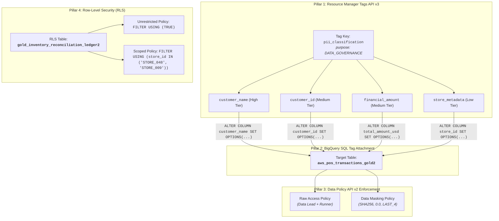
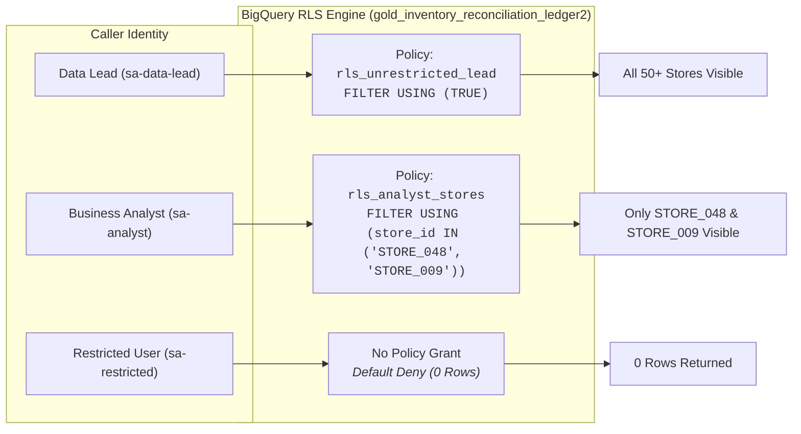
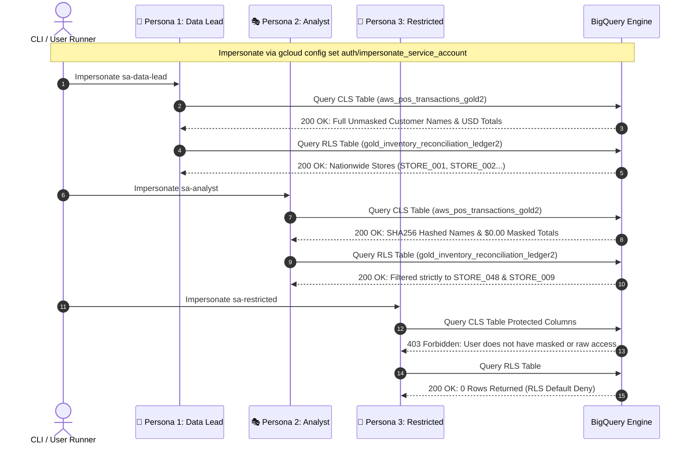

# Module 1 Lab 4 Guide: IAM Data Governance Tags, Dynamic Masking & Row-Level Security in BigQuery

---

## 📋 Pre-Flight Environment Context

Your environment is equipped with BigQuery Enterprise Data Governance capabilities, Cloud Resource Manager IAM Tags, BigQuery Data Policy API v2, and conformed Lakehouse data assets for Column-Level Security (CLS), Dynamic Data Masking, and Row-Level Security (RLS):

- **BigQuery Analytical Datasets & Tables:**
  - **Source Tables:** `{PROJECT_ID}.cymbal-lakehouse.elevate_data.silver_pos_transactions` (90,000+ retail POS transactions) and `{PROJECT_ID}.cymbal_gold.gold_inventory_reconciliation_ledger`.
  - **Target CLS Table:** `{PROJECT_ID}.cymbal_gold.aws_pos_transactions_gold2` (Dedicated working table for column tag attachment and dynamic masking).
  - **Target RLS Table:** `{PROJECT_ID}.cymbal_gold.gold_inventory_reconciliation_ledger2` (Inventory telemetry table governed by Row Access Policies).
- **3 Multi-Persona Service Accounts:**
  - 👑 **Data Lead (`sa-data-lead`):** `sa-data-lead@{PROJECT_ID}.iam.gserviceaccount.com` — Full raw unmasked plaintext access across all columns and nationwide RLS inventory rows.
  - 🎭 **Business Analyst (`sa-analyst`):** `sa-analyst@{PROJECT_ID}.iam.gserviceaccount.com` — Dynamic data masking on sensitive columns (`SHA256` hashed names, `$0.00` masked amounts, last 4 digits on IDs) and scoped RLS access restricted strictly to `STORE_048` and `STORE_009`.
  - 🚫 **Restricted User (`sa-restricted`):** `sa-restricted@{PROJECT_ID}.iam.gserviceaccount.com` — Explicitly denied access (403 Forbidden) to protected CLS columns and 0 rows returned (Default Deny) on RLS tables.

### ⚙️ Environment Variables Setup

Before executing any commands or queries in this lab, export `PROJECT_ID` and `LOCATION` in your active Cloud Shell / terminal session:

```bash
export PROJECT_ID="$(gcloud config get-value project)" # or your specific project ID string
export LOCATION="us-central1"                          # replace with your selected region
```

---

## 🛠️ Instructions & Pre-requisites

### Architecture Evolution: Legacy Data Catalog Policy Tags vs. Modern IAM Data Governance Tags

| Architecture Dimension | Legacy Data Catalog Policy Tags | Modern IAM Data Governance Tags & Data Policy API v2 |
| :--- | :--- | :--- |
| **Tag Definition Store** | Data Catalog Taxonomies (Regional, location-bound) | **Cloud Resource Manager Tags** with `purpose=DATA_GOVERNANCE` (Organization/Project-level) |
| **Tag Management API** | Data Catalog API (`v1beta1` / `v1` PolicyTags) | **Cloud Resource Manager API v3** (`/v3/tagKeys`, `/v3/tagValues`) |
| **Column Tag Attachment** | Console UI / multi-step metadata catalog patches | **Standard SQL DDL**: `ALTER TABLE ... ALTER COLUMN ... SET OPTIONS (data_governance_tags=[...])` |
| **Policy Engine API** | Data Policy API v1 (tied to legacy Taxonomy IDs) | **BigQuery Data Policy API v2** (`/v2/.../dataPolicies`) referencing namespaced `dataGovernanceTag` |
| **Masking Routines** | Limited predefined types | Predefined expressions: `SHA256`, `ALWAYS_NULL`, `LAST_FOUR_CHARACTERS`, `EMAIL_MASK`, `DEFAULT_MASKING_VALUE` |
| **Security Enforcement** | All-or-nothing column grants | **Multi-tier Column-Level Security (CLS) + Live Dynamic Masking + Fallback Redaction** |
| **Row-Level Security (RLS)**| Custom filtering views | Native **Row Access Policies (`ROW ACCESS POLICY`)** evaluated in-database at query runtime |
| **Governance Discovery** | External catalog search API queries | In-database **`INFORMATION_SCHEMA.COLUMN_FIELD_PATHS`** auditing `data_governance_tags` |

---

## 🏛️ The 4 Pillars of Modern BigQuery Data Governance



---

## 🏷️ Part 1: Environment Setup & Working Table Provisioning

### Grant Service Account Token Creator to the calling user

```bash
CALLER_EMAIL=$(gcloud config get-value account)
for SA in sa-data-lead sa-analyst sa-restricted; do
  gcloud iam service-accounts add-iam-policy-binding "${SA}@${PROJECT_ID}.iam.gserviceaccount.com" \
    --member="user:${CALLER_EMAIL}" \
    --role="roles/iam.serviceAccountTokenCreator" \
    --project="${PROJECT_ID}"
done
```

---

### Create Target CLS & RLS Working Tables

Create a dedicated working table `aws_pos_transactions_gold2` copied from `${PROJECT_ID}.cymbal-lakehouse.elevate_data.silver_pos_transactions` so that data governance experiments and column tags do not mutate the baseline gold dataset.

Create a dedicated working table `gold_inventory_reconciliation_ledger2` copied from `${PROJECT_ID}.cymbal_gold.gold_inventory_reconciliation_ledger` so that data governance experiments and RLS do not mutate the baseline gold dataset.

```bash
# Provision dedicated working tables via bq query CLI
bq query --use_legacy_sql=false --location="${LOCATION}" \
"CREATE OR REPLACE TABLE \`${PROJECT_ID}.cymbal_gold.aws_pos_transactions_gold2\` AS
SELECT * FROM \`${PROJECT_ID}.cymbal-lakehouse.elevate_data.silver_pos_transactions\`;

CREATE OR REPLACE TABLE \`${PROJECT_ID}.cymbal_gold.gold_inventory_reconciliation_ledger2\` AS
SELECT * FROM \`${PROJECT_ID}.cymbal_gold.gold_inventory_reconciliation_ledger\`;"
```

---

## 🏷️ Part 2: Pillar 1 — Define IAM Data Governance Tags via API

### Challenge 2.1: Create Tag Key with `purpose = DATA_GOVERNANCE`

#### 🎯 Objective
Create or resolve a namespaced Cloud Resource Manager Tag Key `pii_classification` under the target project with purpose `DATA_GOVERNANCE`.

#### ⚙️ Requirements & Constraints
1. **Endpoint:** `POST https://cloudresourcemanager.googleapis.com/v3/tagKeys`
2. **Payload:**
   ```json
   {
     "shortName": "pii_classification",
     "parent": "projects/{PROJECT_ID}",
     "purpose": "DATA_GOVERNANCE",
     "description": "Data governance tag key for column-level security & masking"
   }
   ```
3. **Namespaced Format:** `{PROJECT_ID}/pii_classification`.

```bash
# Challenge 2.1: Create Tag Key with purpose = DATA_GOVERNANCE
curl --request POST \
  "https://cloudresourcemanager.googleapis.com/v3/tagKeys" \
  --header "Authorization: Bearer $(gcloud auth print-access-token)" \
  --header 'Content-Type: application/json' \
  --data '{
    # TODO: Complete the curl payload with shortName, parent ("projects/'"${PROJECT_ID}"'"), purpose ("DATA_GOVERNANCE"), and description
  }'
```

---

### Challenge 2.2: Create Sensitivity Classification Tag Values

#### 🎯 Objective
Create or resolve the 10 data sensitivity tag values under the parent tag key in Cloud Resource Manager.

| Tag Value | Sensitivity Tier | Description |
| :--- | :--- | :--- |
| `customer_name` | **High** | Individual full name and customer identifiers |
| `customer_id` | **Medium** | Unique customer account ID and loyalty numbers |
| `financial_amount` | **Medium** | Transaction totals, revenue, and monetary figures |
| `store_metadata` | **Low** | Retail store location and register operational metadata |

```bash
# Challenge 2.2: Fetch Numeric Tag Key ID and Create Sensitivity Tag Values

# 1. Fetch Tag Key Numeric ID from namespaced key
TAG_KEY_NAME=$(curl --silent --request GET \
  "https://cloudresourcemanager.googleapis.com/v3/tagKeys/namespaced?name={PROJECT_ID}/pii_classification" \
  --header "Authorization: Bearer $(gcloud auth print-access-token)" \
  --header 'Accept: application/json' | jq -r '.name')
echo ${TAG_KEY_NAME}

# 2. Create the 10 Tag Values under ${TAG_KEY_NAME}
# Example for customer_name:
curl --request POST \
  "https://cloudresourcemanager.googleapis.com/v3/tagValues" \
  --header "Authorization: Bearer $(gcloud auth print-access-token)" \
  --header 'Content-Type: application/json' \
  --data '{
    "shortName": "customer_name",
    "parent": "'"${TAG_KEY_NAME}"'",
    "description": "Individual full name and customer identifiers"
  }'

# TODO: Add tag values for: 
# - customer_id
# - financial_amount
# - store_metadata
```

---

## 🏷️ Part 3: Pillar 2 — Attach Data Governance Tags to Table Columns

### Challenge 3.1: Attach Column Tags using BigQuery SQL DDL

#### 🎯 Objective
Attach the created IAM Data Governance Tags directly to table columns in `{PROJECT_ID}.cymbal_gold.aws_pos_transactions_gold2` using BigQuery native `ALTER TABLE ... ALTER COLUMN` syntax executed via `bq query`.

#### ⚙️ Requirements & Constraints
1. **SQL DDL Syntax:**
   ```sql
   ALTER TABLE `{PROJECT_ID}.cymbal_gold.aws_pos_transactions_gold2`
   ALTER COLUMN <column_name>
   SET OPTIONS (data_governance_tags=[("{PROJECT_ID}/pii_classification", "<tag_value>")]);
   ```
2. **Column Tag Mapping:**
   - `customer_name` → `{PROJECT_ID}/pii_classification/customer_name`
   - `customer_id` → `{PROJECT_ID}/pii_classification/customer_id`
   - `total_amount_usd` → `{PROJECT_ID}/pii_classification/financial_amount`
   - `total_amount` → `{PROJECT_ID}/pii_classification/financial_amount`
   - `store_id` → `{PROJECT_ID}/pii_classification/store_metadata`

```bash
# Challenge 3.1: Attach Data Governance Tags to aws_pos_transactions_gold2 columns
bq query --use_legacy_sql=false --location="${LOCATION}" \
"
-- TODO: Write ALTER TABLE statements to attach data governance tags to the 5 columns:
-- - customer_name (customer_name)
-- - customer_id (customer_id)
-- - total_amount_usd (financial_amount)
-- - total_amount (financial_amount)
-- - store_id (store_metadata)
"
```

---

## 🏷️ Part 4: Pillar 3 — Provision BigQuery Data Policies via API v2

### Challenge 4.1: Create Raw Data Access Policies for Data Lead

#### 🎯 Objective
Provision `RAW_DATA_ACCESS_POLICY` data policies via BigQuery Data Policy API v2 granting unmasked plaintext access on all sensitive tags to the Data Lead persona (`sa-data-lead@{PROJECT_ID}.iam.gserviceaccount.com`).

#### ⚙️ Requirements & Constraints
1. **Endpoint:** `POST https://bigquerydatapolicy.googleapis.com/v2/projects/{PROJECT_ID}/locations/{LOCATION}/dataPolicies`
2. **Policy Type:** `RAW_DATA_ACCESS_POLICY`.
3. **Principal Format:** `principal://iam.googleapis.com/projects/-/serviceAccounts/sa-data-lead@{PROJECT_ID}.iam.gserviceaccount.com`.

```bash
# Challenge 4.1: Create Raw Data Access Policies for Data Lead (sa-data-lead)
curl --silent --request POST \
  "https://bigquerydatapolicy.googleapis.com/v2/projects/${PROJECT_ID}/locations/${LOCATION}/dataPolicies" \
  --header "Authorization: Bearer $(gcloud auth print-access-token)" \
  --header 'Content-Type: application/json' \
  --data '{
    "dataPolicyId": "raw_customer_name_lead",
    "dataPolicy": {
      "dataPolicyType": "RAW_DATA_ACCESS_POLICY",
      "dataGovernanceTag": {
        "key": "'"${PROJECT_ID}"'/pii_classification",
        "value": "customer_name"
      },
      "grantees": [
        "principal://iam.googleapis.com/projects/-/serviceAccounts/sa-data-lead@'"${PROJECT_ID}"'.iam.gserviceaccount.com"
      ]
    }
  }' | jq .

# TODO: Provision raw data access policies for:
# - customer_id
# - financial_amount
# - store_metadata
```

---

### Challenge 4.2: Create Dynamic Data Masking Policies for Business Analyst

#### 🎯 Objective
Provision `DATA_MASKING_POLICY` data policies via BigQuery Data Policy API v2 granting masked views on sensitive tags to the Business Analyst persona (`sa-analyst@{PROJECT_ID}.iam.gserviceaccount.com`).

#### ⚙️ Predefined Masking Expressions Configured:

| Tag Value | Sensitivity | Masking Rule Expression | Analyst Rendered Output |
| :--- | :--- | :--- | :--- |
| `customer_name` | **High** | `SHA256` | Irreversible 64-char SHA256 hex digest |
| `customer_id` | **Medium** | `LAST_FOUR_CHARACTERS` | Masked string showing only last 4 characters |
| `total_amount_usd` | **Medium** | `DEFAULT_MASKING_VALUE` | Numeric default `$0.00` |
| `total_amount` | **Medium** | `DEFAULT_MASKING_VALUE` | Numeric default `$0.00` |
| `store_metadata` | **Low** | `DEFAULT_MASKING_VALUE` | Default masking value |

```bash
# Challenge 4.2: Create Dynamic Data Masking Policies for Business Analyst (sa-analyst)
curl --silent --request POST \
  "https://bigquerydatapolicy.googleapis.com/v2/projects/${PROJECT_ID}/locations/${LOCATION}/dataPolicies" \
  --header "Authorization: Bearer $(gcloud auth print-access-token)" \
  --header 'Content-Type: application/json' \
  --data '{
    "dataPolicyId": "mask_customer_name_analyst",
    "dataPolicy": {
      "dataPolicyType": "DATA_MASKING_POLICY",
      "dataGovernanceTag": {
        "key": "'"${PROJECT_ID}"'/pii_classification",
        "value": "customer_name"
      },
      "dataMaskingPolicy": {
        "predefinedExpression": "SHA256"
      },
      "grantees": [
        "principal://iam.googleapis.com/projects/-/serviceAccounts/sa-analyst@'"${PROJECT_ID}"'.iam.gserviceaccount.com"
      ]
    }
  }' | jq .

# TODO: Provision data masking policies for:
# - customer_id (LAST_FOUR_CHARACTERS)
# - financial_amount - total_amount and total_amount_usd (DEFAULT_MASKING_VALUE)
# - store_metadata (DEFAULT_MASKING_VALUE)
```

---

## 🏷️ Part 5: Pillar 4 — Row-Level Security (RLS) Implementation



---

### Challenge 5.1: Create Unrestricted Row Access Policy for Data Lead

#### 🎯 Objective
Create a row access policy granting nationwide visibility (`FILTER USING (TRUE)`) on `{PROJECT_ID}.cymbal_gold.gold_inventory_reconciliation_ledger2` to `sa-data-lead@{PROJECT_ID}.iam.gserviceaccount.com`.

```bash
# Challenge 5.1: Create Unrestricted Row Access Policy for Data Lead via bq query
bq query --use_legacy_sql=false --location="${LOCATION}" \
"
-- TODO: Write CREATE OR REPLACE ROW ACCESS POLICY statement
"
```

---

### Challenge 5.2: Create Scoped Row Access Policy for Business Analyst

#### 🎯 Objective
Create a row access policy restricting `sa-analyst@{PROJECT_ID}.iam.gserviceaccount.com` to stores assigned to their regional audit territory (`STORE_048` and `STORE_009`).

```bash
# Challenge 5.2: Create Scoped Row Access Policy for Business Analyst via bq query
bq query --use_legacy_sql=false --location="${LOCATION}" \
"
-- TODO: Write CREATE OR REPLACE ROW ACCESS POLICY statement
"
```

---

## 🏷️ Part 6: Live Multi-Persona Verification



---

### Challenge 6.1: Live Query Verification across all 3 Personas

#### 🎯 Objective
Execute identical SQL queries against `{PROJECT_ID}.cymbal_gold.aws_pos_transactions_gold2` and `{PROJECT_ID}.cymbal_gold.gold_inventory_reconciliation_ledger2` impersonating each of the 3 personas using `bq query` CLI and verify that security boundaries are strictly enforced.

#### ⚙️ Verification Assertions:
1. **Data Lead (`sa-data-lead`):**
   - `customer_name` contains clear readable strings (e.g. `Alexander Sharma`).
   - `total_amount_usd` displays exact positive dollar values (e.g. `$2,075.73`).
   - RLS query returns rows from all stores nationwide.
2. **Business Analyst (`sa-analyst`):**
   - `customer_name` returns a 64-character SHA256 hex string.
   - `total_amount_usd` returns `0.0` / `$0.00`.
   - RLS query returns rows exclusively where `store_id IN ('STORE_048', 'STORE_009')`.
3. **Restricted User (`sa-restricted`):**
   - Querying protected columns raises `403 Forbidden` (`BigQuery: User does not have masked access or raw data access to protected column`).
   - Querying the RLS table succeeds with `0 rows` returned (Default Deny).

```bash
# ── 1. Persona 1: Data Lead (Unmasked Raw CLS + Nationwide RLS Access) ──────
gcloud config set auth/impersonate_service_account "sa-data-lead@${PROJECT_ID}.iam.gserviceaccount.com"

# a. CLS Table Query — Raw Plaintext Customer Names & Amounts:
bq query --use_legacy_sql=false --location="${LOCATION}" \
"SELECT store_id, transaction_id, customer_id, customer_name, total_amount_usd
FROM \`${PROJECT_ID}.cymbal_gold.aws_pos_transactions_gold2\`
ORDER BY store_id
LIMIT 4;"

# b. RLS Table Query — Nationwide Inventory Rows:
bq query --use_legacy_sql=false --location="${LOCATION}" \
"SELECT store_id, city, store_name, intraday_gross_revenue_usd
FROM \`${PROJECT_ID}.cymbal_gold.gold_inventory_reconciliation_ledger2\`
ORDER BY store_id
LIMIT 4;"
```

**Sample Output — Data Lead CLS Query (Unmasked Plaintext):**

| store_id | transaction_id | customer_id | customer_name | total_amount_usd |
| :--- | :--- | :--- | :--- | :--- |
| STORE_001 | TXN-20260401-0002310 | CUST_29799 | Alexander Sharma | 1503.06 |
| STORE_001 | TXN-20250201-0058346 | CUST_39879 | Alexander Sharma | 2075.73 |
| STORE_002 | TXN-20260101-0106892 | CUST_29898 | Alexander Sharma | 1.88 |
| STORE_002 | TXN-20260801-0106892 | CUST_29898 | Alexander Sharma | 1.88 |

**Sample Output — Data Lead RLS Query (Nationwide Access):**

| store_id | city | store_name | intraday_gross_revenue_usd |
| :--- | :--- | :--- | :--- |
| STORE_003 | New York | Cymbal New York Fifth Avenue Megastore | 27072.93 |
| STORE_003 | New York | Cymbal New York Fifth Avenue Megastore | 30532.87 |
| STORE_012 | Madrid | Cymbal Madrid Gran Vía Flagship | 33904.73 |
| STORE_010 | Stockholm | Cymbal Stockholm Drottninggatan Galleria | 39530.46 |

```bash
# ── 2. Persona 2: Business Analyst (Dynamic Data Masking + Scoped RLS) ──────
gcloud config set auth/impersonate_service_account "sa-analyst@${PROJECT_ID}.iam.gserviceaccount.com"

# a. CLS Table Query — Dynamic Data Masking (SHA256, 0.0):
bq query --use_legacy_sql=false --location="${LOCATION}" \
"SELECT store_id, transaction_id, customer_id, customer_name, total_amount_usd
FROM \`${PROJECT_ID}.cymbal_gold.aws_pos_transactions_gold2\`
ORDER BY store_id
LIMIT 4;"

# b. RLS Table Query — Scoped by RLS strictly to STORE_048 & STORE_009:
bq query --use_legacy_sql=false --location="${LOCATION}" \
"SELECT store_id, city, store_name, intraday_gross_revenue_usd
FROM \`${PROJECT_ID}.cymbal_gold.gold_inventory_reconciliation_ledger2\`
ORDER BY store_id
LIMIT 4;"
```

**Sample Output — Business Analyst CLS Query (Masked PII):**

| store_id | transaction_id | customer_id | customer_name | total_amount_usd |
| :--- | :--- | :--- | :--- | :--- |
| | TXN-20260401-0002310 | XXXXX9799 | b0yG533B3x2gQfnVkrdiDCBf6k3mG9qX4WArArJwrJo= | 0.0 |
| | TXN-20250201-0058346 | XXXXX9879 | b0yG533B3x2gQfnVkrdiDCBf6k3mG9qX4WArArJwrJo= | 0.0 |
| | TXN-20260101-0106892 | XXXXX9898 | b0yG533B3x2gQfnVkrdiDCBf6k3mG9qX4WArArJwrJo= | 0.0 |
| | TXN-20260801-0106892 | XXXXX9898 | b0yG533B3x2gQfnVkrdiDCBf6k3mG9qX4WArArJwrJo= | 0.0 |

**Sample Output — Business Analyst RLS Query (Scoped Stores):**

| store_id | city | store_name | intraday_gross_revenue_usd |
| :--- | :--- | :--- | :--- |
| STORE_009 | Berlin | Cymbal Berlin Kurfürstendamm Center | 42144.65 |
| STORE_009 | Berlin | Cymbal Berlin Kurfürstendamm Center | 58377.92 |
| STORE_009 | Berlin | Cymbal Berlin Kurfürstendamm Center | 69290.86 |
| STORE_009 | Berlin | Cymbal Berlin Kurfürstendamm Center | 81846.84 |

```bash
# ── 3. Persona 3: Restricted User (CLS Access Denied / RLS Default Deny) ───
gcloud config set auth/impersonate_service_account "sa-restricted@${PROJECT_ID}.iam.gserviceaccount.com"

# a. CLS Table Query — Protected Columns (Expected: 403 Access Denied):
bq query --use_legacy_sql=false --location="${LOCATION}" \
"SELECT store_id, transaction_id, customer_id, customer_name, total_amount_usd
FROM \`${PROJECT_ID}.cymbal_gold.aws_pos_transactions_gold2\`
ORDER BY store_id
LIMIT 4;"
# Expected Error: Access Denied: BigQuery BigQuery: User does not have masked access or raw data access to protected column customer_name

# b. RLS Table Query — Without Granted Policy (Expected: 0 Rows / Default Deny):
bq query --use_legacy_sql=false --location="${LOCATION}" \
"SELECT store_id, city, store_name, intraday_gross_revenue_usd
FROM \`${PROJECT_ID}.cymbal_gold.gold_inventory_reconciliation_ledger2\`
ORDER BY store_id
LIMIT 4;"
# Expected Result: 0 rows returned (RLS Default Deny)

# ── 4. Unset Impersonation ──────────────────────────────────────────────────
gcloud config unset auth/impersonate_service_account
```

---

## 🏷️ Part 7: Comprehensive Governance Audit & Discovery

### Challenge 7.1: Audit Column Tags via `INFORMATION_SCHEMA`

#### 🎯 Objective
Query BigQuery metadata view `INFORMATION_SCHEMA.COLUMN_FIELD_PATHS` using `bq query` to audit all active Data Governance Tags and verify active masking rules across the dataset.

```bash
# Challenge 7.1: Audit Active Column Tags via INFORMATION_SCHEMA
bq query --use_legacy_sql=false --location="${LOCATION}" \
"SELECT
    table_schema AS dataset_id,
    table_name,
    column_name,
    data_type,
    data_governance_tags[SAFE_OFFSET(0)].key AS tag_key,
    data_governance_tags[SAFE_OFFSET(0)].value AS tag_value
FROM \`${PROJECT_ID}.cymbal_gold.INFORMATION_SCHEMA.COLUMN_FIELD_PATHS\`
WHERE ARRAY_LENGTH(data_governance_tags) > 0
ORDER BY table_name, column_name;"
```

**Expected Result:**

| dataset_id | table_name | column_name | data_type | tag_key | tag_value |
| :--- | :--- | :--- | :--- | :--- | :--- |
| cymbal_gold | aws_pos_transactions_gold2 | customer_id | STRING | `${PROJECT_ID}/pii_classification` | customer_id |
| cymbal_gold | aws_pos_transactions_gold2 | customer_name | STRING | `${PROJECT_ID}/pii_classification` | customer_name |
| cymbal_gold | aws_pos_transactions_gold2 | store_id | STRING | `${PROJECT_ID}/pii_classification` | store_metadata |
| cymbal_gold | aws_pos_transactions_gold2 | total_amount | FLOAT64 | `${PROJECT_ID}/pii_classification` | financial_amount |
| cymbal_gold | aws_pos_transactions_gold2 | total_amount_usd | FLOAT64 | `${PROJECT_ID}/pii_classification` | financial_amount |
| cymbal_gold | historical_transactional_data | card_number | STRING | `${PROJECT_ID}/cymbal_pii` | card_number |
**Note:** the last column tag on `cymbal_gold.historical_transactional_data` is pre-created for use in module 3. Do not modify this column tag.

---

## 🏷️ Part 8: Teardown & Resource Clean-Up

Cleans up all provisioned BigQuery Row Access Policies, Column Data Governance Tags, and BigQuery Data Policies. Run these cleanup steps when you want to reset your environment to baseline.

```bash
# 1. Drop Row Access Policies via bq query
bq query --use_legacy_sql=false --location="${LOCATION}" \
"DROP ALL ROW ACCESS POLICIES ON \`${PROJECT_ID}.cymbal_gold.gold_inventory_reconciliation_ledger2\`;"

# 2. Clear Column Tags via bq query
bq query --use_legacy_sql=false --location="${LOCATION}" \
"ALTER TABLE \`${PROJECT_ID}.cymbal_gold.aws_pos_transactions_gold2\`
ALTER COLUMN customer_name SET OPTIONS (data_governance_tags=[]);

ALTER TABLE \`${PROJECT_ID}.cymbal_gold.aws_pos_transactions_gold2\`
ALTER COLUMN customer_id SET OPTIONS (data_governance_tags=[]);

ALTER TABLE \`${PROJECT_ID}.cymbal_gold.aws_pos_transactions_gold2\`
ALTER COLUMN total_amount_usd SET OPTIONS (data_governance_tags=[]);

ALTER TABLE \`${PROJECT_ID}.cymbal_gold.aws_pos_transactions_gold2\`
ALTER COLUMN total_amount SET OPTIONS (data_governance_tags=[]);

ALTER TABLE \`${PROJECT_ID}.cymbal_gold.aws_pos_transactions_gold2\`
ALTER COLUMN store_id SET OPTIONS (data_governance_tags=[]);"

# 3. Delete Data Policies via API
DATA_POLICIES=(
  "raw_customer_name_lead" "raw_customer_id_lead" "raw_financial_amount_lead" "raw_store_metadata_lead"
  "mask_customer_name_analyst" "mask_customer_id_analyst" "mask_financial_amount_analyst" "mask_store_metadata_analyst"
)

for DP in "${DATA_POLICIES[@]}"; do
  curl --silent --request DELETE \
    "https://bigquerydatapolicy.googleapis.com/v2/projects/${PROJECT_ID}/locations/${LOCATION}/dataPolicies/${DP}" \
    --header "Authorization: Bearer $(gcloud auth print-access-token)" | jq . || true
done
```

---

## 📚 Appendix

### Table Schemas

#### 1. CLS Governed Table: `aws_pos_transactions_gold2`
| Column Name | Data Type | Sensitivity Tag Value | Policy Rule (Lead) | Policy Rule (Analyst) |
| :--- | :--- | :--- | :--- | :--- |
| `transaction_id` | STRING | *None* | Plaintext | Plaintext |
| `event_timestamp` | STRING | *None* | Plaintext | Plaintext |
| `store_id` | STRING | `store_metadata` (Low) | Plaintext | Plaintext |
| `customer_id` | STRING | `customer_id` (Medium) | Plaintext | `LAST_FOUR_CHARACTERS` |
| `customer_name` | STRING | `customer_name` (High) | Plaintext | `SHA256` |
| `total_amount_usd` | NUMERIC | `financial_amount` (Medium) | Plaintext | `DEFAULT_MASKING_VALUE` (`0.0`) |
| `total_amount` | NUMERIC | `financial_amount` (Medium) | Plaintext | `DEFAULT_MASKING_VALUE` (`0.0`) |

#### 2. RLS Governed Table: `gold_inventory_reconciliation_ledger2`
| Column Name | Data Type | Description |
| :--- | :--- | :--- |
| `business_date` | STRING | Business operational date |
| `store_id` | STRING | Store ID (Filtered by RLS: `STORE_048`, `STORE_009`) |
| `store_name` | STRING | Store name |
| `city` | STRING | Store city location |
| `intraday_gross_revenue_usd` | FLOAT64 | Intraday revenue metric |
| `reconciliation_status` | STRING | Inventory reconciliation audit status |

---

### Diagnostic & Troubleshooting Playbook

1. **Tag Creation Fails with `403 Permission Denied` on Resource Manager:**
   - **Root Cause:** Caller identity lacks `roles/resourcemanager.tagAdmin` or `roles/resourcemanager.tagUser` on the project/organization.
   - **Resolution:** Grant `roles/resourcemanager.tagAdmin` on the target Google Cloud project.
2. **`ALTER TABLE` fails with `Tag not found`:**
   - **Root Cause:** The tag key or value was created in a different project or the namespaced format is malformed.
   - **Resolution:** Use `${PROJECT_ID}/pii_classification` and ensure the tag value exists under the tag key.
3. **Data Policy Fails to Apply Masking (Analyst sees Plaintext):**
   - **Root Cause:** The analyst principal was granted `RAW_DATA_ACCESS_POLICY` or is assigned `roles/bigquery.admin`.
   - **Resolution:** Ensure the analyst service account is only listed in `DATA_MASKING_POLICY` and lacks unrestricted BigQuery administrative roles.
4. **Impersonation Fails with `403 Access Token Generation`:**
   - **Root Cause:** Caller identity lacks `roles/iam.serviceAccountTokenCreator` on the target service account.
   - **Resolution:** Run `gcloud iam service-accounts add-iam-policy-binding SA_EMAIL --member=user:CALLER --role=roles/iam.serviceAccountTokenCreator`.
