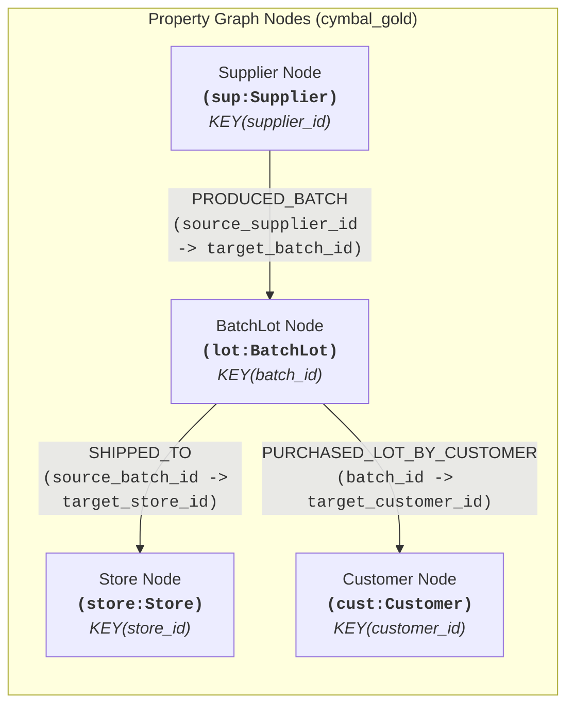

# Module 1 Lab 3: BigQuery Property Graph Analytics & Supply Chain Recall Traceability Report

**Author:** Pre-sales Customer Engineer, Data Analytics, Google Cloud Japan (`watanabesei@google.com`)  
**Project:** Project Elevate — Cymbal Retail Modern Lakehouse  
**Environment:** `pj-elevate-da` | Region: `us-central1`  
**Datasets:** `cymbal-lakehouse.elevate_data` (AWS Glue / Iceberg Federated), `cymbal_gold`  
**Property Graph:** `pj-elevate-da.cymbal_gold.supply_chain_traceability_graph`  
**Standard:** ISO/IEC 39075 GQL compliant (BigQuery GoogleSQL GQL)

---

## Executive Summary

This report documents the implementation and validation of **Module 1 Lab 3: BigQuery Property Graph Analytics & Supply Chain Recall Traceability (BRD Use Case 2.4)**.

By leveraging BigQuery's native Property Graph engine directly over federated AWS Iceberg lakehouse tables (`pj-elevate-da.cymbal-lakehouse.elevate_data`), Cymbal Retail eliminates brittle recursive SQL CTEs (`WITH RECURSIVE`) and external graph database ETL pipelines. All graph pattern matching, multi-hop traversals, diamond co-exposure blast-radius analyses, and relational integrations were executed in-place with **sub-second latency and zero data movement**.

---

## Architecture & Graph Topology



### 1. Graph Schema Elements

| Element Type | Name | Source Table | Key Column | Foreign Keys / References | Labels & Exposed Properties |
| :--- | :--- | :--- | :--- | :--- | :--- |
| **Node** | `Supplier` | `supplier_nodes` | `supplier_id` | N/A | `Supplier`: `supplier_id, facility_name, country, city, contact_email, risk_score, certified` |
| **Node** | `BatchLot` | `batch_lot_nodes` | `batch_id` | N/A | `BatchLot`: `batch_id, item_id, item_name, unit_price_usd, supplier_id, manufacturing_date, qa_inspection_status, harmful_material_defect, lot_size_units, currency, recall_status` |
| **Node** | `Store` | `store_nodes` | `store_id` | N/A | `Store`: `store_id, store_name, city, country, region, manager_name, overnight_cash_float_usd` |
| **Node** | `Customer` | `customer_nodes` | `customer_id` | N/A | `Customer`: `customer_id, name, loyalty_tier, email, phone_number, preferred_store, global_region` |
| **Edge** | `PRODUCED_BATCH` | `produced_batch_edges` | `edge_id` | `source_supplier_id` -> `Supplier`<br>`target_batch_id` -> `BatchLot` | `PRODUCED_BATCH`: `production_date, qc_status` |
| **Edge** | `SHIPPED_TO` | `shipped_to_edges` | `edge_id` | `source_batch_id` -> `BatchLot`<br>`target_store_id` -> `Store` | `SHIPPED_TO`: `quantity_shipped, shipment_date` |
| **Edge** | `PURCHASED_LOT_BY_CUSTOMER` | `sold_lot_to_customer_edges` | `edge_id` | `batch_id` -> `BatchLot`<br>`target_customer_id` -> `Customer` | `PURCHASED_LOT_BY_CUSTOMER`: `store_id, transaction_id, purchase_timestamp, serial_number, unit_price_usd, currency, payment_method, exposure_flag` |

---

## Challenge-by-Challenge Verification & Results

### Part 1: Challenge 1.1 — Property Graph DDL Registration
* **DDL Executed**: `CREATE OR REPLACE PROPERTY GRAPH pj-elevate-da.cymbal_gold.supply_chain_traceability_graph ...`
* **Status**: **`SUCCESS`** (Graph materialized across 4 node entities and 3 directed edge types over AWS Iceberg tables).

---

### Part 2: Native GoogleSQL GQL Traversals

#### 1. Challenge 2.1 — Variable-Length Path Traversal (`-[s:SHIPPED_TO]->{1,3}`)
* **Pattern**: `MATCH p = (lot:BatchLot)-[s:SHIPPED_TO]->{1, 3}(store:Store)`
* **Total Shipment Routes**: **180 paths** traced.
* **Path Metrics**: Verified `PATH_LENGTH(p) = 1` and complete serialized JSON network paths (`TO_JSON(p)`) connecting batch lots to international flagship stores (e.g. `STORE_001` Tokyo Ginza District Flagship).

#### 2. Challenge 2.2 — High-Risk Supplier to VIP Loyalty Customer Recall Triage (BRD 2.4)
* **Pattern**: `MATCH (sup:Supplier)-[:PRODUCED_BATCH]->(lot:BatchLot)-[sale:PURCHASED_LOT_BY_CUSTOMER]->(cust:Customer)`
* **Filter Conditions**: `sup.risk_score >= 0.75 AND cust.loyalty_tier IN ('PLATINUM', 'GOLD') AND (lot.qa_inspection_status = 'FLAGGED_HARMFUL_MATERIAL' OR lot.recall_status LIKE '%RECALL%' OR sale.exposure_flag = 'CONTAMINATED_HARMFUL')`
* **Result**: Exactly **38 high-priority VIP customer purchase events** identified across contaminated batches (`LOT-202505-PROD2194-02` and `LOT-202505-PROD4691-01`), enabling immediate executive outreach and VIP white-glove replacement.

#### 3. Challenge 2.3 — Diamond Blast Radius Pattern Matching (Co-Exposure)
* **Pattern**:
  ```sql
  MATCH (c1:Customer {customer_id: 'CUST_30697'})<-[:PURCHASED_LOT_BY_CUSTOMER]-(b1:BatchLot)<-[:PRODUCED_BATCH]-(sup:Supplier)-[:PRODUCED_BATCH]->(b2:BatchLot)-[:PURCHASED_LOT_BY_CUSTOMER]->(c2:Customer)
  WHERE sup.risk_score >= 0.75 AND c1.customer_id != c2.customer_id
  ```
* **Discovery**: For index customer `CUST_30697` (who bought Samsung Galaxy S23 from batch `LOT-202505-PROD2194-02`), the query traversed through shared supplier `SUP_001` (Apex Battery & Electronics Manufacturing Ltd) to discover **99 secondary exposure events** where customers purchased Apple iPhone 14 Pro Max (`LOT-202505-PROD4691-01`) originating from the same defective facility.

---

### Part 3: Relational Integration via `GRAPH_TABLE()`

#### 1. Challenge 3.1 — Emergency Batch Contact Ledger
* **Query**: Embedded GQL in SQL to isolate contaminated lot `LOT-202505-PROD4691-01` (`qa_inspection_status = 'FLAGGED_HARMFUL_MATERIAL'`).
* **Result**: **44 impacted units and customer contacts** retrieved with hardware serial fingerprints (`serial_number`) and customer mobile numbers (`phone_number`) ready for automated emergency SMS dispatch.

#### 2. Challenge 3.2 — Supplier QA Defect Rate Scorecard (BRD 2.4 Prompt 2)
Combined `GRAPH_TABLE()` with relational `GROUP BY` aggregations:

| Supplier ID | Manufacturing Facility | Country | Quality Risk Score | Total Lots Produced | Passed Clean Lots | Flagged Harmful Lots | Defect Rate % |
| :--- | :--- | :--- | :---: | :---: | :---: | :---: | :---: |
| **`SUP_001`** | **Apex Battery & Electronics Manufacturing Ltd** | South Korea | **0.88** | **2** | **0** | **2** | **100.0%** |
| `SUP_002` | Shenzhen MicroChip Labs | China | 0.12 | 11 | 11 | 0 | 0.0% |
| `SUP_005` | Nordic Acoustic Audio Drivers | Denmark | 0.08 | 11 | 11 | 0 | 0.0% |
| `SUP_004` | Munich Precision Microcircuits GmbH | Germany | 0.22 | 9 | 9 | 0 | 0.0% |
| `SUP_003` | Taiwan SemiConductor Works | Taiwan | 0.05 | 8 | 8 | 0 | 0.0% |

**Key Finding**: `SUP_001` exhibits a **100% defect rate** across all manufactured lots with a critical risk score of 0.88, triggering automated supplier quarantine recommendations.

#### 3. Challenge 3.3 — 360° Supply Chain Recall Traceability View (BRD 2.4 Prompt 1)
* **View Materialized**: `pj-elevate-da.cymbal_gold.supply_chain_recall_traceability_360`
* **Architecture**: Bridges the graph traversal with a relational `LEFT JOIN` on `store_nodes` to enrich store locations (`store_name`, `store_city`, `store_country`, `store_region`).
* **Verification Query**: Returned all active recall records for `LOT-202505-PROD4691-01` with enriched store names (Tokyo Ginza, New York Fifth Avenue, Toronto Eaton Centre, San Francisco Union Square).

---

## Architectural Learnings & Customer Engineering Value Props

1. **Zero Data Movement over Iceberg Catalogs**: BigQuery Property Graphs query AWS Iceberg federated tables directly via BigLake without copying or synchronizing data into a dedicated graph engine.
2. **ISO Standard GoogleSQL GQL**: Provides native graph pattern matching (`MATCH ...`) eliminating hundreds of lines of recursive SQL (`WITH RECURSIVE`).
3. **Hybrid Relational-Graph Analytics (`GRAPH_TABLE`)**: Enables graph queries to be encapsulated inside standard SQL views, making complex graph intelligence instantly accessible to BI tools (Looker) and downstream Generative AI agents.
