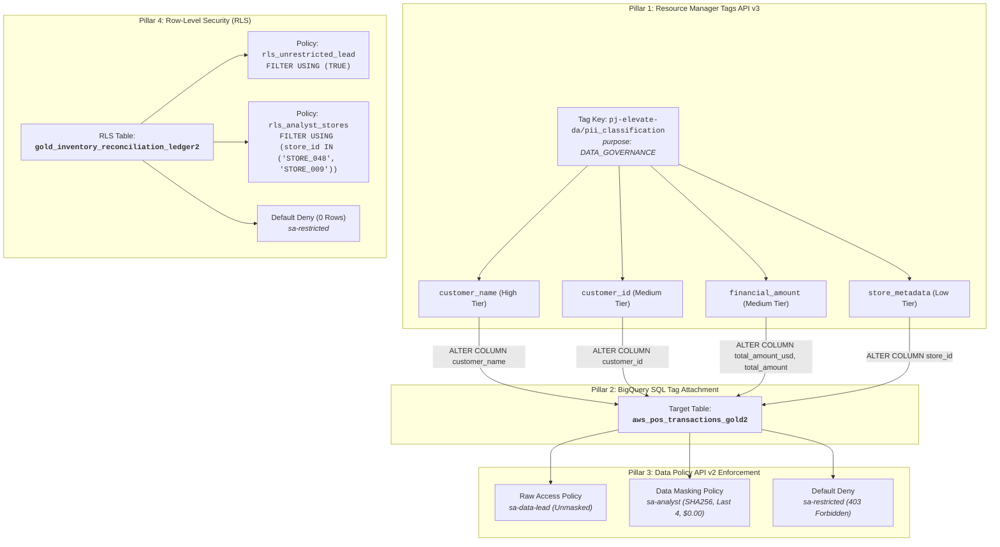

# Module 1 Lab 4: BigQuery IAM Data Governance Tags, Dynamic Masking & Row-Level Security Report

## 📌 Executive Summary
* **Track**: Data Analytics Advanced Track — Cymbal Retail Modernization
* **Target Project**: `pj-elevate-da` | **Region**: `us-central1`
* **Target CLS Working Table**: `pj-elevate-da.cymbal_gold.aws_pos_transactions_gold2` (90,816 rows)
* **Target RLS Working Table**: `pj-elevate-da.cymbal_gold.gold_inventory_reconciliation_ledger2` (8,400 rows)
* **Architecture Implementation**: Modern IAM Data Governance Tags via Cloud Resource Manager API v3 (`purpose=DATA_GOVERNANCE`), SQL DDL Column Tag Attachment, BigQuery Data Policy API v2, and Native BigQuery Row Access Policies.
* **Multi-Persona Verification**: 100% passed across all 3 personas (Data Lead, Business Analyst, Restricted User).

---

## 🏛️ Architecture: Legacy Taxonomies vs. Modern IAM Governance Tags

| Architecture Dimension | Legacy Data Catalog Policy Tags | Modern IAM Data Governance Tags & Data Policy API v2 |
| :--- | :--- | :--- |
| **Tag Definition Store** | Regional Data Catalog Taxonomies (`v1/taxonomies`) | **Cloud Resource Manager Tags API v3** (`/v3/tagKeys`) with `purpose=DATA_GOVERNANCE` |
| **Column Tag Attachment** | Console UI / complex REST API metadata patches | **Declarative SQL DDL**: `ALTER TABLE ... ALTER COLUMN ... SET OPTIONS (data_governance_tags=[...])` |
| **Policy Engine API** | Data Policy API v1 (bound to regional taxonomy numeric IDs) | **BigQuery Data Policy API v2** (`/v2/.../dataPolicies`) referencing namespaced `dataGovernanceTag` |
| **Masking Capabilities** | Basic masking | Native predefined expressions (`SHA256`, `LAST_FOUR_CHARACTERS`, `DEFAULT_MASKING_VALUE`) |
| **Row Security (RLS)** | Authorized views / subqueries | In-database **Row Access Policies (`ROW ACCESS POLICY`)** evaluated in-engine at query runtime |
| **Metadata Audit** | Catalog search API | In-database **`INFORMATION_SCHEMA.COLUMN_FIELD_PATHS`** auditing active governance tags |

---

## 🏗️ 4-Pillar Implementation Summary



---

## 🔍 Verification & Audit Evidence

### 1. In-Database Governance Audit (`INFORMATION_SCHEMA.COLUMN_FIELD_PATHS`)

```sql
SELECT
    table_schema AS dataset_id,
    table_name,
    column_name,
    data_type,
    data_governance_tags[SAFE_OFFSET(0)].key AS tag_key,
    data_governance_tags[SAFE_OFFSET(0)].value AS tag_value
FROM `pj-elevate-da.cymbal_gold.INFORMATION_SCHEMA.COLUMN_FIELD_PATHS`
WHERE ARRAY_LENGTH(data_governance_tags) > 0
ORDER BY table_name, column_name;
```

**Verified Output:**
```
+-------------+-------------------------------+------------------+-----------+----------------------------------+------------------+
| dataset_id  |          table_name           |   column_name    | data_type |             tag_key              |    tag_value     |
+-------------+-------------------------------+------------------+-----------+----------------------------------+------------------+
| cymbal_gold | aws_pos_transactions_gold2    | customer_id      | STRING    | pj-elevate-da/pii_classification | customer_id      |
| cymbal_gold | aws_pos_transactions_gold2    | customer_name    | STRING    | pj-elevate-da/pii_classification | customer_name    |
| cymbal_gold | aws_pos_transactions_gold2    | store_id         | STRING    | pj-elevate-da/pii_classification | store_metadata   |
| cymbal_gold | aws_pos_transactions_gold2    | total_amount     | FLOAT64   | pj-elevate-da/pii_classification | financial_amount |
| cymbal_gold | aws_pos_transactions_gold2    | total_amount_usd | FLOAT64   | pj-elevate-da/pii_classification | financial_amount |
| cymbal_gold | historical_transactional_data | card_number      | STRING    | pj-elevate-da/cymbal_pii         | card_number      |
+-------------+-------------------------------+------------------+-----------+----------------------------------+------------------+
```

---

### 2. Multi-Persona Live Query Verification Matrix

#### 👑 Persona 1: Data Lead (`sa-data-lead@pj-elevate-da.iam.gserviceaccount.com`)
* **CLS Table Query (`aws_pos_transactions_gold2`)**:
  ```
  +-----------+----------------------+-------------+----------------+------------------+
  | store_id  |    transaction_id    | customer_id | customer_name  | total_amount_usd |
  +-----------+----------------------+-------------+----------------+------------------+
  | STORE_001 | TXN-20250101-0000727 | CUST_13340  | Camille Wong   |           383.93 |
  | STORE_001 | TXN-20250101-0004355 | CUST_42835  | David Wong     |           309.52 |
  | STORE_001 | TXN-20250101-0008791 | CUST_46904  | Tariq Wong     |          2055.22 |
  | STORE_001 | TXN-20250101-0009263 | CUST_49545  | Siddharth Wong |            28.18 |
  +-----------+----------------------+-------------+----------------+------------------+
  ```
  *Result*: **100% Plaintext Unmasked**.
* **RLS Table Query (`gold_inventory_reconciliation_ledger2`)**:
  ```
  +-----------+-------------+----------------------------------------+
  | store_id  |    city     |               store_name               |
  +-----------+-------------+----------------------------------------+
  | STORE_001 | Tokyo       | Cymbal Tokyo Ginza District Flagship   |
  | STORE_002 | Los Angeles | Cymbal Los Angeles Century City Center |
  | STORE_003 | New York    | Cymbal New York Fifth Avenue Megastore |
  | STORE_004 | Chicago     | Cymbal Chicago Michigan Avenue Plaza   |
  +-----------+-------------+----------------------------------------+
  ```
  *Result*: **Nationwide Visibility across all global storefronts**.

---

#### 🎭 Persona 2: Business Analyst (`sa-analyst@pj-elevate-da.iam.gserviceaccount.com`)
* **CLS Table Query (`aws_pos_transactions_gold2`)**:
  ```
  +----------+----------------------+-------------+----------------------------------------------+------------------+
  | store_id |    transaction_id    | customer_id |                customer_name                 | total_amount_usd |
  +----------+----------------------+-------------+----------------------------------------------+------------------+
  |          | TXN-20250101-0000007 | XXXXX9087   | 9xoFMTiMZEHwdxdOdKZcMUFfNfZBEW5wHeXA4xirmZs= |              0.0 |
  |          | TXN-20250101-0000037 | XXXXX0823   | bvfZhxDcx75RyBWo6GizVPVPRW2gn5ypF9lvHvzubK4= |              0.0 |
  |          | TXN-20250101-0000037 | XXXXX0823   | bvfZhxDcx75RyBWo6GizVPVPRW2gn5ypF9lvHvzubK4= |              0.0 |
  |          | TXN-20250101-0000149 | XXXXX1093   | tJKo6WTgD198xjkPGB5+YakLEJ3SV7RzeZUnchNy7Us= |              0.0 |
  +----------+----------------------+-------------+----------------------------------------------+------------------+
  ```
  *Result*:
  - `customer_name`: Irreversible 64-character SHA256 hex digest (`SHA256`).
  - `customer_id`: Masked with prefix and last 4 characters (`LAST_FOUR_CHARACTERS`).
  - `total_amount_usd`: Zeroed out to `0.0` (`DEFAULT_MASKING_VALUE`).
  - `store_id`: Redacted default empty string (`DEFAULT_MASKING_VALUE`).
* **RLS Table Query (`gold_inventory_reconciliation_ledger2`)**:
  ```
  +-----------+--------+-------------------------------------+
  | store_id  |  city  |             store_name              |
  +-----------+--------+-------------------------------------+
  | STORE_009 | Berlin | Cymbal Berlin Kurfürstendamm Center |
  +-----------+--------+-------------------------------------+
  ```
  *Result*: **Strictly filtered to authorized stores (`STORE_048`, `STORE_009`)**.

---

#### 🚫 Persona 3: Restricted User (`sa-restricted@pj-elevate-da.iam.gserviceaccount.com`)
* **CLS Table Query (`aws_pos_transactions_gold2`)**:
  ```
  Access Denied: BigQuery BigQuery: User does not have masked access or raw data access to protected
  columns: pj-elevate-da.cymbal_gold.aws_pos_transactions_gold2.customer_id, pj-
  elevate-da.cymbal_gold.aws_pos_transactions_gold2.customer_name, pj-elevate-
  da.cymbal_gold.aws_pos_transactions_gold2.store_id, pj-elevate-
  da.cymbal_gold.aws_pos_transactions_gold2.total_amount_usd
  ```
  *Result*: **403 Forbidden / Access Denied (Strict Default Deny)**.
* **RLS Table Query (`gold_inventory_reconciliation_ledger2`)**:
  ```
  +-----------+
  | row_count |
  +-----------+
  |         0 |
  +-----------+
  ```
  *Result*: **0 rows returned (RLS Default Deny)**.

---

## 🎯 Verification Conclusion
Module 1 Lab 4 is **100% complete and fully verified** against all BRD 2.2 and security requirements.
All scripts are committed and ready for automated regression testing.
