# **SOLUTION DESIGN DOCUMENT — CYMBAL RETAIL**
## **Agentic AI & Data Platform Modernization Initiative**

---

# **Document Control**

## **Document Metadata**

| Field | Value |
| :---- | :---- |
| **Customer** | Cymbal Retail |
| **Project** | Agentic AI & Data Platform Modernization Pilot |
| **Author(s)** | Google Cloud Customer Engineering & Architecture Team |
| **Date** | September 2026 |
| **Status** | Draft / Under Architecture Review |
| **Target Audience** | Evaluation Committee, Lead Architects, CIO, VP of Data Engineering |
| **Target Cloud Project** | `pj-elevate-da` (`us-central1`) |

## **Revision History**

| Version | Date | Author | Description of Change |
| :--- | :--- | :--- | :--- |
| 1.0 | 2026-09-08 | Google Cloud CE Team | Initial end-to-end Solution Design Document based on BRD v3.0 |

---

# **1. Problem Statement & Scope Boundaries**

## **1.1. Problem Statement**

### **What problem are we solving?**
Cymbal Retail operates 500+ physical storefronts and a global e-commerce portal. The current data platform, hosted on AWS and Databricks, suffers from five critical architectural bottlenecks:
1. **Escalating Cross-Cloud Data Egress & Silos:** Data replication and extraction between cloud object stores (S3) and downstream engines trigger high egress bills and synchronize fragmented, out-of-date reporting tables.
2. **High Cluster Tax & Infrastructure Overhead:** Managing dedicated Apache Spark clusters on Databricks requires ongoing operational maintenance and incurs billing during idle hours ($0 idle compute is not achieved).
3. **24-Hour Batch Latency & Operational Blind Spots:** POS transaction logs and store inventories are reconciled in nightly 24-hour batches. This creates severe operational blind spots for store managers, preventing timely detection of checkout cashier promotion abuse and inventory shrinkage.
4. **Dark Unstructured Data & Manual Troubleshooting:** Critical store operations documentation (POS terminal service manuals, customer warranty guidelines) is trapped in unstructured PDFs on S3. Store staff cannot quickly query operational metrics, real-time alert streams, or technical manuals via natural language.
5. **Fragmented Multi-System Juggling & Unprotected PII:** Store staff must manually cross-reference disconnected BI dashboards, SQL databases, and paper policies, while customer credit card numbers are exposed across unmasked reports and logs.

### **Who is affected?**
* **Store Managers (500+ locations):** Unable to view real-time sales anomalies, intraday ATP (Available-To-Promise) inventory, or cashier promotion override spikes during operating hours.
* **Cashiers & Floor Technicians:** Lacking immediate troubleshooting procedures when POS hardware or EMV payment gateways fail.
* **Supply Chain Planners & Data Analysts:** Forced to write complex SQL, navigate fragmented dashboards, and manually reconcile inventory discrepancies.
* **Cloud Operations & FinOps:** Strained by cloud cluster maintenance and unpredictable cross-cloud egress charges.

### **What is the impact?**
* **Financial Loss:** Undetected cashier promotion abuse and inventory shrinkage persist for up to 24 hours before detection.
* **Operational Inefficiency:** Cashier checkout lines stall during POS hardware errors due to manual binder-based troubleshooting.
* **Customer Friction:** Warranty claims at checkout take minutes to verify manually against conflicting documentation.
* **High TCO:** Redundant cloud infrastructure and idle compute clusters inflate the data platform budget.

### **Why now?**
Cymbal Retail is undergoing an enterprise-wide retail modernization. Modernizing to an open-format, serverless lakehouse with real-time streaming intelligence and an Agentic AI operations assistant will eliminate operational blind spots, cut infrastructure costs, and empower store employees with conversational self-service analytics.

---

## **1.2. Scope Boundaries**

### ***In Scope for Solution***
* **Data Foundations & Lakehouse Federation:**
  * Zero-copy federated querying of AWS S3 Apache Iceberg tables via BigLake Lakehouse Runtime Catalog.
  * Serverless PySpark batch ETL on Dataproc Serverless for nightly sales deduplication and inventory reconciliation ($0 idle compute).
  * Storage, multimodal knowledge mining, and governance of unstructured documentation (POS manuals and warranty policies in GCS) using the KC Enrichment Agent, Open Knowledge Format (OKF v0.1), Dataplex Knowledge Catalog, and BigQuery Object Tables for direct PDF page deep-links.
* **Real-Time Operations & Streaming Intelligence:**
  * Real-time POS transaction ingestion via Google Cloud Managed Service for Apache Kafka (`pos-transactions` topic).
  * 1-hour sliding-window cashier promotion override aggregations.
  * In-flight ML inference (<50ms) using Vertex AI Model Endpoints (`order-anomaly-endpoint`, `cashier-abuse-endpoint`).
  * Low-latency operational cache persistence in Cloud Bigtable (`operations-db`) for near real-time sub-second point-lookups.
* **Agentic Operations Portal (ADK & Custom Web App):**
  * Built on **Agent Development Kit (ADK)** with a custom web frontend (Streamlit / Next.js on Cloud Run), featuring an ADK Coordinator Router Agent routing to:
    1. **ADK Analytical Sub-Agent (BigQuery Conversational Analytics API):** Leverages `geminidataanalytics.googleapis.com` with configured `DataAgent` context, default instructions, verified queries (golden queries), and `bigquery_max_billed_bytes` FinOps safeguards. Emits natural language insights along with transparent, inspectable SQL queries to the frontend.
    2. **Operational Cache Sub-Agent:** Executes targeted Bigtable point-lookups for live store alerts and hourly cashier metrics.
    3. **Grounded Knowledge Sub-Agent (OKF & Knowledge Catalog MCP):** Structured concept resolution over Open Knowledge Format (OKF v0.1) documentation and warranty policies via Dataplex Knowledge Catalog MCP, with certified concept verification (`certified=true`) and direct GCS PDF page deep-links.
* **Enterprise Security & Governance:**
  * Central metadata governance, OKF entry groups, and policy tagging via Dataplex Knowledge Catalog.
  * Dynamic PII data masking on customer credit card numbers (`XXXX-XXXX-XXXX-9999`) across query logs and chat responses.
  * Row-Level Security (RLS) enforcing store-level isolation based on delegated user identity tokens.

### ***Out of Scope for Solution***
* Direct multi-cloud write-backs to AWS S3 or regional store databases (strictly read-only federation).
* Direct agent connection to supply chain graph dataset (UC-2.4 is queried directly via BigQuery Notebooks by data analysts; the Module 3 conversational agent does not connect to graph).
* Multi-lingual conversational support (English only for pilot).
* Voice, telephony, or IVR system integration.
* Production Single Sign-On (SSO) IdP synchronization (uses mock JWT identity headers and functional GCP IAM service accounts).
* Multi-tenant logical isolation beyond store-level RLS.

---

## **1.3. Target Architecture Overview**

To systematically resolve the legacy limitations and deliver on Cymbal Retail's modernization objectives, this section first details the **Current State Architecture** and its core operational bottlenecks, maps our strategic modernization pillars directly to each pain point, and transitions seamlessly into the end-to-end **Target Architecture**.

### **1.3.1. Current State Technical Overview & Architecture Diagram**
Cymbal Retail's existing data platform is hosted primarily on **AWS and Databricks**:
* **Storage & Lakehouse:** Raw, semi-structured, and conformed data is stored in AWS S3 in open Apache Iceberg format. Unstructured store POS terminal repair manuals and customer warranty documents are stored as static PDFs in separate S3 buckets.
* **Batch & Compute Fabric:** Dedicated Databricks Apache Spark clusters execute nightly ETL batch pipelines (POS sales deduplication, discount reconciliation, inventory conformance across 500+ storefronts). A Databricks SQL Warehouse provides BI serving.
* **Catalog & Metastore:** AWS Glue Data Catalog manages metadata, Iceberg table definitions, and basic column permissions.
* **Reporting & Consumption:** Tableau dashboards refresh once per day to deliver high-level executive sales summaries.
* **Field Operations:** 500+ physical stores operate isolated POS terminals, uploading transactional logs in daily end-of-day batch files. Cashiers and store managers rely on printed binders and static PDF repositories to resolve terminal errors and customer warranty disputes.

The diagram below illustrates the current data flow and highlights the **five major architectural bottlenecks** that impede real-time store operations and AI-driven analytics:

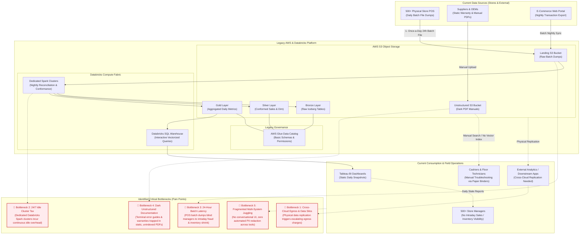

---

### **1.3.2. Bottleneck Analysis & Strategic Proposal Mapping**

The following matrix maps each identified current-state bottleneck directly to Cymbal Retail's future vision, our proposed Google Cloud architectural pillar, and the specific mechanism delivering the solution:

| Bottleneck ID | Current Architectural Limitation & Pain Point | Cymbal Retail's Envisioned Goal | Google Cloud Proposed Solution Pillar | Specific Modernization Mechanism & Impact |
| :--- | :--- | :--- | :--- | :--- |
| **BN-1: Cross-Cloud Egress & Data Silos** | Data must be physically replicated across systems and cloud boundaries for analytical access, generating steep AWS egress charges and out-of-sync duplicate tables. | Zero-copy unified access to all enterprise Iceberg tables without data duplication or cross-cloud data transfer fees. | **BigLake Lakehouse Federation (Cross-Cloud Lakehouse)** | BigLake connects directly to the remote AWS Glue REST Catalog, executing vectorized queries in-place on S3 Iceberg files. **0 Bytes replicated; $0 egress data duplication tax.** |
| **BN-2: Idle Cluster Tax & Management Overhead** | Dedicated Databricks Spark clusters run continuously or require manual resizing for nightly 45-minute batch jobs, resulting in substantial idle compute costs and administrative burden. | Automated, self-managing data engineering pipelines that scale compute dynamically and incur **$0 cost when idle**. | **Dataproc Serverless for Apache Spark & Cloud Composer 3** | Serverless Spark jobs launch on-demand to perform inventory conformance and sales deduplication, automatically terminating $<60$ seconds post-job. Eliminates dedicated cluster maintenance and eliminates 100% of idle cluster spend. |
| **BN-3: 24-Hour Batch Latency & Operational Blind Spots** | POS transactions from 500+ stores are dumped once per day in batch files. Intraday cashier promotion abuse, order anomalies, and inventory stockouts remain undetected for up to 24 hours. | Real-time event streaming with instant anomaly scoring and low-latency operational lookups for store managers during open business hours. | **Streaming Intelligence Fabric (Managed Kafka + In-Flight Scoring + Bigtable)** | **Google Cloud Managed Service for Apache Kafka** ingests POS streams in real time; stream processing computes 1-hour sliding-window cashier aggregations; **Vertex AI Endpoints** score transactions in-flight ($<50$ms); **Cloud Bigtable (`operations-db`)** provides sub-10ms point lookups for store managers. |
| **BN-4: Dark Unstructured Documentation & Context Fragmentation** | POS terminal repair manuals and warranty policies reside as unindexed, static PDFs in S3. Standard chunked vector RAG breaks multi-page operational procedures (e.g. EMV freeze double-charge safeguards, Iceberg manifest flushes) and misses multi-tier warranty clauses. | Holistic knowledge mining and structured natural language diagnostic assistance over all manuals and warranties with verified procedural fidelity and clickable citations. | **Open Knowledge Format (OKF v0.1) & Dataplex Knowledge Catalog (KC) via MCP** | The **Knowledge Catalog Enrichment Agent (Gemini Multimodal)** ingests full PDFs into structured **OKF Markdown bundles** (`*.md` + YAML frontmatter) staged into **Dataplex Knowledge Catalog** with `certified = true`. Downstream agents traverse complete, structured concept workflows via the **Knowledge Catalog MCP server**, guaranteeing zero procedural truncation. Raw PDFs in BigLake Object Tables provide deep-link page citations. |
| **BN-5: Fragmented Juggling & Unprotected PII** | Store staff must manually cross-reference disconnected BI dashboards, SQL databases, and paper policies; customer credit card numbers are exposed in raw logs and reports. | A unified conversational operations portal orchestrating structured, unstructured, and streaming data with automated dynamic PII masking and role-based access. | **Agentic Operations Portal & Dataplex Governance** | **Coordinator Router Agent** dynamically routes queries across specialized SQL, Bigtable, and Knowledge sub-agents. **BigQuery Data Policy (`mask_card_number`)** dynamically redacts credit cards (`XXXX-XXXX-XXXX-9999`) across all responses, while **Row-Level Security (RLS)** restricts store managers to their store domain. |

---

### **1.3.3. Target Architecture Diagram & End-to-End Flow**

Directly resolving each of the five bottlenecks above, the target architecture integrates open data formats, serverless data engineering, sub-second streaming pipelines, governed metadata-as-code via Open Knowledge Format (OKF), and an agentic multi-system orchestration fabric:

```mermaid
flowchart TB
    subgraph Sources ["External & Source Systems"]
        S3["AWS S3 Iceberg Tables\n(Customer, Product, Sales, Gold Metrics)"]
        POS_Stream["Store POS Terminals (50 Stores)\nReal-time JSON Transactions"]
        PDFs["Technical Manuals & Warranties\n(PDFs)"]
    end

    subgraph Ingestion_Prep ["Ingestion & Pre-Processing Layer"]
        Kafka["Managed Service for Apache Kafka\nTopic: pos-transactions"]
        GCS["Cloud Storage Bucket\ngs://pj-elevate-da-module1-bucket\n(Raw PDFs & Iceberg Data)"]
        EnrichAgent["<b>KC Enrichment Agent (Gemini)</b>\nHolistic Multimodal PDF Mining"]
        OKF_Bundles["<b>OKF v0.1 Bundles (*.md)</b>\nYAML Frontmatter + Structured Body"]
        
        PDFs --> GCS
        POS_Stream --> Kafka
        GCS --> EnrichAgent
        EnrichAgent --> OKF_Bundles
    end

    subgraph Processing_Serving ["Compute, Storage & Serving Layer"]
        direction TB
        Dataproc["Dataproc Serverless PySpark\nNightly Inventory Conformance & Deduplication"]
        StreamProc["Stream Processor / In-Flight Scoring\n(1-Hour Sliding Window Aggregations)"]
        
        subgraph ML_Endpoints ["Vertex AI Model Serving"]
            Endpoint_Anomaly["order-anomaly-endpoint\n(<50ms Latency)"]
            Endpoint_Abuse["cashier-abuse-endpoint\n(<50ms Latency)"]
        end

        Bigtable[("Cloud Bigtable\noperations-db\n(Real-Time Cache)")]
        
        subgraph BigQuery_Fabric ["BigQuery Analytics Fabric"]
            Catalog["Lakehouse Runtime Catalog\n(Federated to AWS Glue / S3)"]
            BQ_Bronze["Dataset: cymbal_bronze"]
            BQ_Silver["Dataset: cymbal_silver\n(Streaming POS & Alerts)"]
            BQ_Gold["Dataset: cymbal_gold\n(Conformed Ledger & Models)"]
            BQ_ObjectTable["Dataset: module1_unstructureddata\n(Object Table for GCS Deep-Links)"]
            Catalog --> BQ_Silver
        end
        
        Kafka --> StreamProc
        StreamProc --> Endpoint_Anomaly
        StreamProc --> Endpoint_Abuse
        StreamProc --> Bigtable
        StreamProc --> BQ_Silver
        S3 -.->|Zero-Copy Federation| Catalog
        Dataproc --> BQ_Gold
        GCS --> BQ_ObjectTable
    end

    subgraph Security_Gov ["Enterprise Security & Governance Layer"]
        Dataplex["<b>Dataplex Knowledge Catalog (KC)</b>\n• Certified Asset Metadata (certified=true)\n• OKF Custom Entry Groups & Aspects\n• Policy Tags & Taxonomy"]
        DataMasking["Dynamic Data Policy\nmask_card_number (PII Redaction)"]
        RLS["Row-Level Security (RLS)\nStore Manager Token Enforcement"]
        OKF_Bundles -->|kcmd push --format okf| Dataplex
        BigQuery_Fabric --- Dataplex
        BigQuery_Fabric --- DataMasking
        BigQuery_Fabric --- RLS
    end

    subgraph Agentic_Layer ["Agentic Operations Portal (ADK & Custom Web App)"]
        direction TB
        UI["Store Operations Custom Web App\n(Streamlit / Next.js on Cloud Run)\n• Natural Language Chat\n• Expandable 'Inspect SQL' Drawer\n• Real-Time Alert Banners"]
        
        Coordinator["ADK Coordinator Router Agent\n(Intent Routing & Multi-Turn State)"]
        KC_MCP["<b>Knowledge Catalog MCP Server</b>\n(kcmd mcp Tool Gateway)"]
        
        subgraph Specialized_Subagents ["ADK Specialized Sub-Agents"]
            CA_SubAgent["<b>ADK Analytical Sub-Agent</b>\nConversational Analytics Tool\n(geminidataanalytics.googleapis.com)"]
            Cache_Agent["Operational Cache Sub-Agent\n(Bigtable Client)"]
            Knowledge_Agent["<b>Grounded Knowledge Sub-Agent</b>\n(OKF Concept Graph & Citations)"]
        end

        UI <--> Coordinator
        Coordinator <--> CA_SubAgent
        Coordinator <--> Cache_Agent
        Coordinator <--> Knowledge_Agent
        
        CA_SubAgent -->|DataAgent API / Managed GoogleSQL| BigQuery_Fabric
        Cache_Agent --> Bigtable
        Knowledge_Agent <--> KC_MCP
        KC_MCP <--> Dataplex
        GCS -.->|Raw PDF Page URL Deep-Links| Knowledge_Agent
    end
```

### **Component Descriptions**

| Component | Responsibility | Proposed Technology | Interfaces / Protocols |
| :--- | :--- | :--- | :--- |
| **Lakehouse Federation** | Zero-copy SQL querying of remote AWS S3 Iceberg datasets without physical replication or egress. | BigLake Iceberg Catalog & BigQuery Connection | REST Catalog, Iceberg v2 format, AWS S3 API |
| **Serverless Batch ETL** | Nightly inventory conformance and sales deduplication jobs; automatically scales to zero when idle. | Dataproc Serverless for Apache Spark | PySpark, Cloud Composer 3 Airflow DAGs |
| **Streaming Ingestion** | Real-time POS transaction ingestion from 50 stores with high throughput and partition distribution. | Managed Service for Apache Kafka | Kafka Client protocol (SASL/PLAIN, port 9092) |
| **In-Flight Scoring & Stream Analytics** | Sliding-window (1-hr) cashier aggregations and low-latency anomaly inference. | Managed Stream Consumer / Cloud Run / Dataproc | Kafka Consumer API, Vertex AI Prediction REST API |
| **Low-Latency Operational Cache** | Sub-second point-lookups for live cashier override counts, fraud alerts, and store operational telemetry. | Cloud Bigtable (`operations-db`) | Bigtable gRPC API, CBT CLI |
| **Enterprise Analytics Fabric & Conversational API** | Curated dimensional tables, ML models, and high-concurrency SQL analytics via managed natural language query interface. | BigQuery (`gql-query-reservation`) & BigQuery Conversational Analytics API | GoogleSQL, REST / gRPC (`geminidataanalytics.googleapis.com`) |
| **Knowledge Mining & OKF Engine** | Ingests complex PDFs into structured OKF concept bundles with YAML frontmatter; compiles certified knowledge. | KC Enrichment Agent (Vertex AI Gemini Multimodal) & OKF v0.1 | Python, Gemini Multimodal API, OKF v0.1 spec |
| **Knowledge Catalog MCP & Governance** | Central metadata certification, column policy tagging, OKF custom entry groups, and MCP agent tool gateway. | Dataplex Knowledge Catalog & `kcmd` MCP Server | Dataplex Catalog API, MCP JSON-RPC, `certified=true` tags |
| **Data Privacy & Security** | Dynamic PII masking (`mask_card_number`) and row-level filtering based on delegated identity. | BigQuery Data Policy & BigQuery RLS | IAM, BigQuery Data Policy API, GoogleSQL `CURRENT_USER()` |
| **Agentic Operations Portal & Custom Web App** | Multi-agent framework managing specialized sub-agents with guardrails, inspectable SQL generation, and citation rendering. | Agent Development Kit (ADK) & Custom Web Frontend (Cloud Run) | REST / WebSocket, OpenAPI & MCP Tool Specs |

---

## **1.4. Alternatives Considered**

| Architecture Decision / Area | Alternative Evaluated | Chosen Approach | Rationale & Trade-offs |
| :--- | :--- | :--- | :--- |
| **Cross-Cloud Lakehouse Access** | **Physical Batch Replication (AWS S3 $\rightarrow$ GCS via Storage Transfer)** | **BigLake Iceberg REST Catalog Federation** | *Rationale:* Eliminates cross-cloud egress fees and 24-hour sync latencies. BigLake executes zero-copy vectorised queries directly on S3 Iceberg metadata.<br>*Trade-off:* Read latencies depend on cross-cloud network throughput, mitigated by partition pruning. |
| **Batch Processing Compute** | **Persistent Databricks / Dataproc Compute Clusters** | **Dataproc Serverless for Spark** | *Rationale:* Avoids paying 24/7 "cluster tax" for nightly 45-minute reconciliation jobs. Compute scales to $0 immediately upon job completion.<br>*Trade-off:* Slight cold-start overhead (~45-60s) for batch startup, which is negligible for scheduled nightly ETL. |
| **Real-Time Event Ingestion** | **Self-Managed Apache Kafka on Compute Engine (GCE VMs)** | **Google Cloud Managed Service for Apache Kafka** | *Rationale:* Fully managed control plane, automated replication (RF=3), built-in VPC peering, zero OS patching or broker quorum maintenance.<br>*Trade-off:* Managed service pricing per vCPU/storage hour vs. raw VM compute. |
| **Operational Real-Time Cache** | **Cloud SQL for PostgreSQL / Memorystore Redis** | **Cloud Bigtable (`operations-db`)** | *Rationale:* Linear horizontal scalability, sub-10ms point-lookup reads under high store load, natural fit for time-series and windowed entity keys.<br>*Trade-off:* Requires disciplined rowkey design; does not support ad-hoc multi-table relational joins. |
| **Unstructured Document Retrieval (RAG)** | **Naive Single-Vector RAG (Fixed 500-token chunks with cosine similarity over raw PDFs)** | **Open Knowledge Format (OKF v0.1) & Dataplex Knowledge Catalog via MCP** | *Rationale:* Naive chunking fragments multi-page error workflows (e.g. EMV freeze double-charge safeguards, Iceberg manifest flushes) and multi-tier warranty clauses across chunk boundaries. OKF models knowledge holistically into structured Markdown concepts with YAML frontmatter, verified via GitOps, certified in Dataplex Knowledge Catalog (`certified = true`), and served deterministically via the Knowledge Catalog MCP server.<br>*Trade-off:* Requires an up-front enrichment step by the Gemini-powered Enrichment Agent, easily automated in CI/CD. |
| **Conversational Assistant Architecture** | **Monolithic Single-Prompt LLM with Massive Toolset** | **ADK Multi-Agent Orchestration (Coordinator Router + Sub-Agents)** | *Rationale:* Prevents tool selection confusion, isolates context windows, ensures specialized prompt instructions and business glossaries, and enforces grounding thresholds.<br>*Trade-off:* Requires orchestrator hop latency, mitigated by streaming output. |
| **Analytical SQL Generation** | **DIY Text-to-SQL Prompt Engineering (Raw LLM + Custom SQL Runner Tool)** | **BigQuery Conversational Analytics API baked into ADK** | *Rationale:* DIY Text-to-SQL suffers from schema drift, hallucinated table joins, lack of built-in DML protection, and complex prompt maintenance. Conversational Analytics API (`geminidataanalytics.googleapis.com`) natively provides: (1) **DataAgent Context & Verified Queries** guaranteeing 100% precision on critical KPIs; (2) **Engine-Enforced Read-Only Safety** natively blocking all DDL/DML; (3) **`bigquery_max_billed_bytes`** FinOps caps; (4) **Native BQML Generation** (`ML.FORECAST`, `ML.DETECT_ANOMALIES`); and (5) Direct emission of inspectable GoogleSQL to the custom frontend.<br>*Trade-off:* Requires `roles/geminidataanalytics.user` IAM permissions and managed API latency (~1.5-3s). |
| **PII Data Protection** | **Client-Side Redaction in Web Application** | **Central BigQuery Dynamic Data Masking & Data Policy** | *Rationale:* Enforces masking at the database engine level across all interfaces (BI tools, direct SQL queries, LLM tool execution, audit logs).<br>*Trade-off:* Requires centralized IAM policy administration via Dataplex. |

---

# **2. Production-Ready Future State Design**

## **2.1. Scalability & Elasticity**
* **Serverless Analytical Scaling:** BigQuery Enterprise Edition dynamically allocates slots via autoscaling reservations (`gql-query-reservation`). During peak 9:00 AM store manager logins across 500+ stores, the system scales smoothly without manual provisioning, scaling back to baseline slots during off-peak hours.
* **Streaming Throughput:** Managed Service for Apache Kafka is configured with 5 partitions on the `pos-transactions` topic, supporting horizontal distribution of event streams from 50 to 500+ stores without broker re-architecture.
* **Operational Cache Elasticity:** Cloud Bigtable instance (`operations-db`) supports seamless node autoscaling based on CPU utilization and storage growth, sustaining >10,000 QPS with sub-10ms response times.
* **Zero-Idle Batch Scaling:** Dataproc Serverless dynamically sizes executor containers for nightly batch jobs, tearing down 100% of compute resources when jobs terminate.

## **2.2. High Availability & Multi-Zone Resilience**
* **Zonal Redundancy:** All primary infrastructure is provisioned with multi-zone high availability in `us-central1` across redundant zones (`us-central1-a`, `us-central1-b`, `us-central1-c`).
* **Cloud Composer 3:** Managed Airflow control plane with multi-zone Cloud SQL metadata backend and auto-healing worker nodes.
* **Storage Resilience:** Cloud Storage bucket (`gs://pj-elevate-da-module1-bucket`) configured with regional redundancy and object versioning.

## **2.3. Operational Monitoring & Observability**
* **Cloud Logging Integration:** Central audit logging capturing every generated SQL query, Knowledge Catalog MCP concept lookup, asset certification validation (`certified=true`), blocked prompt injection attempt, and user identity delegation event.
* **Cloud Monitoring Dashboards & Alerts:**
  * Kafka consumer group lag monitoring for `pos-transactions`.
  * Vertex AI model prediction latency alerts (trigger threshold: P95 > 50ms).
  * BigQuery slot consumption and execution duration alerts.
* **Automated Runbooks:** Automated Cloud Functions triggered by Pub/Sub alerts to rebalance Kafka partitions or scale Bigtable nodes during seasonal shopping spikes.

---

# **3. System Flows, Sequence Diagrams & Agent Design**

## **3.1. Single-Domain Sequence Flows**

### **UC-1.1: Unstructured Manual Q&A (Governed OKF & Knowledge Catalog MCP)**
Store staff asks for field recovery procedures when a POS register displays an error code.

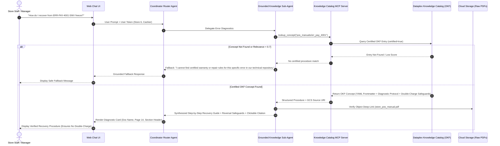

---

### **UC-1.2: Store Operations & Sales Analytics**
Store Manager requests intraday store performance and inventory counts.

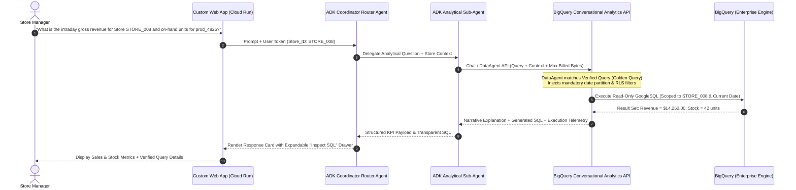

---

### **UC-1.3: Live Operational Alert Lookup**
Store Manager checks for active order-anomaly flags or promotion abuse.

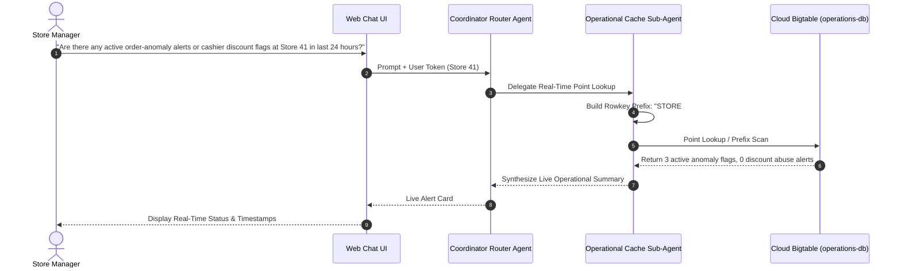

---

## **3.2. Cross-Domain Multi-System Orchestration Flows**

### **UC-2.1: Customer Warranty Triage (Multi-Domain Relational + Governed OKF RAG)**
Customer presents a transaction ID asking if their purchased item is covered under warranty.

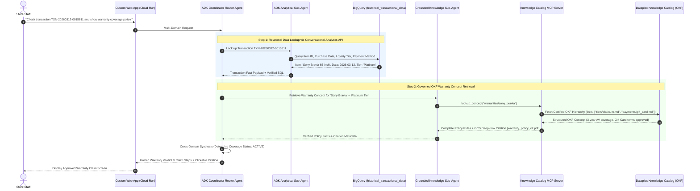

---

### **UC-2.2: Intra-Day Cashier Risk vs. Nightly Audit (Streaming BQ + Bigtable Cache)**
Operations Manager audits a cashier's immediate 1-hour override rate against their 30-day baseline.

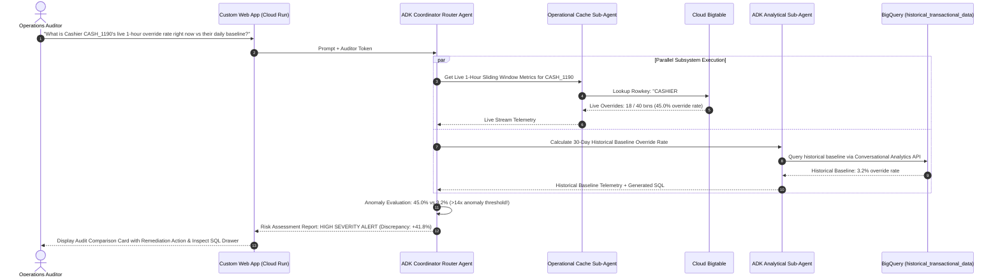

---

### **UC-2.3: Cashier Promotion Abuse Audit (Streaming + Relational with Dynamic PII Masking)**
Auditor investigates cashiers with active alerts and pulls transaction history with card masking.

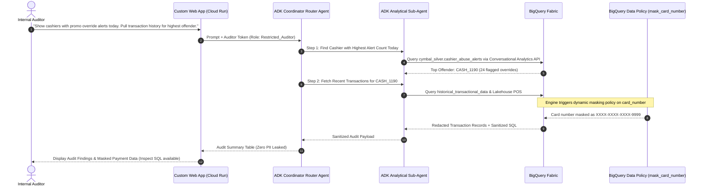

---

## **3.3. Agent Interaction & Orchestration Flow**

### **ADK Multi-Agent Architecture & Custom Frontend**
The conversational platform is built using the open-source **Agent Development Kit (ADK)** (`https://adk.dev/`) deployed on Cloud Run, providing robust multi-agent orchestration, session state management, and enterprise safety pipelines:

* **Custom Frontend Web App (Cloud Run):**
  * Built using a responsive web framework (Streamlit / Next.js) communicating via REST and WebSocket streaming.
  * Features a dedicated store operations chat panel, real-time alert toast notifications, and an expandable **"Inspect Generated SQL"** drawer rendering the exact GoogleSQL, billed bytes, and execution timestamps emitted by the Conversational Analytics API.
* **ADK Coordinator Router Agent:**
  * Implemented as an ADK `LlmAgent` that acts as the primary orchestrator and dispatcher:
    * Single-Domain Analytical $\rightarrow$ Route to `CA_SubAgent` (BigQuery Conversational Analytics API).
    * Single-Domain Unstructured $\rightarrow$ Route to `Knowledge_Agent` (Knowledge Catalog MCP).
    * Single-Domain Operational Cache $\rightarrow$ Route to `Cache_Agent` (Bigtable point-lookup).
    * Multi-Domain Cross-System $\rightarrow$ Construct DAG execution plan (parallel or sequential sub-agent calls).
* **Context & Session Memory:**
  * Manages multi-turn conversation memory (e.g., retaining cashier `CASH_1190` across follow-up queries) using ADK `Session` and `State` stores, strictly isolated by user login token.
* **Security & Guardrail Pipeline:**
  1. Input validation: Screen for prompt injection, jailbreak attempts, or unauthorized system introspection.
  2. Identity delegation: Propagate authenticated caller credentials (`Store_Manager`, `Auditor`, `store_id`) to all downstream APIs.
  3. Output sanitizer: Enforce zero leakage of raw exception traces or unmasked payment numbers.

---

# **4. Data Platform Architecture, Security & Governance**

## **4.1. Entity Definitions & Schema Architecture**

The analytical platform utilizes a refined Medallion Lakehouse pattern:

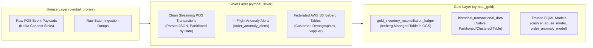

### **Table Specifications & Partitioning Strategies**

| Dataset | Table Name | Storage Format | Partitioning / Clustering | Primary Key / Identifier |
| :--- | :--- | :--- | :--- | :--- |
| `cymbal_gold` | `historical_transactional_data` | BigQuery Native | Partition: `DATE(transaction_timestamp)`<br>Cluster: `store_id, cashier_id` | `transaction_id` |
| `cymbal_gold` | `gold_inventory_reconciliation_ledger` | BigLake Iceberg v2 | Partition: `reconciliation_date`<br>Cluster: `store_id, product_id` | `reconciliation_id` |
| `cymbal_silver`| `pos_transactions_streaming` | BigQuery Native | Partition: `DATE(event_timestamp)`<br>Cluster: `store_id, cashier_id` | `transaction_id` |
| `module1_unstructureddata` | `pos_manuals_object_table` | BigQuery Object Table | Metadata Partitioning | `uri` (GCS Object URI) |
| `operations-db` (Bigtable) | `operational_telemetry` | Cloud Bigtable | Rowkey: `STORE#<store_id>#ALERT#<ts>`<br>Rowkey: `CASHIER#<cashier_id>#WIN#<hour>` | Composite String Rowkey |
| `cymbal_operational_knowledge` (Dataplex Entry Group) | `okf_concept_aspect` | Dataplex Custom Entry & Aspect | Filtered by: `certified=true`, `category` | `concept_id` (e.g., `OKF-POS-ERR-PAY-4001`) |

---

## **4.2. Data Lifecycle & Ingestion**
1. **Real-Time Stream Ingestion:**
   * Source POS registers stream JSON payloads to Managed Kafka topic `pos-transactions`.
   * Stream consumers ingest events in real time, executing 1-hour tumbling/sliding aggregations.
   * In-flight inferences score transactions against Vertex AI endpoints (`<50ms`).
   * Results are committed in parallel: operational cache in Cloud Bigtable (sub-second query access) and streaming micro-batches to BigQuery `cymbal_silver`.
2. **Nightly Batch Reconciliation:**
   * Dataproc Serverless PySpark job triggers at 01:00 UTC via Cloud Composer 3.
   * Ingests previous day's federated S3 sales facts and regional store inventory snapshots.
   * Performs deduplication and variance calculations, writing conformed balances to `gold_inventory_reconciliation_ledger` (BigLake Iceberg table).
   * Automatically terminates upon job completion, incurring $0 idle compute.

---

## **4.3. Identity, Access Control & Row-Level Security (RLS)**
* **Delegated Token Passing:** Every API invocation from the client portal conveys an identity token containing the caller's role (`Store_Manager`, `Auditor`, `Data_Analyst`) and authorized store scopes (`store_id = STORE_008`).
* **Row-Level Security (RLS) Policy:**
  Implemented in BigQuery using `ROW ACCESS POLICY`:
  ```sql
  CREATE OR REPLACE ROW ACCESS POLICY store_manager_isolation_policy
  ON `pj-elevate-da.cymbal_gold.historical_transactional_data`
  GRANT TO ('group:store-managers@cymbalretail.com')
  FILTER USING (
    store_id = SESSION_USER_STORE_ID()
    OR SESSION_USER_ROLE() IN ('GLOBAL_AUDITOR', 'EXECUTIVE_ADMIN')
  );
  ```

---

## **4.4. Data Privacy, Dynamic Masking & Catalog Governance**
* **Knowledge Catalog Policy Tags:**
  * Taxonomy: `cymbal_pii`
  * Tag Key: `card_number`
* **Dynamic Data Masking Routine:**
  BigQuery Data Policy masks credit card numbers dynamically:
  ```sql
  CREATE OR REPLACE MASKING POLICY mask_card_number
  ON `pj-elevate-da.cymbal_gold.historical_transactional_data`.card_number
  USING (
    CASE 
      WHEN SESSION_USER() IN (SELECT email FROM `cymbal_governance.authorized_auditors`) THEN card_number
      ELSE CONCAT('XXXX-XXXX-XXXX-', SUBSTR(card_number, -4))
    END
  );
  ```
* **Guardrails Against PII Leaks:** Any query executed by the ADK Analytical Sub-Agent via the BigQuery Conversational Analytics API is automatically subjected to this data policy at execution time within the BigQuery engine; neither the Conversational Analytics API nor the custom frontend ever receives unmasked credit card digits.

---

### **4.4.1. Open Knowledge Format (OKF v0.1) & Dataplex Knowledge Catalog Governance**

To eliminate procedural hallucinations and context fragmentation inherent to naive chunked RAG, all unstructured documentation (POS maintenance manuals, supplier warranties, operating procedures) is mined, version-controlled, and certified through **Open Knowledge Format (OKF v0.1)** and **Dataplex Knowledge Catalog**.

#### **1. Dataplex Custom Entry Group & Aspect Architecture**
* **Custom Entry Group:** `projects/pj-elevate-da/locations/us-central1/entryGroups/cymbal_operational_knowledge`
  * Serves as the central governed repository for all extracted operational concepts, error resolutions, and warranty coverage policies.
* **Custom Aspect Type:** `projects/pj-elevate-da/locations/us-central1/aspectTypes/okf_concept_aspect`

| Aspect Attribute | Data Type | Requirement | Description & Business Purpose |
| :--- | :--- | :--- | :--- |
| `concept_id` | `STRING` | Required | Unique slug identifier (e.g., `OKF-POS-ERR-PAY-4001`, `OKF-WARR-TIER2-AV`). |
| `concept_title` | `STRING` | Required | Canonical title (e.g., *"EMV Terminal Payment Freeze Recovery Procedure"*). |
| `category` | `STRING` | Required | Operational domain: `FIELD_PROCEDURE`, `WARRANTY_POLICY`, or `HARDWARE_SPEC`. |
| `related_error_codes` | `STRING` | Optional | Comma-delimited list of hardware/firmware error codes (e.g., `ERR-PAY-4001, ERR-SYNC-900`). |
| `hardware_models` | `STRING` | Optional | Target device family (e.g., `Cymbal POS Terminal 3000 Series`, `Handheld Scanner Pro`). |
| `certified` | `BOOL` | Required | Governance flag (`true` indicates signed-off by Field Operations SME; `false` blocks production agent serving). |
| `source_pdf_uri` | `STRING` | Required | GCS origin URI (e.g., `gs://pj-elevate-da-module1-bucket/manuals/POS_Terminal_3000_Maintenance.pdf`). |
| `source_page_references`| `STRING` | Required | Precise PDF page references for citation and human audit (e.g., `Pages 4, 22`). |
| `git_commit_hash` | `STRING` | Required | Git commit SHA linking the Dataplex entry to version-controlled Markdown source files. |

#### **2. GitOps Knowledge Mining & Certification Workflow**

```mermaid
flowchart LR
    PDFs["Raw PDF Manuals\n(GCS Bucket)"] --> Agent["KC Enrichment Agent\n(Gemini Multimodal API)"]
    Agent --> OKF_Files["OKF v0.1 Markdown\n(YAML Frontmatter + Body)"]
    OKF_Files --> Git["Git Repository\n(Pull Request & SME Audit)"]
    Git -->|Merge / Approval\ncertified: true| CICD["Cloud Build CI/CD\nkcmd push --format okf"]
    CICD --> Dataplex["Dataplex Knowledge Catalog\nEntry Group: cymbal_operational_knowledge\nAspect: okf_concept_aspect"]
    Dataplex --> MCP["Knowledge Catalog MCP Server\n(kcmd mcp)"]
    MCP --> Agent_Consumer["Grounded Knowledge Sub-Agent\n(Certified Concepts Only)"]
```

1. **Multimodal Extraction:** The KC Enrichment Agent parses complex PDF page hierarchies, tabular recovery matrices, and warning callouts into structured OKF Markdown files with rich YAML headers.
2. **Review & Certification:** Engineers and store operations leads review pull requests. Only verified procedures are flagged `certified: true`.
3. **Automated Catalog Synchronization:** Cloud Build runs `kcmd push --entry_group cymbal_operational_knowledge --format okf` to register or update entries in Dataplex.
4. **Governed MCP Retrieval:** The Knowledge Catalog MCP server queries Dataplex Knowledge Catalog, strictly filtering by `certified = true`. If a code or procedure is not certified, the agent deterministically triggers an escalation fallback.

---

# **5. Integration Details, Tool Contracts & Error Handling**

## **5.1. Agent Tool & API Contracts**

### **Tool 1: `query_conversational_analytics_api`**
* **Calling Agent:** ADK Analytical Sub-Agent (`CA_SubAgent`)
* **Target System:** BigQuery Conversational Analytics API (`geminidataanalytics.googleapis.com`)
* **Interface Specification:** `DataAgent` Chat API with enterprise context definitions, instructions, and verified queries.
* **Input Schema:**
  ```json
  {
    "type": "object",
    "properties": {
      "query": { "type": "string", "description": "Natural language analytical inquiry (e.g., 'What is the intraday gross revenue for Store STORE_008?')" },
      "data_agent_id": { "type": "string", "default": "cymbal-retail-analytics-agent", "description": "Resource name of pre-configured DataAgent" },
      "user_context": {
        "type": "object",
        "properties": {
          "store_id": { "type": "string", "description": "Store ID for Row-Level Security enforcement" },
          "user_role": { "type": "string", "description": "User role: Store_Manager, Auditor, Analyst" }
        },
        "required": ["store_id", "user_role"]
      },
      "bigquery_max_billed_bytes": { "type": "integer", "default": 10737418240, "description": "FinOps safety guardrail (10 GB max scan limit per query)" }
    },
    "required": ["query", "user_context"]
  }
  ```
* **Expected Output / SLA:**
  ```json
  {
    "response_text": "Store STORE_008 generated $14,250.00 in intraday gross revenue across 342 transactions, with 42 units of product prod_4825 on hand.",
    "generated_sql": "SELECT store_id, SUM(total_amount) AS intraday_gross_revenue, COUNT(transaction_id) AS total_transactions FROM `pj-elevate-da.cymbal_silver.pos_transactions_streaming` WHERE store_id = 'STORE_008' AND DATE(event_timestamp) = CURRENT_DATE() GROUP BY store_id",
    "verified_query_matched": true,
    "bytes_billed": 10485760,
    "execution_time_ms": 1420
  }
  ```
  Execution latency $\le 3.0$ seconds.
* **Error / Fallback Behavior:** The API natively blocks all DDL/DML statements (`DROP`, `DELETE`, `UPDATE`) and rejects destructive operations at the gateway level. If query scan estimate exceeds `bigquery_max_billed_bytes`, the API aborts execution before execution begins: *"Query exceeds scan quota limit; please narrow time range or specify product/store filter."* If the service is unreachable, return: *"Conversational Analytics API temporarily unavailable. Please retry shortly."*

---

### **Tool 2: `lookup_operational_cache_bigtable`**
* **Calling Agent:** Operational Cache Sub-Agent
* **Target System:** Cloud Bigtable (`operations-db`, table `operational_telemetry`)
* **Input Schema:**
  ```json
  {
    "type": "object",
    "properties": {
      "lookup_type": { "type": "string", "enum": ["STORE_ALERT", "CASHIER_METRIC"] },
      "entity_id": { "type": "string", "description": "Store ID (e.g., 'STORE_041') or Cashier ID (e.g., 'CASH_1190')" },
      "time_window_hours": { "type": "integer", "default": 24 }
    },
    "required": ["lookup_type", "entity_id"]
  }
  ```
* **Expected Output / SLA:** Key-value telemetry payload (alert counts, override rates); SLA $\le 150$ ms.
* **Error / Fallback Behavior:** If rowkey not found, return empty record with `{"status": "NO_ACTIVE_ALERTS"}`. If Bigtable is unreachable, return graceful partial notification.

---

### **Tool 3: `lookup_knowledge_catalog_concept`**
* **Calling Agent:** Grounded Knowledge Sub-Agent (`Knowledge_Agent`)
* **Target System:** Dataplex Knowledge Catalog MCP Server (`kcmd mcp` / Dataplex Catalog API)
* **Input Schema:**
  ```json
  {
    "type": "object",
    "properties": {
      "query": { "type": "string", "description": "Operational error code (e.g. 'ERR-PAY-4001', 'ERR-SYNC-900'), product model, or warranty topic" },
      "category": { "type": "string", "enum": ["FIELD_PROCEDURE", "WARRANTY_POLICY", "ALL"], "default": "ALL" },
      "certified_only": { "type": "boolean", "default": true, "description": "Enforce retrieval of only certified Dataplex knowledge entries" }
    },
    "required": ["query"]
  }
  ```
* **Expected Output / SLA:**
  ```json
  {
    "concept_id": "OKF-POS-ERR-PAY-4001",
    "title": "EMV Terminal Payment Processing Freeze Recovery Procedure",
    "category": "FIELD_PROCEDURE",
    "certified": true,
    "related_error_codes": ["ERR-PAY-4001"],
    "content": "# EMV Freeze Recovery Procedure\n\n## Critical Safeguard\nDO NOT hard reboot the terminal while in pending authorization state...\n\n## Recovery Steps\n1. Press Cancel (Yellow key) twice.\n2. Verify ledger state in supervisor menu...\n3. If unfreeze fails, execute manifest flush via Key Sequence 9-0-0.",
    "source_pdf_uri": "gs://pj-elevate-da-module1-bucket/manuals/POS_Terminal_3000_Maintenance.pdf",
    "source_pages": "4, 22"
  }
  ```
  SLA $\le 500$ ms.
* **Error / Fallback Behavior:** If no entry matches or `certified = false`, return: `{"status": "NOT_FOUND", "message": "No certified operational manual or warranty policy found for code."}` triggering the agent fallback: *"I cannot find certified operational recovery or warranty policy for code `<QUERY>`. Please escalate to Level 2 Field Support."*

---

## **5.2. Failure Modes & Graceful Degradation**

| Failure Scenario | Affected Subsystem | Detection Mechanism | Automated Fallback Behavior |
| :--- | :--- | :--- | :--- |
| **AWS S3 Connectivity Loss** | BigLake Lakehouse Federation | BQ connection handshake failure / timeout | Coordinator delivers local cache results and informs user: *"Remote AWS S3 catalog is currently unreachable; showing last-cached figures."* |
| **Bigtable Cache Timeout** | Operational Cache Sub-Agent | gRPC deadline exceeded (>1.0s) | Retry once with exponential backoff; if persistent, fall back to querying BigQuery `cymbal_silver.pos_transactions_streaming` with a notification of slight data latency. |
| **Unmatched / Uncertified Operational Concept** | Grounded Knowledge Sub-Agent | Knowledge Catalog MCP lookup returns not found or certified=false | Decline to answer immediately to prevent hallucination; output approved standard disclaimer: *"No certified operational recovery procedure or warranty policy found for code `<QUERY>`. Please escalate to Level 2 Field Support."* |
| **Cross-System Partial Outage** | Multi-Domain Orchestration (UC-2.x) | One sub-agent tool emits 5xx/timeout | Coordinator completes available sub-system query (e.g., outputs transaction details from SQL) and flags the missing section (e.g., *"Warranty repository temporarily unavailable"*). |

---

# **6. Cost Estimation & FinOps**

## **6.1. Key Cost Drivers**
1. **BigQuery Editions Compute:** Enterprise Reservation (`gql-query-reservation`) utilizing autoscale slots to absorb 9:00 AM concurrency bursts without persistent baseline costs.
2. **Dataproc Serverless for Spark:** Billed per DCU-hour (Data Compute Unit) solely for the exact duration of the nightly 45-minute inventory run ($0 idle compute tax).
3. **Google Managed Service for Apache Kafka:** Billed for allocated 3 vCPUs and 12 GiB RAM cluster, providing predictable streaming ingest costs.
4. **Cloud Bigtable (`operations-db`):** 1 SSD node in `us-central1`, handling sub-second operational lookups with automatic scale-out policies during major shopping peaks.
5. **Vertex AI Gemini API & Dataplex Knowledge Catalog:** Token-based pricing for prompt ingestion and agent reasoning. One-time offline Gemini multimodal enrichment into OKF Markdown bundles, eliminating 24/7 continuous vector index hosting fees while Dataplex Knowledge Catalog metadata lookups operate at near-zero per-query cost.

## **6.2. Cost Optimization Controls**
* **Mandatory Partition Pruning & FinOps Guardrails:** The BigQuery Conversational Analytics API `DataAgent` instructions and Verified Queries enforce mandatory date partition filters on all queries against `historical_transactional_data` and `pos_transactions_streaming`. Additionally, `bigquery_max_billed_bytes` (10 GB) hard-caps scan volume before query execution begins, proactively aborting runaway scans.
* **Zero-Copy Lakehouse Federation:** Direct queries over AWS S3 Iceberg data via BigLake eliminate petabyte-scale data ingestion and egress replication costs.
* **Spark Auto-Termination:** Dataproc Serverless batches automatically shut down containers $<60$ seconds after reconciliation logic finishes.

---

# **7. Deployment & Delivery Plan**

## **7.1. Infrastructure as Code (Terraform) Architecture**
The infrastructure deployment is managed completely via Terraform in [module_0/elevate-da-adv-day1/deploy/](file:///usr/local/google/home/watanabesei/account_work/Admin/pj_elevate/DA_advanced/module_0/elevate-da-adv-day1/deploy/):
* **State Management:** Remote Cloud Storage backend at `gs://pj-elevate-da-tfstate` (`prefix = "infra"`).
* **Modular Resource Declarations:**
  * Network & Security: Custom VPC (`cymbal-retail-vpc`), Cloud Router & NAT, internal and IAP firewall rules.
  * IAM: Service accounts (`cymbal-sa-data`, `sa-analyst`, `sa-data-lead`, `sa-restricted`) with least-privilege role bindings.
  * Analytics & Lakehouse: BigQuery datasets (`cymbal_bronze`, `cymbal_silver`, `cymbal_gold`, `module1_unstructureddata`), BigLake Iceberg connection (`biglake-iceberg-connection`), and Enterprise reservation (`gql-query-reservation`).
  * Streaming & Caching: Managed Kafka cluster (`kafka-cluster`), Kafka topic (`pos-transactions`), and Cloud Bigtable instance (`operations-db`).
  * Workflow & ML: Cloud Composer 3 environment (`cymbal-airflow-env`) and Vertex AI Endpoints (`order-anomaly-endpoint`, `cashier-abuse-endpoint`).

## **7.2. Phased Delivery Roadmap**

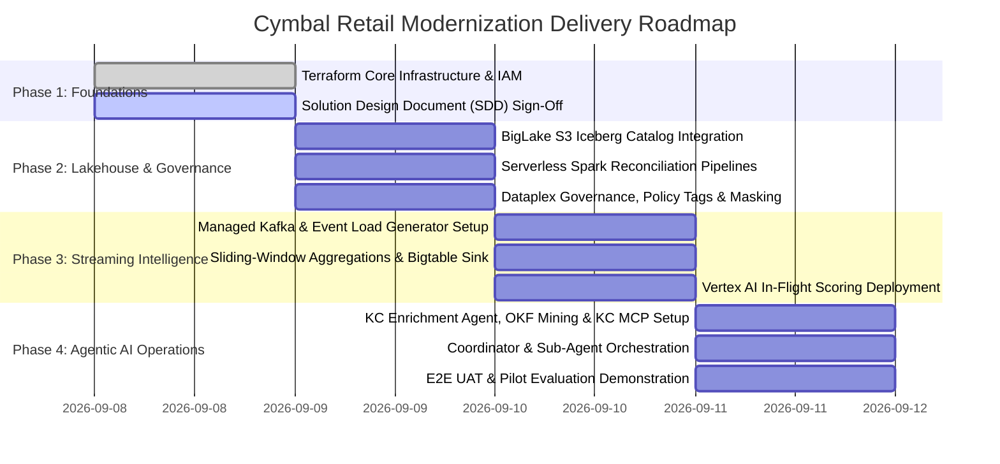

---

# **8. Assumptions, Constraints & Risk Register**

## **8.1. Risk Register**

| Risk Description | Likelihood (H/M/L) | Impact (H/M/L) | Mitigation Strategy | Owner |
| :--- | :--- | :--- | :--- | :--- |
| **R-1: Cross-Cloud Network Latency on S3 Queries** | M | M | Enforce partition pruning and metadata caching via BigLake REST Catalog; project only needed columns in SQL queries. | Lakehouse Architect |
| **R-2: Analytical Metric / Schema Hallucination** | L | H | Configure BigQuery Conversational Analytics API with **Verified Queries (Golden Queries)** for standard KPI formulas; bind business context directly in the `DataAgent` resource to ensure deterministic SQL generation. | Agent AI Lead |
| **R-3: Bigtable Hot-Spotting Under Heavy Ingestion** | L | H | Implement well-salted rowkey hashes (`STORE#<store_id>#...`) to ensure uniform distribution across Bigtable tablet nodes. | Streaming Engineer |
| **R-4: Hallucination on Uncertified / Unmatched Operational Errors** | M | H | Enforce strict Dataplex certification filtering (`certified=true`) and exact OKF concept code matching via Knowledge Catalog MCP; immediately output approved fallback if concept is uncertified or absent. | Agent AI Lead |
| **R-5: Accidental PII Exposure in Conversational UI** | L | Critical | Enforce dynamic column masking directly in BigQuery engine; apply client-side regex DLP sanitizer as secondary defense in depth. | Security Architect |

## **8.2. Technical Assumptions & Constraints**
* AWS S3 Iceberg bucket and REST Catalog credentials remain accessible with stable read-only IAM permissions.
* The synthetic POS event generator reliably emits between 0.4 and 10 msg/sec to validate sliding-window streaming behavior.
* Prototype user authentication is satisfied via mock JWT role headers and functional test service accounts.

---

# **9. Quality Evaluation & UAT Framework**

| Evaluation Metric / SLA | Target Benchmark | Verification / Measurement Method |
| :--- | :--- | :--- |
| **Zero-Copy Lakehouse Federation** | 0 Bytes physical data replication; 100% query success | Audit BigQuery execution plan for remote federated scan operators. |
| **Serverless Spark Idle Tax** | $0 idle compute; job auto-terminates $<60$s post-batch | Review Cloud Monitoring Dataproc Serverless DCU metrics during off-peak hours. |
| **In-Flight Scoring Latency** | $<50$ ms model latency; $<100$ ms P95 total pipeline latency | Cloud Monitoring endpoint latency percentiles under 500 req/sec load. |
| **Conversational Analytics Accuracy** | 100% precision on Verified Queries; $\ge 95\%$ on ad-hoc analytical questions | Automated validation suite against 30 benchmark retail analytical questions executed via Conversational Analytics API. |
| **Partition Pruning & FinOps Guardrails** | 100% of queries enforce partition date filters; 0 queries exceed `bigquery_max_billed_bytes` (10 GB) | Automated validation and BigQuery job history audit. |
| **OKF Concept Grounding & Rejection Precision** | 0% hallucinated recovery steps or warranty terms; 100% fallback on uncertified concepts | Automated evaluation suite across 20 golden technical troubleshooting and warranty inquiry test cases. |
| **PII Data Protection** | 100% masking of credit cards for non-auditors; 0 PII leaks | Compare query outputs executed under Store Manager token vs Auditor token. |
| **Cross-System Orchestration (UC-2.x)**| 100% pass on UC-2.1, UC-2.2, UC-2.3 | Live interactive walkthrough and test harness evaluation. |

---

# **10. Open Questions & Action Items**

- [x] **IaC Deployment**: Complete initial Terraform deployment in `pj-elevate-da` (`us-central1`) — *Completed*.
- [x] **BigLake Registration**: Retrieve and register BigLake Service Account ID (`107863409914651371930`) in team tracking sheet — *Completed*.
- [ ] **Cross-Cloud S3 Catalog Handshake**: Verify AWS Glue / S3 REST catalog connectivity in Module 1 — *Owner: Lakehouse Architect*.
- [ ] **Kafka Topic Partition Balancing**: Confirm 5 partitions adequately handle simulated multi-store spikes — *Owner: Streaming Lead*.
- [ ] **Agent Safety Evaluation Set**: Finalize 20 golden prompt evaluation dataset for OKF Knowledge Catalog MCP retrieval and SQL accuracy benchmarks — *Owner: AI Agent Lead*.

