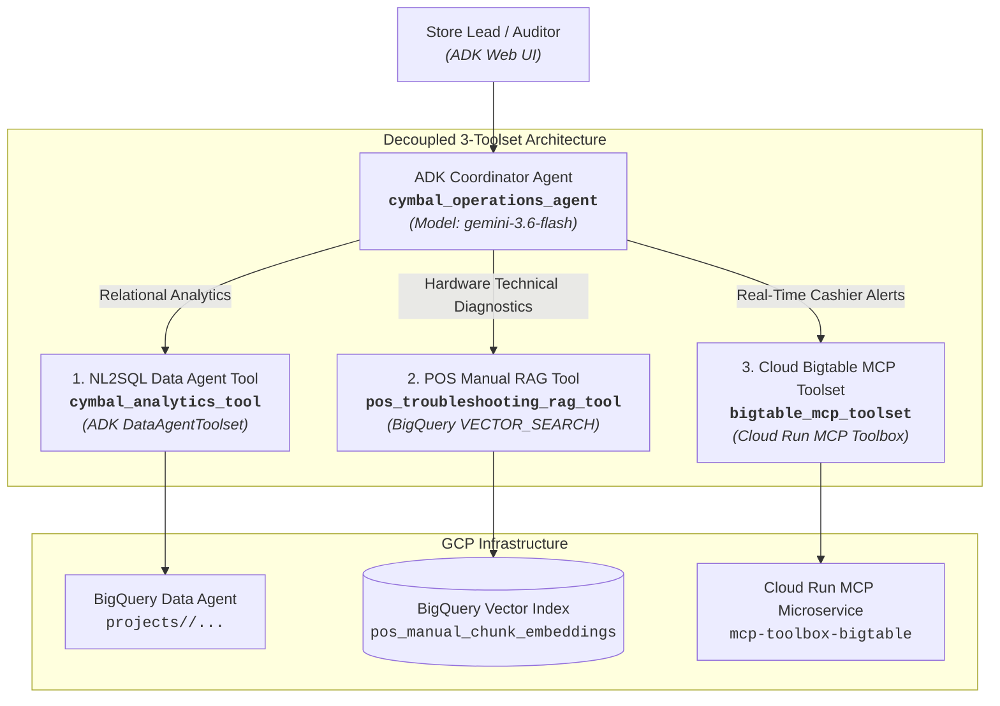

# Module 3 Lab Guide: Building & Orchestrating the Multi-Tool ADK Agent

---

## 📋 Pre-Flight Environment Context

Your landing zone has already been bootstrapped with baseline data assets and the BigQuery Conversational Data Agent built in the previous lab:
- **Google Cloud Project:** `<PROJECT_ID>`
- **GCP Region:** `<REGION>` (Default: `us-central1` or `us`).
- **Published BQ CA Agent Resource Name:** `projects/<PROJECT_ID>/locations/global/dataAgents/<DATA_AGENT_ID>` *(Use the Data Agent ID from your previous lab)*
- **BigQuery Datasets & Tables:**
  - `cymbal_gold` (Structured Gold Serving Layer):
    - `pos_transactions_gold` (Real-time intraday POS checkout ledger)
    - `pos_anomaly_alerts` (Real-time anomaly & promo abuse alert ledger)
    - `gold_inventory_reconciliation_ledger` (Daily reconciled store inventory & burn-rate ledger)
    - `historical_transactional_data` (Historical customer transaction ledger)
    - `pos_manual_generic_embeddings` / `pos_manual_chunk_embeddings` (POS hardware technical manual vector embeddings ledger)
  - `module1_unstructureddata` (Extracted Unstructured Document Layer):
    - `warranty_generic_sections_extracted` (AI-extracted warranty terms & conditions)
    - `pos_manual_generic_sections_extracted` (Extracted POS hardware manual sections)
    - `pos_manual_embeddings` (Original baseline embeddings)
  - `cymbal-lakehouse.elevate_data` (Cross-Cloud AWS S3 BigLake Federated Layer):
    - `silver_pos_transactions` (Cross-cloud AWS S3 checkout ledger)

- **BigTable Instance and Tables:**
  - `operations-db` (Instance)
    - `cashier_realtime_alerts` (Table)

> [!WARNING]
> **Data Agent Location Override Requirement (mTLS Error Mitigation):**  
> Even if your BigQuery datasets (`cymbal_gold`, `module1_unstructureddata`) and tables are created in `us-central1`, you **MUST create your BigQuery Conversational Data Agent (BQ CA Agent) with `global` as the location** by overriding the default location setting in the BigQuery Studio UI.  
> *Why?* Creating your Data Agent with `global` location (`projects/<PROJECT_ID>/locations/global/dataAgents/<DATA_AGENT_ID>`) ensures seamless API routing and completely avoids mTLS / SSL certificate errors associated with regional endpoint routing.

> [!IMPORTANT]
> **Project & Service Parameterization:** Replace `<PROJECT_ID>`, `<REGION>`, `<DATA_AGENT_ID>`, and `<BIGTABLE_MCP_SERVICE_URL>` with your assigned GCP Project ID, Data Agent ID, and Cloud Run service URL.

---

## 🏷️ Topology: Decoupled 3-Toolset ADK Coordinator Agent

> [!NOTE]
> **Reference Topology:** The architecture diagram below represents a recommended reference topology. Attendees are free to design and architect their agent hierarchy, toolsets, and internal routing logic in whatever structure they determine to be optimal for fulfilling the business requirements.



---

## 🏷️ Part 1: Project Scaffolding with `agents-cli`

### Challenge 1.1: Scaffold Your Agent Project

#### 🎯 Objective
Use `agents-cli` to initialize your agent workspace structure. You are free to design and organize your code layout as you see fit.

#### ⚙️ Functional Requirements
1. Initialize a new agent project using `agents-cli scaffold create`.
2. Configure your environment variables (`.env`) for project ID, region, published BQ Data Agent resource name, and Bigtable MCP service URL.
3. Ensure necessary dependencies (`google-adk==2.3.0`, `mcp==1.29.0`, `google-genai`, `google-cloud-bigquery`) are present in your Python environment.

#### 💡 Hints & Clues
- Run `agents-cli scaffold create --help` to inspect available scaffolding options.
- On Cloudtop workstations, ensure `gcert` and `gpkg setup` are executed before running `uv pip install -r requirements.txt`.
- Always build a clean virtual environment (`uv venv && source .venv/bin/activate`) to avoid virtualenv path mismatches when working across workspace directories.
- Keep your codebase modular so tool definitions, system instructions, and coordinator initialization are cleanly separated.

---

## 🏷️ Part 2: Tool Implementation & Microservice Deployment

### Challenge 2.1: Implement NL2SQL Data Agent Tool (`cymbal_analytics_tool`)

#### 🎯 Objective
Implement a tool function or toolset wrapper (`cymbal_analytics_tool`) leveraging ADK's native `DataAgentToolset` or `ask_data_agent` Python functions bound to your published BigQuery Conversational Data Agent.

> 💡 **Architectural Rationale: Why BigQuery Data Agent API?**  
> While predictable operational metrics can be implemented with fixed SQL templates, enterprise operations portals must support **arbitrary, open-ended natural language questions** from store managers and auditors (e.g. *"Compare store opening revenues against regional warranty claim trends"*).  
> We leverage the **BigQuery Conversational Data Agent API (`cymbal_analytics_tool`)** as our primary analytical engine specifically because it provides dynamic schema discovery and real-time GoogleSQL generation—allowing the coordinator agent to fulfill unpredictable, ad-hoc business inquiries beyond the specific queries highlighted in the use case requirements.

#### ⚙️ Functional Requirements
1. Target your published Data Agent resource name (`projects/<PROJECT_ID>/locations/global/dataAgents/<DATA_AGENT_ID>`). **Learners are strongly recommended to create their Data Agent in the `global` location** in BigQuery Studio to ensure seamless endpoint routing and avoid mTLS / certificate errors.
2. Include transient fault tolerance (exponential backoff retries) for database calls.
3. If database connectivity fails, return a user-friendly fallback message indicating store data is unreachable.
4. **Business Glossary & Verbatim Prompt Passing:** Ensure natural language inquiries referencing standardized enterprise business terms (e.g., *Net Transaction Revenue*, *Total On-Hand Inventory*, *Estimated Cover Hours*, *Cashier Manual Override Rate*) are passed verbatim to the underlying Data Agent without keyword stripping or lossy summarization, ensuring accurate semantic glossary mapping.

#### 💡 Hints & Clues
- Look for `ask_data_agent` in `google.adk.tools.data_agent.data_agent_tool`. Wrapping `ask_data_agent` inside a custom `FunctionTool` allows you to pin the `data_agent_name` on the server side, add exponential backoff retries, and format error fallbacks cleanly for your coordinator agent.
- **Recommended Location:** Ensure your Data Agent is created with location `global` (`projects/<PROJECT_ID>/locations/global/dataAgents/<DATA_AGENT_ID>`) in BigQuery Studio.
- **Potential Regional Issue Workaround:** If your Data Agent was provisioned in a non-global region (e.g. `location="us"` or `"eu"`), ADK 2.5 routes calls to the global endpoint by default, causing an HTTP 403 Forbidden error. To resolve this for regional Data Agents, include the base URL override before invoking `ask_data_agent`:
  ```python
  import google.adk.tools.data_agent.data_agent_tool as data_agent_tool
  data_agent_tool.BASE_URL = f"https://geminidataanalytics.{location}.rep.googleapis.com/v1beta"
  ```

---

### Challenge 2.2: Implement Baseline POS RAG Tool & Optimize with Advanced Chunking (`pos_troubleshooting_rag_tool`)

#### 🎯 Objective
Implement `pos_troubleshooting_rag_tool` to perform vector similarity search over POS terminal runbooks in BigQuery. First, connect your tool to the original baseline embedding table created in Module 1 (`<PROJECT_ID>.module1_unstructureddata.pos_manual_embeddings`) and observe why coarse embeddings yield sub-optimal retrieval accuracy for specific hardware error codes. Then, optimize retrieval performance by redoing document chunking, regenerating dense embeddings, and applying adjacent context window stitching.

> 💡 **Why Is the Module 1 Baseline Table Sub-Optimal?**  
> In Module 1, embeddings were generated over large, coarse document sections (`pos_manual_embeddings`). When an operator queries for a specific hardware fault (such as *"ERR-PAY-4001 EMV reader freeze"* or *"ERR-DN-PRNT-24V thermal cutter lock"*), the specific error code gets diluted within thousands of characters of general text. Consequently, vector search similarity scores often fall below the safety threshold (`< 0.70`), triggering uncertified warning fallbacks or returning irrelevant general maintenance sections.  
>  
> By **redoing chunking with a fine-grained sliding window** (500 characters with 100 character overlap / 400 step size) into `<PROJECT_ID>.cymbal_gold.pos_manual_chunk_embeddings` and using **adjacent context window stitching ($N-1$ to $N+1$)** at query time, you achieve high similarity scores on precise error codes while still supplying complete procedural runbooks to the agent!

#### ⚙️ Functional Requirements
1. **Baseline Implementation:** Implement `pos_troubleshooting_rag_tool` in `app/tools/rag_tool.py` initially targeting the Module 1 embedding table `<PROJECT_ID>.module1_unstructureddata.pos_manual_embeddings`. Test a query referencing `ERR-PAY-4001` and observe the similarity score.
2. **Re-Chunking Unstructured Documents:** Chunk the raw text from `<PROJECT_ID>.module1_unstructureddata.pos_manual_generic_sections_extracted` into a new table `<PROJECT_ID>.cymbal_gold.pos_manual_chunk_embeddings` using sliding character windows (500 chars with 100 char overlap).
3. **Re-Generating Embeddings with BigQuery ML:** Add an `embedding ARRAY<FLOAT64>` column and generate dense vector embeddings using `ML.GENERATE_EMBEDDING` with model `<PROJECT_ID>.module1_unstructureddata.pos_text_embedding_model` (or `text-embedding-005`) with `task_type => 'RETRIEVAL_DOCUMENT'`.
4. **Vector Search with Adjacent Context Stitching:** Query `pos_manual_chunk_embeddings` using `VECTOR_SEARCH` with `AI.EMBED` (or query embeddings) and stitch adjacent chunks ($N-1$ to $N+1$) using `STRING_AGG` so the agent receives the full surrounding troubleshooting procedure.
5. **Tool Hardening & Citations:** In `app/tools/rag_tool.py`:
   - Point the tool table to `<PROJECT_ID>.cymbal_gold.pos_manual_chunk_embeddings`.
   - Enforce transient fault tolerance with 3 exponential backoff retries.
   - Enforce a minimum similarity score threshold (`0.70`). If vector search falls below threshold, trigger full-text `SEARCH(chunk_content, @query)` fallback before returning a warning.
   - Convert GCS URIs (`gs://...`) to clickable HTTPS links (`https://storage.cloud.google.com/...`).

#### 💡 Hints & Clues
- **Step 1: Baseline Query on `pos_manual_embeddings`:**
  - Connect to `<PROJECT_ID>.module1_unstructureddata.pos_manual_embeddings` and inspect the cosine distance returned for `ERR-PAY-4001`. Notice that the similarity score (`1 - distance`) is often lower than the `0.70` threshold due to coarse chunk sizes.
- **Step 2: Sliding Window Chunking with GoogleSQL:**
  - Break `extracted_full_content` from `<PROJECT_ID>.module1_unstructureddata.pos_manual_generic_sections_extracted` into 500-character blocks using `GENERATE_ARRAY(1, GREATEST(LENGTH(extracted_full_content), 1), 400)` unnested `WITH OFFSET chunk_index` and `SUBSTR(extracted_full_content, offset_pos, 500)`.
  - Filter out trailing empty/short whitespace chunks with `WHERE LENGTH(TRIM(chunk_text)) > 30`.
  - Preserve metadata columns: `document_filename`, `document_title`, `equipment_covered`, `source_pdf_uri`, `chunk_index`, and `chunk_content`.
- **Step 3: Vector Embedding Generation with BigQuery ML:**
  - Alter `pos_manual_chunk_embeddings` to add `embedding ARRAY<FLOAT64>`.
  - Use `ML.GENERATE_EMBEDDING` with model `<PROJECT_ID>.module1_unstructureddata.pos_text_embedding_model` (or `text-embedding-005`).
  - Prepend titles to text for richer semantic signals: `CONCAT('[', document_title, ']\n', chunk_content) AS content`.
  - Set `STRUCT('RETRIEVAL_DOCUMENT' AS task_type)` and update the table joining on `document_filename` and `chunk_index`.
- **Step 4: Vector Search & Adjacent Context Window Stitching:**
  - Execute `VECTOR_SEARCH` over `pos_manual_chunk_embeddings` using `COSINE` distance and query embedding via `AI.EMBED('<USER_QUERY>', endpoint => 'text-embedding-005')`.
  - Normalize relevance score: `ROUND(1 - distance, 4)`.
  - Self-join matched chunk `m` to `pos_manual_chunk_embeddings c` on `m.document_filename = c.document_filename AND c.chunk_index BETWEEN (m.chunk_index - 1) AND (m.chunk_index + 1)`.
  - Aggregate chunks using `STRING_AGG(c.chunk_content, '\n' ORDER BY c.chunk_index ASC)`.
- **Step 5: Python Tool Implementation:**
  - Wrap the BigQuery client call inside `app/tools/rag_tool.py`, incorporate the `0.70` relevance score guardrail, add `SEARCH()` fallback, and format clickable GCS links.

---

### Challenge 2.3: Configure & Deploy Bigtable MCP Microservice & Implement Toolset (`bigtable_mcp_toolset`)

#### 🎯 Objective
Author your MCP toolbox configuration for Cloud Bigtable instance `operations-db`, store it securely in Secret Manager, deploy the official GCP Database Toolbox container microservice (`mcp-toolbox-bigtable`) to Cloud Run, and implement `bigtable_mcp_toolset` in your agent to query real-time cashier alerts.

#### ⚙️ Functional Requirements
1. **MCP Config & Secret Management:** Create your `tools.yaml` configuration defining the Bigtable data source (`operations-db`). Ensure the `project` field is configured with your assigned `<PROJECT_ID>` (or substituted via `sed -i "s/<PROJECT_ID>/${PROJECT_ID}/g" tools.yaml`) before uploading. Store your configuration securely in Secret Manager as secret `bigtable-mcp-tools-secret`.
2. **Container Microservice Deployment:** Deploy your MCP toolbox service (`mcp-toolbox-bigtable`) to Cloud Run in region `<REGION>` using the official GCP Database Toolbox container image, mounting secret `bigtable-mcp-tools-secret`.
3. **Python Toolset Implementation:** Obtain your deployed Cloud Run service URL (`BIGTABLE_MCP_URL`) and implement `bigtable_mcp_toolset` using ADK's `McpToolset`. Ensure incoming calls authenticate via OIDC bearer tokens.

#### 💡 Hints & Clues
- *Secret Manager Clue:* Use `gcloud secrets create` and `gcloud secrets versions add` to manage your configuration payload.
- *Cloud Run Deployment Clue:* Use `gcloud run deploy` with `--image` targeting the official `database-toolbox/toolbox` image (`us-central1-docker.pkg.dev/database-toolbox/toolbox/toolbox:latest`) and `--set-secrets` to mount your configuration.
- *Authentication Clue:* Cloud Run services configured without public access require callers to pass a GCP OIDC ID Token generated for the target Cloud Run service audience in HTTP request headers (`Authorization: Bearer <TOKEN>`).

---

## 🏷️ Part 3: Coordinator Binding & System Prompts

### Challenge 3.1: Bind Toolsets & Configure Intent Routing Instructions

#### 🎯 Objective
Define your root coordinator agent (`cymbal_operations_agent`) using model `gemini-3.6-flash`, bind all 3 tools, and configure intent routing instructions.

#### ⚙️ Functional Requirements
1. Bind `cymbal_analytics_tool`, `bigtable_mcp_toolset`, and `pos_troubleshooting_rag_tool` to your root agent.
2. Formulate system instructions that guide Gemini when to:
   - Use single-tool dispatch for direct inquiries.
   - Execute **parallel tool dispatch** (calling Bigtable MCP and BigQuery tools concurrently in a single turn) for intra-day risk comparison.
   - Execute **sequential multi-turn dispatch** for cross-cloud audit workflows.

#### 💡 Hints & Clues
- Clearly describe tool execution protocols in your system instructions so Gemini understands multi-tool orchestration workflows.

---

## 🏷️ Part 4: Local Testing & Validation

### Challenge 4.1: Test Operational Use Cases Locally (`adk web app`)

#### 🎯 Objective
Launch the local ADK Web UI and test your agent across a variety of operational scenarios.

#### ⚙️ Functional Requirements
1. Start the local server:
   ```bash
   adk web app
   ```
2. Open the Web UI in your browser.
3. Execute the provided sample test prompts(feel free to add your own based on various scenarios) and verify agent behaviour in the ADK trace waterfall.

**Sample Prompts:**

| Scenario Category | Sample Test Prompt | Operational Domain & Verification Criteria |
| :--- | :--- | :--- |
| **UC 1.1a Hardware Error** | *"What is the immediate field recovery protocol when a cashier encounters an ERR-PAY-4001 EMV contactless payment freeze, and how do we ensure the customer is not double-charged?"* | `pos_troubleshooting_rag_tool`: Returns certified PDF documentation link from GCS for Toshiba TCx 810. |
| **UC 1.1c Out-of-Scope Hardware** | *"How do I replace the engine oil on a Ford F-150 truck?"* | `pos_troubleshooting_rag_tool`: Triggers similarity score fallback returning certified warning string. |
| **UC 1.2a Stockout Risk (<20h)** | *"What is the estimated cover hours remaining for store inventory positions experiencing stockout risk of less than 20 hours, and what is their total on-hand inventory?"* | `cymbal_analytics_tool`: Queries `gold_inventory_reconciliation_ledger` filtering `< 20.0` cover hours and sums total on-hand inventory. |
| **UC 1.3 Real-Time Cashier Metrics** | *"Read live 1-hour rolling metrics and audit status flags for Cashier CASH_1190 at Store 48."* | `bigtable_mcp_toolset`: Queries Bigtable row key prefix `STORE_048#CASH_1190` for live flags and metrics. |
| **UC 2.1a Warranty Transaction** | *"Check transaction details for TXN-20260312-0015811 and show the warranty coverage policy for the purchased item."* | `cymbal_analytics_tool`: Unnests line items and joins extracted warranty policy terms in BigQuery. |
| **UC 2.2 Dual Cashier Baseline** | *"What is Cashier CASH_1190's live 1-hour override rate right now, compared to their 7-day historical override baseline?"* | ADK trace verifies **PARALLEL DISPATCH** calling both Bigtable MCP and BigQuery tools concurrently in Turn 1. |
| **UC 2.3 Cross-Cloud Offender Audit** | *"Show cashiers with active cashier promo abuse alerts in the last 7 days and retrieve checkout logs for the top offender."* | ADK trace verifies **SEQUENTIAL DISPATCH** (Turn 1 GCP anomaly ranking -> Turn 2 AWS S3 checkout logs). |


4. Finally navigate to the [Feedback server](https://elevate-evaluation-preprod.aishprabhat.demo.altostrat.com/?track=data), and follow the instructions to complete the ***'Agent Codebase Readiness'*** check. Review any feedback you receive to iteratively improve your agent code against original requirements. 

---

## 🏷️ Part 5: Bonus Challenges: Production Hardening & Advanced Security (Optional)

#### 🎯 Objective
Apply production-grade security, query guardrails, semantic entity resolution, and multi-tenant access control to your ADK agent and BigQuery foundation.

#### ⚙️ Requirements
1. **End-User OAuth Authentication (Delegated Access):** Apply OAuth authentication to the BigQuery tool and Data Agent tool to ensure BigQuery queries execute under the end user's permissions when deployed to production.  
   *(Reference: [ADK BigQuery Integration - External Access Token](https://adk.dev/integrations/bigquery/#external-access-token))*
2. **Query Cost & Resource Guardrail (Max Bytes Billed):** Limit the `Max Bytes Billed` (`maximum_bytes_billed`) value for query executions to prevent heavy queries (such as full table scans) from being submitted due to malformed or unoptimized SQL.
3. **Semantic Search via Autonomous Embeddings (`store_name` ↔ `store_id`):** Generate autonomous text embeddings for `store_name` so users can search by store name instead of `store_id`. Verify that the agent resolves the exact store ID and provides the correct answer even when the user inputs an approximate or informal store name.
4. **Multi-Tenant Data Isolation:** Consider and determine what configurations or policies need to be implemented in BigQuery so that employees of a specific store can only view records belonging to their assigned store.


