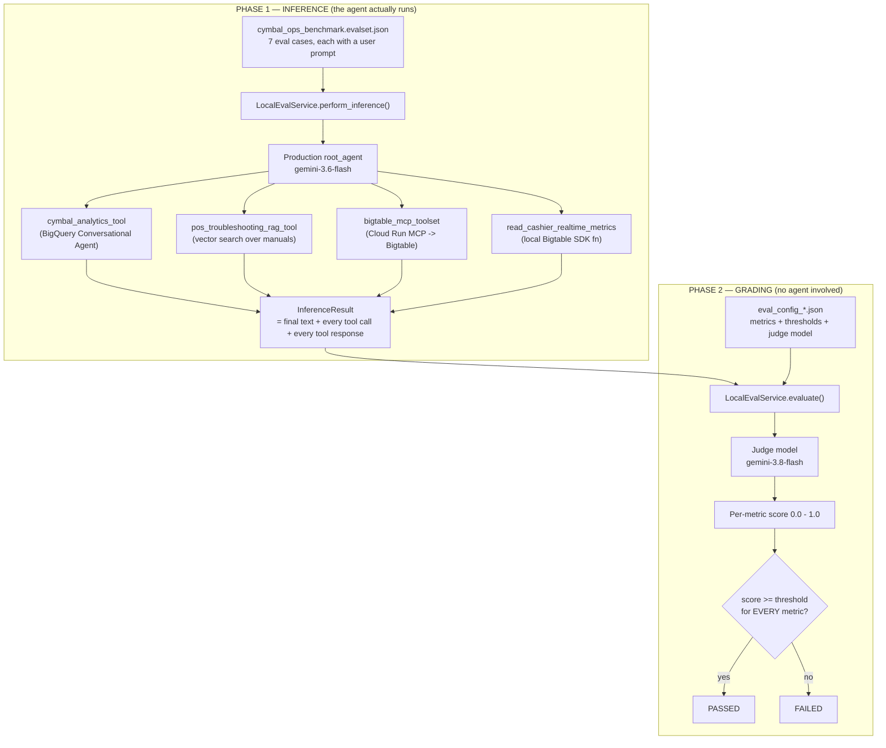

# How the ADK Evaluation Mechanism Works — Module 3 / Lab 3.2

A walkthrough of the evaluation harness for `cymbal_operations_agent`: what runs, what I built,
and how the LLM-as-judge actually scores.

---

## TL;DR — the three questions you asked

| Question | Answer |
| :--- | :--- |
| **Did you create a separate `agent.py` for eval?** | **No.** The harness loads and executes the *production* agent from [`module_3/app/agent.py`](file:///usr/local/google/home/watanabesei/account_work/Admin/pj_elevate/DA_advanced/module_3/app/agent.py) — same model, same 4 tools, same prompt, same live Cloud Run MCP + BigQuery + Bigtable backends. Nothing is mocked or stubbed. |
| **Who wrote the scoring logic?** | **ADK did.** Every metric is a built-in from ADK's `PrebuiltMetrics` enum. I wrote zero scoring code. What I authored is the *test data* (the evalset), the *choice* of metrics, the *thresholds*, and the *runner* that wires them together. |
| **How does LLM-as-judge work?** | A second Gemini model (`gemini-3.8-flash`) is handed the user prompt, the agent's actual answer, and (for reference-based metrics) the golden answer. It returns a structured verdict. ADK samples it **5×** per invocation and aggregates by majority vote / mean. Details in §4. |

---

## 1. The big picture

Evaluation runs in **two completely separate phases**. This is the single most important
thing to understand, because it explains why a "failing" eval doesn't necessarily mean a
broken agent.



> [!IMPORTANT]
> Phase 1 is **live**. Real BigQuery queries, real Bigtable reads, real Cloud Run calls, real
> money. Phase 2 never touches the agent — it only reads the transcript Phase 1 produced.
> That separation is why the same recorded run can be re-graded with different metrics
> without paying for inference again.

---

## 2. What an eval case actually contains

Each of the 7 cases in [`cymbal_ops_benchmark.evalset.json`](file:///usr/local/google/home/watanabesei/account_work/Admin/pj_elevate/DA_advanced/module_3/app/cymbal_ops_benchmark.evalset.json) is a recorded conversation:

```jsonc
{
  "evalId": "UC_1.1a_hardware_error",
  "conversation": [{
    "userContent":   { "parts": [{ "text": "What is the immediate field recovery protocol when a cashier encounters an ERR-PAY-4001 ..." }] },

    // ---- everything below is the EXPECTATION (the "golden") ----
    "finalResponse": { "parts": [{ "text": "**Immediate Field Recovery Protocol** ... " }] },
    "intermediateData": {
      "toolUses": [
        { "name": "pos_troubleshooting_rag_tool", "args": { "query": "ERR-PAY-4001 EMV ... double charge prevention" } }
      ]
    }
  }]
}
```

At runtime ADK replays only `userContent` into the live agent, then compares what came back
against `finalResponse` / `toolUses` using whichever metrics you selected.

---

## 3. Prep work I had to do to make this run

This is the part that took the effort. In order:

### 3.1 Install the eval extra (it is not in the base install)
The Dev UI was returning `HTTP 400 — Eval module is not installed`. The documented fix
(`pip install "google-adk[eval]"`) **fails in our corp environment** because the `gepa>=0.1`
transitive dep 401s against the internal index. Working command:

```bash
uv pip install --python ./module_3/.venv/bin/python \
  --default-index http://airlock-proxy.uplink.goog:999/python/artifact-foundry-prod/ah-3p-staging-python/simple/ \
  pandas tabulate nltk rouge-score jinja2 openpyxl google-cloud-aiplatform
```

### 3.2 Author the evalset (7 cases)
Built from the UC scenarios in the BRD, covering single-tool, parallel-dispatch, and
sequential-dispatch routing.

### 3.3 Diagnose and fix a 0/7 benchmark
The first full run scored **0 passed / 7 failed** — with a demonstrably working agent. Two
independent measurement bugs, both in the *default* metric set:

**Bug A — `tool_trajectory_avg_score` is binary exact-match on tool arguments.**
In [`trajectory_evaluator.py`](file:///usr/local/google/home/watanabesei/account_work/Admin/pj_elevate/DA_advanced/module_3/.venv/lib/python3.11/site-packages/google/adk/evaluation/trajectory_evaluator.py) the comparison requires `actual.args == expected.args` — exact dict equality — and the score is a hard `1.0` or `0.0`. Our tools take **free-text natural-language arguments**, so:

```
golden : "ERR-PAY-4001 EMV contactless payment freeze field recovery protocol double charge prevention"
actual : "ERR-PAY-4001 EMV contactless payment freeze recovery protocol double charged"
score  : 0.00
```

Same tool, same document retrieved, correct answer — scored zero for rewording two words.

**Bug B — `response_match_score` is ROUGE-1 word overlap against data that expires.**
[`final_response_match_v1.py:69`](file:///usr/local/google/home/watanabesei/account_work/Admin/pj_elevate/DA_advanced/module_3/.venv/lib/python3.11/site-packages/google/adk/evaluation/final_response_match_v1.py) uses Porter-stemmed unigram F-measure. Case UC_1.3 reads a **1-hour rolling Bigtable window**; the golden was frozen at `REVIEW / risk 0.99999 / 19 overrides / 65.63%` but the live window now returns `CLEAR / 0.0000093 / 8 overrides / 37.04%`. Correct behaviour, 0.5405 score.

### 3.4 Switch to semantic metrics — 0/7 became 5/7
Replaced the defaults with LLM-judged metrics. Same agent, same recorded run, same goldens:

| Case | `final_response_match_v2` | `hallucinations_v1` | Result |
| :--- | ---: | ---: | :--- |
| UC_2.1a_warranty_transaction | 1.0000 | 1.0000 | ✅ |
| UC_1.2a_stockout_risk_lt_20h | 1.0000 | 0.7500 | ✅ |
| UC_1.1c_out-of-scope_hardware | 1.0000 | 1.0000 | ✅ |
| UC_2.3_cross-cloud_offender_audit | 1.0000 | 0.8000 | ✅ |
| UC_1.1a_hardware_error | 1.0000 | 0.6522 | ✅ |
| UC_2.2_dual_cashier_baseline | **0.0000** | 0.8000 | ❌ |
| UC_1.3_real-time_cashier_metrics | **0.0000** | 0.7778 | ❌ |

The two remaining failures are **exactly** the two live-Bigtable cases — and the split in
their scores is the proof: `0.00` on the *reference-based* metric but `0.78–0.80` on the
*reference-free* one. Translation: *"the agent faithfully reported what the tool returned;
the golden answer is what's wrong."*

### 3.5 Split grading into two tiers
A reference-based judge is **right** to score 0.0 when the facts genuinely differ. So the fix
isn't to loosen the judge — it's to stop giving those cases a stale reference at all.

| Tier | Cases | Metrics | Why |
| :--- | ---: | :--- | :--- |
| `reference` | 5 | `final_response_match_v2` ≥ 0.7, `hallucinations_v1` ≥ 0.6 | Static BigQuery / RAG corpora → golden stays valid |
| `livedata` | 2 | `hallucinations_v1` ≥ 0.6, `rubric_based_tool_use_quality_v1` ≥ 0.7 | Rolling 1-hour window → grade faithfulness + tool correctness, not literal values |

### 3.6 Pin the judge model
ADK hardcodes `judge_model = "gemini-2.5-flash"` at [`eval_metrics.py:85`](file:///usr/local/google/home/watanabesei/account_work/Admin/pj_elevate/DA_advanced/module_3/.venv/lib/python3.11/site-packages/google/adk/evaluation/eval_metrics.py#L84-L89) — obsolete. Overridden to `gemini-3.8-flash` in all three config files.

### 3.7 Build an in-repo runner instead of patching the library
I had temporarily hand-edited two files inside `.venv` to work around concurrency crashes.
Those are now **reverted**, and the fixes live in [`run_eval_suite.py`](file:///usr/local/google/home/watanabesei/account_work/Admin/pj_elevate/DA_advanced/module_3/run_eval_suite.py) instead:

| Problem | Library default | What the runner does |
| :--- | :--- | :--- |
| `ConnectionError: Failed to get tools from MCP server` | `parallelism=4` — 4 runners collide on one Cloud Run SSE session, ADK silently drops the whole toolset | `InferenceConfig(parallelism=1)` |
| `sqlite3.OperationalError: database is locked` | Persists eval sessions to `app/.adk/session.db` | Explicit `InMemorySessionService()` — never touches disk |
| One metric set for all cases | Single `--config_file_path` | Runs the two tiers separately, merges into one scorecard |

---

## 4. How LLM-as-judge actually works

Three different judging strategies are in play. None of them is a similarity score.

### 4.1 `final_response_match_v2` — reference-based verdict

Judge sees **three** things: user prompt, agent response, golden response. Verbatim from the
ADK prompt template in [`final_response_match_v2.py`](file:///usr/local/google/home/watanabesei/account_work/Admin/pj_elevate/DA_advanced/module_3/.venv/lib/python3.11/site-packages/google/adk/evaluation/final_response_match_v2.py):

> *"Note sometimes the reference response only contains the key entities of the correct answer and you need to be flexible to allow the agent response to contain more information than the reference response, or to present the key entities in a different format... Allow flexibility of format... For numbers, allow flexibility of formatting, e.g. 1000000 vs 1,000,000... If the model response contains the correct final answer, rate it as valid even when the model response contains more information than the reference response."*

Output is forced JSON:
```json
{ "reasoning": "...", "is_the_agent_response_valid": "valid" }
```

**Scoring:** each sample is binary `valid=1` / `invalid=0`. ADK draws **`num_samples=5`**
independent samples, takes the **majority vote** per invocation, and the case score is the
fraction of valid invocations. This is why you see clean `1.0000` / `0.0000` on single-turn
cases — one turn, majority vote, no middle ground.

> This is also the precise reason UC_1.3 scored `0.0000`: the judge is explicitly instructed
> to *trust the reference* on numbers. When live telemetry says `CLEAR / 8 overrides` and the
> reference says `REVIEW / 19 overrides`, "invalid" is the correct verdict. The metric worked;
> the reference was stale.

### 4.2 `hallucinations_v1` — reference-free groundedness

No golden answer involved. This one is a **two-pass** pipeline ([`hallucinations_v1.py`](file:///usr/local/google/home/watanabesei/account_work/Admin/pj_elevate/DA_advanced/module_3/.venv/lib/python3.11/site-packages/google/adk/evaluation/hallucinations_v1.py)):

1. **Segmenter pass** — the judge splits the agent's answer into individual sentences, copied word-for-word (bullets become separate sentences; tables stay as one).
2. **Validator pass** — each sentence is labelled against the *context*, where context = the user prompt + the tool declarations + **every tool call and tool response from the run**:

   | Label | Meaning |
   | :--- | :--- |
   | `supported` | Entailed by context, with a quoted supporting excerpt |
   | `not_applicable` | Not a factual claim (greetings, formatting, offers to help) |
   | `unsupported` | No indisputable evidence in context |
   | `contradictory` | Context says otherwise |
   | `disputed` | Context contains conflicting evidence |

   The prompt is deliberately harsh: *"Be very strict... Unless you can find straightforward, indisputable evidence excerpts in the context, consider it `unsupported`. You should not employ world knowledge unless it is truly trivial."*

**Scoring:** `accuracy = mean(sentence is in {supported, not_applicable})`. So `0.6522` on
UC_1.1a means ~65% of sentences were directly traceable to tool output — the rest were the
agent's own connective prose and framing. That's why the threshold is 0.6, not 0.9: a
well-written operational answer legitimately contains explanatory scaffolding.

### 4.3 `rubric_based_tool_use_quality_v1` — reference-free, checklist-graded

Also no golden answer. The judge sees the tool declarations, the user prompt, the actual tool
calls/responses, and a list of yes/no properties **I authored** in
[`eval_config_livedata.json`](file:///usr/local/google/home/watanabesei/account_work/Admin/pj_elevate/DA_advanced/module_3/app/eval_config_livedata.json):

| Rubric ID | Property being tested |
| :--- | :--- |
| `live_tool_invoked` | Did it actually call a Bigtable telemetry tool (rather than answer from memory or use BigQuery)? |
| `correct_store_cashier_targeting` | Did it resolve "Store 48 / CASH_1190" to `STORE_048#CASH_1190`, including the zero-padding? |
| `historical_baseline_when_requested` | If (and only if) a 7-day baseline was asked for, did it *also* call `cymbal_analytics_tool`? |
| `no_fabricated_tool_input` | Is every argument traceable to the prompt or to a prior tool response? |

The judge answers each with a 5-step chain-of-thought and a `Verdict: yes|no`. **Scoring** is
the mean of the per-rubric confidences.

> [!NOTE]
> This is the one place I injected domain judgement into the scoring. But note the shape of
> it: I'm specifying *what correct tool use looks like for this domain* — declarative test
> intent — not writing the comparison algorithm. ADK still owns the prompting, sampling, and
> aggregation.

### 4.4 Pass/fail rollup

A case is `PASSED` only if **every** configured metric clears its threshold. Any single
`FAILED` metric short-circuits the whole case (`local_eval_service._generate_final_eval_status`).

---

## 5. Metric selection cheat-sheet

| Metric | Needs golden? | Judge? | Scoring | When to use |
| :--- | :---: | :---: | :--- | :--- |
| `tool_trajectory_avg_score` | ✅ | ❌ | Binary exact dict-match on tool args | Structured/enum args only. **Useless for NL args.** |
| `response_match_score` | ✅ | ❌ | ROUGE-1 F-measure | Short, canonical, stable answers |
| `final_response_match_v2` | ✅ | ✅ | Majority vote over 5 samples | Free-form answers over stable data |
| `hallucinations_v1` | ❌ | ✅ | Fraction of grounded sentences | Always. Catches fabrication regardless of golden freshness |
| `rubric_based_tool_use_quality_v1` | ❌ | ✅ | Mean of per-rubric verdicts | Live/volatile data, or when *how* it got the answer matters |

> [!TIP]
> `tool_trajectory_avg_score` isn't irredeemable — [`ToolTrajectoryCriterion`](file:///usr/local/google/home/watanabesei/account_work/Admin/pj_elevate/DA_advanced/module_3/.venv/lib/python3.11/site-packages/google/adk/evaluation/eval_metrics.py#L193-L245) supports `IN_ORDER` and `ANY_ORDER` match types alongside the default `EXACT`. Those tolerate extra tool calls. They still require exact argument equality though, which is the actual blocker for our NL-argument tools.

---

## 6. Files I created

| File | Role |
| :--- | :--- |
| [`app/cymbal_ops_benchmark.evalset.json`](file:///usr/local/google/home/watanabesei/account_work/Admin/pj_elevate/DA_advanced/module_3/app/cymbal_ops_benchmark.evalset.json) | The 7 test cases: prompts + golden answers + golden tool calls |
| [`app/eval_config_reference.json`](file:///usr/local/google/home/watanabesei/account_work/Admin/pj_elevate/DA_advanced/module_3/app/eval_config_reference.json) | Reference-based grading for the 5 deterministic cases |
| [`app/eval_config_livedata.json`](file:///usr/local/google/home/watanabesei/account_work/Admin/pj_elevate/DA_advanced/module_3/app/eval_config_livedata.json) | Reference-free grading + 4 tool-use rubrics for the 2 live cases |
| [`app/test_config.json`](file:///usr/local/google/home/watanabesei/account_work/Admin/pj_elevate/DA_advanced/module_3/app/test_config.json) | Auto-discovered fallback for bare `adk eval`; judge pinned so it can't silently regress to 2.5 |
| [`run_eval_suite.py`](file:///usr/local/google/home/watanabesei/account_work/Admin/pj_elevate/DA_advanced/module_3/run_eval_suite.py) | The runner: serialised inference, in-memory sessions, two-tier grading, scorecard output |

**No new agent code.** The only production change was raising the MCP SSE timeout from 30s to
90s in [`app/tools/bigtable_tool.py`](file:///usr/local/google/home/watanabesei/account_work/Admin/pj_elevate/DA_advanced/module_3/app/tools/bigtable_tool.py) to survive Cloud Run cold starts during batch runs.

---

## 7. Running it

```bash
# Full benchmark (both tiers) -> writes EVAL_SCORECARD.md + .json
uv run python run_eval_suite.py

# One tier
uv run python run_eval_suite.py --tier livedata

# One case
uv run python run_eval_suite.py --case UC_1.3_real-time_cashier_metrics
```

> [!WARNING]
> The **Dev UI ignores every `*_config.json` file**. `dev_server.py:1341` passes the metric
> checkboxes from the Run modal straight through, and there is no judge-model field in that
> dialog — so UI runs always use the obsolete `gemini-2.5-flash` and the wrong metric set for
> the live-data cases. Use the CLI runner for anything official.
