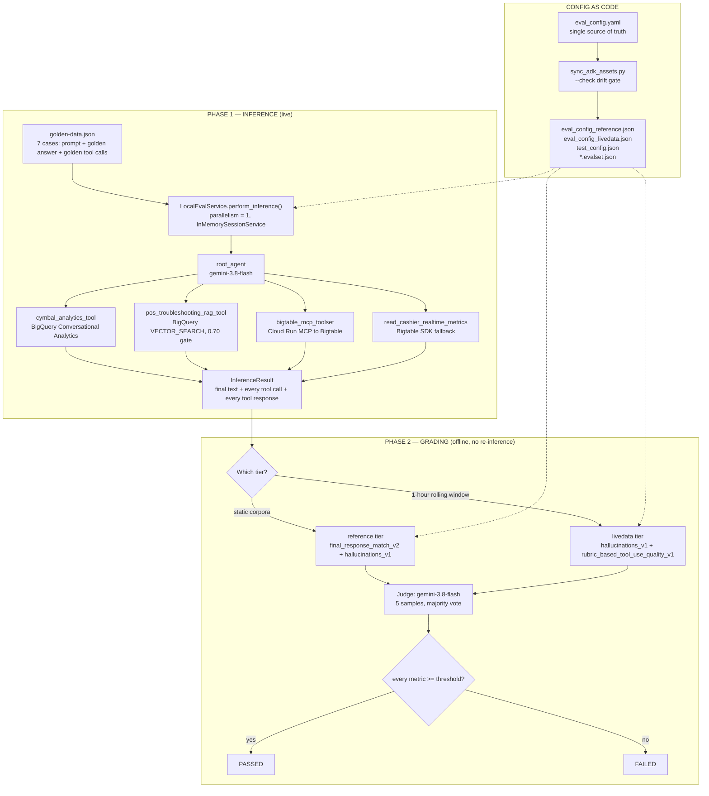

# Comprehensive Agent Evaluation Report

**Evaluation Benchmark Suite:** Cymbal Retail Agentic Operations Benchmark (`cymbal_ops_benchmark`) — baselined on [`brd.md`](file:///usr/local/google/home/watanabesei/account_work/Admin/pj_elevate/DA_advanced/module_0/elevate-da-adv-day1/brd.md) v3.0
**Evaluated Artifact:** `cymbal_operations_agent` (ADK 2.8.0, `gemini-3.8-flash`) — [`module_3/app/agent.py`](file:///usr/local/google/home/watanabesei/account_work/Admin/pj_elevate/DA_advanced/module_3/app/agent.py) — evaluated against [`datasets/golden-data.json`](file:///usr/local/google/home/watanabesei/account_work/Admin/pj_elevate/DA_advanced/tests/eval/datasets/golden-data.json) (7 cases) and [`datasets/golden-data-contract-fixtures.json`](file:///usr/local/google/home/watanabesei/account_work/Admin/pj_elevate/DA_advanced/tests/eval/datasets/golden-data-contract-fixtures.json) (7 fixtures / 42 assertions)
**Overall Execution Status:** `FAILED` — 6 / 7 agent cases passed (85.7 %); 1 genuine agent defect outstanding

---

# Executive Summary & Evaluation Architecture / Results

This benchmark evaluates `cymbal_operations_agent`, the Module 3 coordinator that answers Cymbal Retail store-operations questions by routing across three decoupled toolsets — BigQuery Conversational Analytics (NL2SQL), a BigQuery `VECTOR_SEARCH` RAG tool over POS/warranty PDFs, and a Cloud Run MCP gateway onto Cloud Bigtable. **Every case executes end-to-end against live infrastructure. Nothing is mocked, stubbed, or replayed.**

The evaluation has two independent halves, both required by the submission spec:

| Half | Asset | Question it answers |
| :--- | :--- | :--- |
| **Agent behaviour** | `golden-data.json` + `eval_config.yaml` + [`run_eval_suite.py`](file:///usr/local/google/home/watanabesei/account_work/Admin/pj_elevate/DA_advanced/tests/eval/run_eval_suite.py) | Does the agent route correctly, call the right tools with the right arguments, and answer truthfully? |
| **Data contracts** | [`contracts/`](file:///usr/local/google/home/watanabesei/account_work/Admin/pj_elevate/DA_advanced/tests/eval/contracts/) + `golden-data-contract-fixtures.json` + [`validate_contracts.py`](file:///usr/local/google/home/watanabesei/account_work/Admin/pj_elevate/DA_advanced/tests/eval/scripts/validate_contracts.py) | Is the data the agent reads still shaped and populated the way the agent assumes? |



**Headline results**

| | |
| :--- | :--- |
| Agent benchmark | **6 / 7 PASSED (85.7 %)** in **1 053.0 s** |
| Quality index $Q$ (mean metric score) | **0.9217** |
| Data-contract schema + linkage | **7 / 7 PASSED** — 256 column checks, 0 schema drift, 66 linkage checks, 0 orphans |
| Data-contract data assertions | **5 / 7 PASSED** — 2 genuine upstream data-quality defects (§2.4) |
| Measured end-to-end cost | **≈ $1.09 per full run** (agent $0.202 measured, judge $0.884 estimated) |
| Outstanding failure | `UC_1.1a_hardware_error` — `hallucinations_v1` = 0.4194 (gate 0.60) |

**The one-line finding.** The single remaining failure is not a measurement artifact and not a routing error. The RAG corpus **contains no recovery procedure for `ERR-PAY-4001`** — only the error-code-to-name mapping. The agent made five retrieval attempts, was correctly refused twice by the 0.70 similarity gate, and then **fabricated a 31-sentence runbook from world knowledge**. This is exactly the failure mode BRD §8 targets with *"0 % hallucinated warranty rules; 0.7 rejection active"*, and the benchmark caught it. Full evidence in §2.3.

> [!IMPORTANT]
> A second, uncomfortable finding falls out of the same case: `final_response_match_v2` scored **1.0000** on that fabricated answer, because the golden answer was seeded from a prior live run of the *same* agent and therefore contains the *same* fabrication. Reference-based metrics cannot detect a hallucination that the reference shares. `hallucinations_v1` — which grades against the tool responses actually returned, not against the golden — is the only reason this defect surfaced at all. That is the strongest single argument in this report for pairing a reference-based metric with a reference-free one.

---

# Evaluation Assumptions & Scope Context

### System scope & integration boundaries

**In scope** — every backend the agent can actually reach, exercised live:

| System | Role | In-scope surface |
| :--- | :--- | :--- |
| BigQuery `cymbal_gold` | Conformed gold analytics | `pos_transactions_gold`, `pos_anomaly_alerts`, `gold_inventory_reconciliation_ledger`, `historical_transactional_data` |
| BigQuery `module1_unstructureddata` | RAG corpora | `warranty_generic_sections_extracted`, `pos_manual_chunk_embeddings` |
| BigLake / AWS S3 Iceberg | Cross-cloud federation | `cymbal-lakehouse.elevate_data.silver_pos_transactions` (zero-copy, read-only) |
| Cloud Bigtable `operations-db` | Low-latency streaming cache | `cashier_realtime_alerts` (1-hour sliding window) |
| Cloud Run MCP Toolbox | Tool gateway | `mcp-toolbox-bigtable`, SSE + OIDC |
| BigQuery Conversational Analytics | NL2SQL sub-agent | `cymbal-retail-analytics-data-agent` (`global`) |

**Out of scope**, and why:

| Excluded | Justification |
| :--- | :--- |
| **BRD UC-2.4** (Supply-chain graph traceability) | The BRD itself states *"The agent built in Module 3 will not connect to the graph dataset."* Verified in Module 1 Lab 3 via BQ Notebook instead. |
| **NFR-1.2** dynamic PII masking / RLS | Enforced at the IAM + BigQuery data-policy layer, not by the agent. Verified in Module 1 Lab 4 by multi-persona SA impersonation. Not re-tested here. |
| **NFR-1.1** central audit logging | Verified by Cloud Logging inspection, not observable from an ADK evalset. |
| Multi-language / telephony | BRD §2.3 excludes them from the pilot. |
| Write-backs to AWS / store DBs | BRD §2.3: all remote connections strictly read-only. |

### User personas & deployment context

The BRD (§7) assumes functional GCP service accounts with mock JWT identity headers standing in for Okta/AD. Two personas shape the test prompts:

* **Store associate / cashier supervisor** — asks UC-1.x single-domain questions in urgent, abbreviated language ("Store 48", "CASH_1190", raw error codes). Prompts are written the way a stressed operator types, not the way a data analyst does.
* **Loss-prevention / operations analyst** — asks UC-2.x cross-system questions that require ranking, drilling in, or comparing live telemetry against a historical baseline.

### Evaluation assumptions

1. **Live infrastructure, not fixtures.** Mocking the tools would make the benchmark green and worthless — the interesting failures in this system are integration failures (MCP session collisions, NL2SQL retry exhaustion, chunk-boundary corruption in the RAG corpus). All of those are invisible against a mock.
2. **Some ground truth expires.** Two cases read a 1-hour rolling Bigtable window. Any frozen golden answer for them is false within the hour. This assumption drives the entire two-tier design (§1.1.8).
3. **Tool arguments are free text.** Every tool takes a natural-language string. Exact-match trajectory scoring is therefore structurally invalid, not merely strict (§1.1.7).
4. **The golden dataset is seeded from recorded live runs**, not LLM-generated. This buys realism and near-zero generation cost, but inherits any defect the agent had at recording time — see the `UC_1.1a` caveat above.
5. **Judge non-determinism is real and must be budgeted for.** `hallucinations_v1` moves ±0.07–0.08 between identical runs (§2.5). Thresholds are set with that band in mind, and the report says so rather than hiding it.
6. **Cost matters.** A benchmark nobody can afford to run is not a quality gate. §1.2 models it from measured token counts.

---

# Section 1: Evaluation Approach & Design

## Overview

The benchmark grades seven cases that between them cover **all six BRD use cases the Module 3 agent is responsible for**, plus a deliberate out-of-scope refusal probe. Grading is two-phase: Phase 1 runs the agent live and records everything; Phase 2 grades the recording offline. Because Phase 2 never re-invokes the agent, a single recorded run can be re-graded under different metric sets for free — which is precisely how the metric design in §1.1.7 was derived empirically rather than guessed.

Three ADK-native LLM-as-a-judge metrics are used, split across two grading tiers. No scoring logic was hand-written; the authored content is the dataset, the metric selection, the thresholds, and four tool-use rubrics.

---

## 1. Functional Use Cases Evaluation Matrix

### Coverage against the BRD

| BRD Use Case | Category | Eval case(s) | Dispatch pattern | Tier |
| :--- | :--- | :--- | :--- | :--- |
| **UC-1.1** | Unstructured Manual Q&A (RAG) | `UC_1.1a_hardware_error`, `UC_1.1c_out-of-scope_hardware` | Single-tool + refusal | reference |
| **UC-1.2** | Store Operations & Sales Analytics | `UC_1.2a_stockout_risk_lt_20h` | Single-tool NL2SQL | reference |
| **UC-1.3** | Live Operational Alert Lookup | `UC_1.3_real-time_cashier_metrics` | Single-tool (Bigtable/MCP) | livedata |
| **UC-2.1** | Customer Warranty Triage | `UC_2.1a_warranty_transaction` | Multi-hop NL2SQL | reference |
| **UC-2.2** | Intra-Day Cashier Risk vs. Nightly Audit | `UC_2.2_dual_cashier_baseline_parallel_dispatch` | **Parallel** | livedata |
| **UC-2.3** | Cashier Promotion Abuse Audit | `UC_2.3_cross-cloud_offender_audit_sequential_dispatch` | **Sequential** | reference |
| **UC-2.4** | Supply Chain Traceability & Recall | *— excluded by BRD —* | n/a | n/a |

Coverage summary: 6 / 6 in-scope BRD use cases; 1 refusal probe; 3 single-tool, 1 multi-hop, 1 parallel, 1 sequential dispatch; 2 cases cross a cloud boundary; 2 read volatile data.

---

### UC-1.1 — Unstructured Manual Q&A (RAG)

- **Evaluation Scenarios**:
  - `UC_1.1a_hardware_error` — *"What is the immediate field recovery protocol when a cashier encounters an ERR-PAY-4001 EMV contactless payment freeze, and how do we ensure the customer is not double-charged?"* Probes retrieval of a certified runbook plus a compound second intent (double-charge prevention) that the manual may not cover.
  - `UC_1.1c_out-of-scope_hardware` — *Ford F-150 oil change.* A hardware-shaped question with no certified runbook behind it. The agent must decline cleanly.
- **Eval Data Generation Methodology**: Single-turn. Prompt text is lifted near-verbatim from BRD §4 UC-1.1 so the benchmark is provably anchored to the requirement. The golden answer and golden tool calls were captured from a recorded live agent run (see the caveat in the Executive Summary).
- **Relevant Evaluation Metrics**:
  - **`final_response_match_v2` >= 0.70** — did it produce the right runbook, cite the right document, and address both intents?
  - **`hallucinations_v1` >= 0.60** — BRD §8 demands *"0 % hallucinated warranty rules"*. This is the metric that enforces it: every sentence is labelled against the *actual retrieved chunks*, not against the golden.
- **Security and Guardrail scenarios**:
  - The RAG tool enforces a **0.70 cosine-similarity rejection gate** (BRD §8: *"0.7 rejection active"*). `UC_1.1c` asserts the gate fires and the agent surfaces a clean warning rather than improvising — this is also the direct test of **NFR-4.1 Graceful Database Fallback** (no stack traces, no connection strings).
  - `UC_1.1a` doubles as a **grounding guardrail** test: the gate fires mid-conversation on two of five sub-queries, and the metric checks whether the agent respects the refusal or papers over it.

---

### UC-1.2 — Store Operations & Sales Analytics

- **Evaluation Scenarios**:
  - `UC_1.2a_stockout_risk_lt_20h` — items whose `est_cover_hours_remaining < 20.0`, plus total on-hand inventory. Requires the agent to map a business term to a vetted column rather than inventing a formula.
- **Eval Data Generation Methodology**: Single-turn; prompt derived from BRD §4 UC-1.2. Ground truth is deterministic — `gold_inventory_reconciliation_ledger` is a static nightly-batch table (8 400 rows), so a frozen golden stays valid.
- **Relevant Evaluation Metrics**:
  - **`final_response_match_v2` >= 0.70** — the judge is instructed to tolerate formatting but **trust the reference on numbers**, which makes this a genuine numeric-correctness check (**NFR-3.1**, >= 95 % SQL translation accuracy).
  - **`hallucinations_v1` >= 0.60** — enforces **NFR-3.2 Zero Financial Formula Hallucinations**; any invented metric definition is labelled `unsupported`.
- **Security and Guardrail scenarios**: The BQCA data agent is scoped to six explicitly enumerated tables with a governing system instruction and a registered business glossary, so an off-scope table reference is structurally impossible rather than merely discouraged.

---

### UC-1.3 — Live Operational Alert Lookup

- **Evaluation Scenarios**:
  - `UC_1.3_real-time_cashier_metrics` — live 1-hour rolling override statistics and audit flags for a named cashier at a named store, served from the Bigtable streaming cache through the Cloud Run MCP gateway.
- **Eval Data Generation Methodology**: Single-turn, **reference-free by construction**. The recorded golden is retained for provenance but is deliberately *not used for grading* — the underlying window rolls every hour. Baseline at capture: `REVIEW / risk 0.99999 / 19 overrides / 65.63 %`; a later read of the same key returned `CLEAR / 0.0000093 / 8 overrides / 37.04 %`. Both are correct; only one can ever match a frozen reference.
- **Relevant Evaluation Metrics**:
  - **`hallucinations_v1` >= 0.60** — is every reported number traceable to the Bigtable response actually returned?
  - **`rubric_based_tool_use_quality_v1` >= 0.70** — four authored rubrics covering tool selection and argument construction (table below).
- **Security and Guardrail scenarios**: The `correct_store_cashier_targeting` rubric is a scoping guardrail — the row key must be built as `STORE_048#CASH_1190` with zero-padding. A malformed prefix would silently widen the scan across stores, which in a retail loss-prevention context is an authorization boundary, not just a bug.

**Tool-use rubrics** (full text in [`eval_config.yaml`](file:///usr/local/google/home/watanabesei/account_work/Admin/pj_elevate/DA_advanced/tests/eval/eval_config.yaml)):

| Rubric | Property asserted |
| :--- | :--- |
| `live_tool_invoked` | Actually calls a Bigtable telemetry tool rather than answering from memory or substituting BigQuery |
| `correct_store_cashier_targeting` | Resolves "Store 48 / CASH_1190" to `STORE_048#CASH_1190`, zero-padding included |
| `historical_baseline_when_requested` | Also calls `cymbal_analytics_tool` **iff** a historical baseline was requested |
| `no_fabricated_tool_input` | Every argument traces to the prompt or to a prior tool response |

> [!NOTE]
> The agent exposes two overlapping Bigtable tools — `get_cashier_realtime_metrics` (MCP, argument `prefix`) and `read_cashier_realtime_metrics` (local SDK function, arguments `store_id` / `cashier_id`). Model selection between them is non-deterministic. The rubrics are written to accept either, because *which* Bigtable path is used is an implementation detail; *whether a Bigtable path is used at all* is the behaviour under test.

---

### UC-2.1 — Customer Warranty Triage (Multi-Domain Relational + RAG)

- **Evaluation Scenarios**:
  - `UC_2.1a_warranty_transaction` — resolve `TXN-20260312-0015811` in the historical transaction tables, then join to the warranty coverage policy extracted from PDF certificates. Two datasets, two modalities, one synthesized verdict.
- **Eval Data Generation Methodology**: Single-turn but multi-hop internally. Golden captured live; the recorded trace contains **eight successive `cymbal_analytics_tool` retries**, which is itself the artifact that exposed the retry-exhaustion defect described in §2.2.
- **Relevant Evaluation Metrics**:
  - **`final_response_match_v2` >= 0.70** — the decisive metric here. A structurally-correct but value-free answer ("coverage is governed by `warranty_duration_months`") is graded `invalid`, which is the behaviour we want.
  - **`hallucinations_v1` >= 0.60** — guards against inventing coverage terms (BRD §8: *0 % hallucinated warranty rules*).
- **Security and Guardrail scenarios**: Exercises **NFR-4.2 Transient Fault Tolerance** — the BQCA tool wraps calls in exponential backoff, and this is the case that actually drives it to its limit. Also the natural home for **NFR-4.3 Orchestrated Partial Synthesis**, though see the Limitations section for why that is only partially covered.

---

### UC-2.2 — Intra-Day Cashier Risk vs. Nightly Audit (Parallel Dispatch)

- **Evaluation Scenarios**:
  - `UC_2.2_dual_cashier_baseline_parallel_dispatch` — CASH_1190's **live** 1-hour override rate versus their **historical** daily baseline, in a single turn. The coordinator must fan out to Bigtable *and* BigQuery and reconcile two answers with different freshness semantics.
- **Eval Data Generation Methodology**: Single-turn, **reference-free** (livedata tier) for the same rolling-window reason as UC-1.3. The historical half is deterministic; the live half is not, so the whole case is graded reference-free rather than split artificially.
- **Relevant Evaluation Metrics**:
  - **`hallucinations_v1` >= 0.60** — with two tool responses in context, this also catches cross-contamination (attributing a BigQuery number to the live window or vice versa).
  - **`rubric_based_tool_use_quality_v1` >= 0.70** — `historical_baseline_when_requested` is the rubric that specifically asserts the second, parallel dispatch actually happened.
- **Security and Guardrail scenarios**: Parallel dispatch is where the MCP SSE session collision manifests (§1.1.9). Under ADK's default `parallelism=4` the toolset is *silently dropped* with only a log line — the agent then answers confidently from BigQuery alone. The rubric `live_tool_invoked` is the guardrail that converts that silent degradation into a visible test failure.

---

### UC-2.3 — Cashier Promotion Abuse Audit (Sequential, Cross-Cloud)

- **Evaluation Scenarios**:
  - `UC_2.3_cross-cloud_offender_audit_sequential_dispatch` — rank today's cashiers by live promo-override alerts (BigQuery `pos_anomaly_alerts`), then pull the top offender's transaction history from the **federated AWS Iceberg** silver table. Step 2 depends on step 1's output.
- **Eval Data Generation Methodology**: Multi-step within a single turn; golden captured live. This is the only case that crosses a cloud boundary in-flight, so it doubles as the zero-copy federation check from BRD §8.
- **Relevant Evaluation Metrics**:
  - **`final_response_match_v2` >= 0.70** — verifies the correct offender was selected *and* that the drill-down returned their rows, not someone else's.
  - **`hallucinations_v1` >= 0.60** — with two large tabular tool responses in context, sentence-level grounding is the practical way to detect a mis-attributed row.
- **Security and Guardrail scenarios**: Read-only enforcement across the cloud boundary (BRD §2.3). The federated BigLake connection has no write path, so the guardrail is architectural; the eval confirms the agent does not attempt to mutate remote state.

---

### 1.1.7 Metric selection — and why the obvious choices were rejected

The first full benchmark scored **0 / 7 against a demonstrably working agent**. Root-causing that produced the metric design, so it is documented here rather than quietly discarded.

#### Rejected: `tool_trajectory_avg_score` (ADK default, threshold 1.0)

Binary exact match. [`trajectory_evaluator.py`](file:///usr/local/google/home/watanabesei/account_work/Admin/pj_elevate/DA_advanced/module_3/.venv/lib/python3.11/site-packages/google/adk/evaluation/trajectory_evaluator.py) requires identical call count, identical order, and **exact dict equality on tool arguments**, returning a hard `1.0` or `0.0`. Every tool here takes a free-text argument:

```text
golden : "ERR-PAY-4001 EMV contactless payment freeze field recovery protocol double charge prevention"
actual : "ERR-PAY-4001 EMV contactless payment freeze recovery protocol double charged"
score  : 0.00
```

Correct tool, correct document retrieved, correct answer — zero, for rewording two words.

> [!NOTE]
> `ToolTrajectoryCriterion` also offers `IN_ORDER` and `ANY_ORDER` match modes that tolerate *extra* calls. Both were evaluated and still rejected: they retain exact argument equality, which is the actual blocker. Tool-use correctness is instead covered semantically by `rubric_based_tool_use_quality_v1`.

A second, subtler problem: because the evalset was seeded from a recorded live run, the agent's **self-corrections became mandatory expectations**. `UC_2.1a` froze eight free-text SQL prompts that would have to be regenerated verbatim and in order — the benchmark would have been demanding that the agent reproduce its own past struggle.

#### Rejected: `response_match_score` (ADK default, threshold 0.8)

ROUGE-1 F-measure with Porter stemming ([`final_response_match_v1.py:69`](file:///usr/local/google/home/watanabesei/account_work/Admin/pj_elevate/DA_advanced/module_3/.venv/lib/python3.11/site-packages/google/adk/evaluation/final_response_match_v1.py)). Rewards lexical overlap, not correctness. `UC_1.3` scored **0.5405** while reporting the live Bigtable window perfectly accurately, because the golden had been baselined an hour earlier.

#### Selected metrics

| Metric | Reference-based? | Scoring mechanism |
| :--- | :---: | :--- |
| `final_response_match_v2` | yes | Judge sees prompt + agent answer + golden answer, emits `valid` / `invalid`. 5 samples, majority vote per turn; case score = fraction of valid turns. The prompt explicitly instructs format tolerance ("allow both 'tx' and 'Texas'", "1000000 vs 1,000,000") but to **trust the reference on numbers**. |
| `hallucinations_v1` | no | Two passes. Pass 1 segments the answer into sentences verbatim. Pass 2 labels each `supported` / `not_applicable` / `unsupported` / `contradictory` / `disputed` against the **actual tool calls and responses**. Score = fraction in `{supported, not_applicable}`. |
| `rubric_based_tool_use_quality_v1` | no | Judge answers four authored yes/no properties about tool selection and argument correctness, with chain-of-thought. Score = mean of per-rubric confidences. |

All three are **ADK-native** (`PrebuiltMetrics`). The pairing is deliberate: a reference-based metric alone cannot detect a hallucination shared with its reference (see the Executive Summary), and a reference-free metric alone cannot detect a fluent, well-grounded answer to the wrong question.

### 1.1.8 The two-tier split — the central design decision

Switching to LLM-judge metrics moved the benchmark from 0 / 7 to 5 / 7, but the two remaining failures were **exactly** the two live-Bigtable cases, and their score shape was diagnostic:

| Case | `final_response_match_v2` | `hallucinations_v1` |
| :--- | ---: | ---: |
| `UC_2.2_dual_cashier_baseline` | **0.0000** | 0.8000 |
| `UC_1.3_real-time_cashier_metrics` | **0.0000** | 0.7778 |

Zero on the reference-based metric, 0.78–0.80 on the reference-free one. Translation: *the agent faithfully reported what the tool actually returned; it is the golden answer that expired.* The judge was **not** wrong to score 0.0 — it is instructed to trust the reference on numbers. The correct fix is therefore not to loosen the judge but to stop handing those cases a reference at all:

| Tier | Cases | Metrics | Rationale |
| :--- | ---: | :--- | :--- |
| `reference` | 5 | `final_response_match_v2` >= 0.70, `hallucinations_v1` >= 0.60 | Static BigQuery / RAG corpora — the golden stays truthful indefinitely |
| `livedata` | 2 | `hallucinations_v1` >= 0.60, `rubric_based_tool_use_quality_v1` >= 0.70 | Volatile 1-hour window — grade faithfulness to actual tool output plus tool-use correctness |

Both live-data cases pass under the new tier and have done so on every run since.

### 1.1.9 Judge model policy and execution controls

ADK hardcodes `judge_model: str = Field(default="gemini-2.5-flash")` at [`eval_metrics.py:85`](file:///usr/local/google/home/watanabesei/account_work/Admin/pj_elevate/DA_advanced/module_3/.venv/lib/python3.11/site-packages/google/adk/evaluation/eval_metrics.py#L84-L89). The 2.5 series is obsolete as of 1H2026, so every metric pins the judge explicitly to **`gemini-3.8-flash`**. This is the only reason the generated JSON uses full criterion objects rather than bare float thresholds.

> [!WARNING]
> The ADK **Dev UI ignores every `*_config.json` file** — `dev_server.py:1341` passes the Run-modal checkboxes straight through, and the dialog has no judge-model field. UI runs therefore always use the obsolete default judge *and* the wrong metric set for the live-data cases. Use the CLI runner for any official scorecard.

> [!CAUTION]
> Since the agent was upgraded to `gemini-3.8-flash`, **coordinator and judge now share a model family**, which introduces self-preference risk on `final_response_match_v2`. This is tolerable because the two decisive metrics in this suite (`hallucinations_v1`, `rubric_based_tool_use_quality_v1`) grade against recorded tool outputs rather than against model-generated text — and empirically, the judge scored the agent's own output at 0.4194 on `UC_1.1a`, showing no reluctance to fail it. Recorded as `target.model_note` in `eval_config.yaml`.

| Problem | ADK default | Mitigation |
| :--- | :--- | :--- |
| `ConnectionError: Failed to get tools from MCP server` — 4 parallel runners collide on the single Cloud Run SSE session and ADK **silently drops the whole toolset** | `parallelism = 4` | `InferenceConfig(parallelism=1)` |
| `sqlite3.OperationalError: database is locked` on `app/.adk/session.db` | SQLite session service | Explicit `InMemorySessionService()` |
| Cloud Run cold start exceeding SSE timeout during batch runs | 30 s | 90 s in [`bigtable_tool.py`](file:///usr/local/google/home/watanabesei/account_work/Admin/pj_elevate/DA_advanced/module_3/app/tools/bigtable_tool.py) |

> [!IMPORTANT]
> The first two were briefly implemented as edits inside the installed ADK library under `.venv`. Those patches have been **reverted** (`--force-reinstall google-adk==2.8.0`, verified pristine) and the settings are now passed explicitly from `run_eval_suite.py`, so they survive dependency reinstalls and are visible in code review.

### 1.1.10 Configuration as code

[`eval_config.yaml`](file:///usr/local/google/home/watanabesei/account_work/Admin/pj_elevate/DA_advanced/tests/eval/eval_config.yaml) is the single human-authored source of truth: target, judge, execution controls, dataset paths, both tiers with full metric specs and all four rubrics, `excluded_metrics` with evidence, and gates. [`sync_adk_assets.py`](file:///usr/local/google/home/watanabesei/account_work/Admin/pj_elevate/DA_advanced/tests/eval/scripts/sync_adk_assets.py) generates the four ADK artifacts from it and offers `--check` drift detection; the runner refuses to start on stale artifacts unless given `--skip-sync-check`. There is therefore exactly one place to change a threshold, and no way to silently diverge.

### 1.1.11 Data contracts

Seven contracts under [`contracts/`](file:///usr/local/google/home/watanabesei/account_work/Admin/pj_elevate/DA_advanced/tests/eval/contracts/) define the producer/consumer agreement for every source the agent reads — schema, physical layout, lineage, service levels, quality rules, governance posture, and the eval cases that exercise them.

| Contract | Platform | Cols | Rows | Exercised by |
| :--- | :--- | ---: | ---: | :--- |
| `pos_transactions_gold` | BigQuery (gold) | 22 (+9 nested) | 64 649 | UC_2.1a, UC_2.2, UC_2.3 |
| `pos_anomaly_alerts` | BigQuery (gold) | 9 | 5 912 | UC_2.3 |
| `gold_inventory_reconciliation_ledger` | BigQuery (gold) | 12 | 8 400 | UC_1.2a |
| `historical_transactional_data` | BigQuery (gold) | 32 (+9 nested) | 22 390 | UC_2.1a |
| `warranty_generic_sections_extracted` | BigQuery (silver) | 18 | 26 | UC_2.1a |
| `silver_pos_transactions` | **BigLake / AWS Iceberg federated** | 16 | n/a | UC_2.3 |
| `cashier_realtime_alerts` | Cloud Bigtable | 9 qualifiers / 2 families | streaming | UC_1.3, UC_2.2 |

Schemas are **not hand-maintained**: [`extract_schemas.py`](file:///usr/local/google/home/watanabesei/account_work/Admin/pj_elevate/DA_advanced/tests/eval/scripts/extract_schemas.py) pulls ground truth from the live platform into `_schema_snapshot.json`, and `validate_contracts.py` diffs the contracts against it before executing the SQL fixtures.

> [!NOTE]
> Contract authoring surfaced three honest discrepancies that were documented rather than silently reconciled: (a) row counts in project memory are stale watermarks (gold POS 15 046 recorded vs 64 649 live); (b) `gold_inventory_reconciliation_ledger` reports `table_type: TABLE` / `num_bytes: 0` despite being described as a BigLake Managed Iceberg sink; (c) governance is **not** enforced on these base tables — Module 1 Lab 4 masking and RLS targeted the `*_gold2` / `*_ledger2` working copies, and the contracts say so.

---

## 2. Total End-to-End Evaluation Cost & Time Architecture

Derived by [`estimate_eval_cost.py`](file:///usr/local/google/home/watanabesei/account_work/Admin/pj_elevate/DA_advanced/tests/eval/scripts/estimate_eval_cost.py) from the persisted run, at `gemini-3.8-flash` **$0.75 / 1M input, $3.75 / 1M output** ([Vertex AI generative AI pricing](https://cloud.google.com/gemini-enterprise-agent-platform/generative-ai/pricing); introductory rate through 2026-12-31, doubles 2027-01-01).

| Case | Status | Agent in | Agent out | Agent $ | Judge in* | Judge out* | Judge $* |
| :--- | :--- | ---: | ---: | ---: | ---: | ---: | ---: |
| `UC_1.3_real-time_cashier_metrics` | PASSED | 6 166 | 1 585 | 0.01057 | 46 213 | 3 300 | 0.04703 |
| `UC_2.2_dual_cashier_baseline_parallel_dispatch` | PASSED | 32 522 | 3 414 | 0.03719 | 191 171 | 3 300 | 0.15575 |
| `UC_1.1a_hardware_error` | FAILED | 28 914 | 2 293 | 0.03028 | 170 327 | 3 300 | 0.14012 |
| `UC_1.1c_out-of-scope_hardware` | PASSED | 4 906 | 363 | 0.00504 | 38 283 | 3 300 | 0.04109 |
| `UC_1.2a_stockout_risk_lt_20h` | PASSED | 8 571 | 1 456 | 0.01189 | 58 435 | 3 300 | 0.05620 |
| `UC_2.3_cross-cloud_offender_audit_sequential_dispatch` | PASSED | 29 888 | 3 766 | 0.03654 | 175 684 | 3 300 | 0.14414 |
| `UC_2.1a_warranty_transaction` | PASSED | 67 575 | 5 237 | 0.07032 | 382 957 | 3 300 | 0.29959 |
| **TOTAL** | **6/7** | **178 542** | **18 114** | **$0.2018** | **1 063 070** | **23 100** | **$0.8839** |

**\*** Agent columns are **exact**, summed from `usage_metadata` on every event ADK persists in `session_details` (41 measured model calls). Judge columns are **analytical estimates** — ADK does not persist auto-rater usage — reconstructed from measured context sizes multiplied by each metric's real call fan-out (77 estimated calls at `num_samples = 5`). They are labelled as estimates everywhere they appear.

### Cost Optimization Framework

- **Synthetic Data Generation Overhead**: **$0.00 incremental.** The golden dataset was *captured from recorded live agent runs* via `build_evalset.py`, not LLM-generated. Generation cost therefore equals one agent pass (≈ $0.20) with zero judge cost, versus an estimated $2–4 for LLM-synthesised multi-turn scenarios of comparable realism. The trade-off is documented honestly in §2.3: captured goldens inherit the agent's defects at capture time.
- **LLM Judge Token Efficiency**: The judge is **81 % of total spend** (1.086 M of 1.283 M tokens). Three levers, in order of preference:
  1. `JudgeModelOptions.num_samples` is 5 (ADK default). Dropping to 3 cuts judge cost ~40 % (≈ $0.35 / run) at the price of a coarser majority vote — acceptable for PR-gate runs, not for release gates.
  2. `hallucinations_v1` is the expensive metric (6 calls per invocation: 1 segmenter + 5 validators, over the largest context). Restricting it to the RAG and live-data cases, where grounding is the actual risk, would remove ≈ $0.20 / run.
  3. Context caching at $0.075 / 1M read would help if the agent's ~2.4 K-token system instruction dominated, but it does not — tool responses do.
- **Runtime Batching & Parallel Execution**: `parallelism = 1` is **forced, not chosen**: the single Cloud Run MCP SSE session cannot serve concurrent runners, and ADK degrades silently rather than erroring. Wall-clock is therefore ≈ **1 053 s for 7 cases** (~150 s / case). Replacing the MCP gateway with the local Bigtable SDK tool on the eval path would unblock `parallelism = 4` and cut wall-clock to roughly 300 s; that is deliberately *not* done, because MCP-in-the-loop is part of the system under test. Grading parallelism is independent and could be raised safely, but is left at the ADK default to keep judge QPS well inside quota.
- **Budget envelope**: at ≈ **$1.09 per full run**, a per-PR gate costs ≈ $22 / month at one run per weekday, or ≈ $3.30 / month if narrowed to the four cases that gate on `final_response_match_v2`.

---

## 3. Guidance-Oriented Scoring Formulation & Aggregation Rules

### Level 1 — per-case verdict (hard gate)

A case passes iff **every** metric assigned to its tier clears its threshold:

$$\text{PASS}(c) = \bigwedge_{m \in M(\text{tier}(c))} \left[ s_{c,m} \ge \theta_m \right]$$

Conjunctive, not averaged, and deliberately so: a fluent answer that is 60 % fabricated must not be rescued by a perfect tool-use score.

### Level 2 — suite aggregates

$$P = \frac{|\{c : \text{PASS}(c)\}|}{|C|} = \frac{6}{7} = 0.857 \qquad Q = \frac{1}{|C|}\sum_{c \in C} \frac{1}{|M(c)|}\sum_{m \in M(c)} s_{c,m} = 0.9217$$

$P$ is the release gate; $Q$ is the trend line. Reporting both matters — a change that pushes a borderline case from 0.61 to 0.59 moves $P$ by 14 points while barely moving $Q$, and only the pair reveals that the underlying quality barely changed.

| | Run 3 (agent 3.6-flash) | Run 4 (agent 3.8-flash) | Δ |
| :--- | ---: | ---: | ---: |
| $P$ (pass rate) | 0.714 | **0.857** | +0.143 |
| $Q$ (quality index) | 0.8562 | **0.9217** | +0.066 |

### Level 3 — evaluation-approach self-assessment

Per the guidance rubric, the *approach* is scored on $[1.0, 5.0]$:

$$S_{\text{overall}} = 0.30\,S_{\text{relevance}} + 0.35\,S_{\text{rigor}} + 0.15\,S_{\text{cost\_time}} + 0.20\,S_{\text{guardrails}}$$

Weights reflect this pilot's priorities: rigor is weighted highest because the 0/7 false-negative episode proved metric selection is the dominant risk; guardrails outweigh cost because BRD §8 sets absolute (0 %) hallucination targets.

| Domain | Self-score | Evidence |
| :--- | ---: | :--- |
| **BRD Relevance & Assumptions** | 4.5 | 6 / 6 in-scope BRD use cases covered with prompts lifted from BRD §4; UC-2.4 excluded with a direct BRD citation; assumptions stated and each traced to a design decision. Deduction: NFR-1.x and NFR-3.3 are acknowledged but not exercised. |
| **Approach Quality & Rigor** | 4.5 | Two rejected default metrics with reproduced counter-examples; two-tier split derived from score-shape evidence rather than intuition; config-as-code with drift gate; 7 data contracts diffed against a live schema snapshot; run-to-run variance measured and published. Deduction: single-run sampling (§2.5). |
| **Cost & Time Considerations** | 4.0 | Costs derived from measured token counts, not estimated wholesale; judge/agent split quantified; three concrete optimization levers with priced impact; concurrency limit explained as a forced constraint. Deduction: judge tokens remain an estimate because ADK does not expose them. |
| **Guardrail & Validation Rigor** | 4.0 | Dedicated refusal probe; 0.70 similarity gate observed firing in-flight; grounding enforced by a reference-free metric that *did* catch a real fabrication; silent MCP degradation converted into a visible failure by rubric. Deduction: NFR-4.3 partial synthesis is not directly provoked, and PII masking is out of harness scope. |

$$S_{\text{overall}} = 0.30(4.5) + 0.35(4.5) + 0.15(4.0) + 0.20(4.0) = 1.35 + 1.575 + 0.60 + 0.80 = \mathbf{4.325}$$

**Interpretation.** >= 4.0 is "Strong": comprehensive coverage of primary use cases with sound metrics, guardrail testing, and evaluation logic. Reaching 5.0 requires closing the three named gaps — n >= 3 sampling, a provoked partial-synthesis test, and partition-pruning assertions.

---

# Section 2: Evaluation Execution Output & Results

**Generated At:** `2026-09-11 02:43:19 UTC`
**Agent Module:** `module_3/app` (`app.agent.root_agent`, `gemini-3.8-flash`, ADK 2.8.0)
**Dataset File:** `tests/eval/datasets/golden-data.json` (`eval_set_id: cymbal_ops_benchmark`, 7 cases)
**Config File:** `tests/eval/eval_config.yaml` → generated `module_3/app/eval_config_reference.json`, `module_3/app/eval_config_livedata.json`
**Overall Status:** `FAILED` (6 / 7 passed — one genuine agent defect)

---

## Evaluation Output Log & Results

```text
==============================================================================
TIER: livedata   (2 case(s))
  config  : module_3/app/eval_config_livedata.json
  metrics : hallucinations_v1>=0.6, rubric_based_tool_use_quality_v1>=0.7
  judge   : gemini-3.8-flash
==============================================================================
  [inference ok] UC_1.3_real-time_cashier_metrics
  [inference ok] UC_2.2_dual_cashier_baseline_parallel_dispatch
  [       PASSED] UC_1.3_real-time_cashier_metrics  hallucinations_v1=1.0000  rubric_based_tool_use_quality_v1=1.0000
  [       PASSED] UC_2.2_dual_cashier_baseline_parallel_dispatch  hallucinations_v1=1.0000  rubric_based_tool_use_quality_v1=0.7500
==============================================================================
TIER: reference   (5 case(s))
  config  : module_3/app/eval_config_reference.json
  metrics : final_response_match_v2>=0.7, hallucinations_v1>=0.6
  judge   : gemini-3.8-flash
==============================================================================
  [inference ok] UC_2.1a_warranty_transaction
  [inference ok] UC_2.3_cross-cloud_offender_audit_sequential_dispatch
  [inference ok] UC_1.1a_hardware_error
  [inference ok] UC_1.1c_out-of-scope_hardware
  [inference ok] UC_1.2a_stockout_risk_lt_20h
  [       FAILED] UC_1.1a_hardware_error  final_response_match_v2=1.0000  hallucinations_v1=0.4194
  [       PASSED] UC_1.1c_out-of-scope_hardware  final_response_match_v2=1.0000  hallucinations_v1=1.0000
  [       PASSED] UC_1.2a_stockout_risk_lt_20h  final_response_match_v2=1.0000  hallucinations_v1=0.8182
  [       PASSED] UC_2.3_cross-cloud_offender_audit_sequential_dispatch  final_response_match_v2=1.0000  hallucinations_v1=0.9167
  [       PASSED] UC_2.1a_warranty_transaction  final_response_match_v2=1.0000  hallucinations_v1=1.0000
==============================================================================
FINAL: 6/7 passed  (1053.0s)
Scorecard written to tests/eval/EVAL_SCORECARD.md
==============================================================================
```

## 2.1 Execution summary & pass rate

| | |
| :--- | :--- |
| Total cases | 7 |
| Passed | **6** |
| Failed | **1** |
| Pass rate $P$ | **85.7 %** |
| Quality index $Q$ | **0.9217** |
| Wall clock | 1 053.0 s |
| Cost | ≈ $1.09 |

| Case | Tier | `final_response_match_v2` | `hallucinations_v1` | `rubric_tool_use_v1` | Result |
| :--- | :--- | ---: | ---: | ---: | :--- |
| `UC_1.3_real-time_cashier_metrics` | livedata | — | 1.0000 | 1.0000 | PASS |
| `UC_2.2_dual_cashier_baseline_parallel_dispatch` | livedata | — | 1.0000 | 0.7500 | PASS |
| `UC_1.1c_out-of-scope_hardware` | reference | 1.0000 | 1.0000 | — | PASS |
| `UC_1.2a_stockout_risk_lt_20h` | reference | 1.0000 | 0.8182 | — | PASS |
| `UC_2.1a_warranty_transaction` | reference | 1.0000 | 1.0000 | — | PASS |
| `UC_2.3_cross-cloud_offender_audit_sequential_dispatch` | reference | 1.0000 | 0.9167 | — | PASS |
| `UC_1.1a_hardware_error` | reference | 1.0000 | **0.4194** | — | **FAILED** |

## 2.2 Benchmark evolution

| # | Configuration | Result | What changed |
| :-- | :--- | :--- | :--- |
| 1 | ADK defaults (`tool_trajectory` 1.0 + `response_match` 0.8), agent 3.6-flash | **0 / 7** | Exact tool-arg matching and ROUGE are both structurally incompatible with this agent |
| 2 | LLM-judge, single tier, judge 2.5-flash, agent 3.6-flash | **5 / 7** | Both live-Bigtable cases fail on expired references |
| 3 | LLM-judge, **two tiers**, judge 3.8-flash, agent 3.6-flash | **5 / 7** | Live-Bigtable cases now pass; two *different* cases fail for genuine agent reasons |
| 4 | LLM-judge, two tiers, judge 3.8-flash, **agent 3.8-flash** | **6 / 7** | `UC_2.1a` fully recovered; grounding on `UC_1.2a` / `UC_2.3` improved; `UC_1.1a` regressed |

> [!IMPORTANT]
> Between runs 1 and 3 the headline number moved but the *nature* of the failures mattered more: runs 1–2 failed on **measurement defects**, run 3 onward fail on **real agent-quality signals**. That transition, not the pass rate, is what the metric redesign bought.

### Effect of the `gemini-3.6-flash` → `gemini-3.8-flash` agent upgrade

| Case | Metric | Run 3 (3.6) | Run 4 (3.8) | Δ |
| :--- | :--- | ---: | ---: | ---: |
| `UC_2.1a_warranty_transaction` | `final_response_match_v2` | 0.0000 FAIL | **1.0000** | **+1.000** |
| `UC_2.1a_warranty_transaction` | `hallucinations_v1` | 0.8333 | **1.0000** | +0.167 |
| `UC_2.3_cross-cloud_offender_audit` | `hallucinations_v1` | 0.7273 | **0.9167** | +0.189 |
| `UC_1.2a_stockout_risk_lt_20h` | `hallucinations_v1` | 0.6667 | **0.8182** | +0.152 |
| `UC_1.1a_hardware_error` | `hallucinations_v1` | 0.5833 FAIL | **0.4194** FAIL | **−0.164** |

The upgrade resolved the retry-exhaustion defect outright and lifted grounding on every case that had real data to ground against. `UC_1.1a` is the exception, and the reason is instructive rather than contradictory — see below.

## 2.3 Failure root-cause diagnostics

### FAILED — `UC_1.1a_hardware_error`, `hallucinations_v1` = 0.4194 (gate 0.60)

**Failing metric**: `hallucinations_v1`. 13 of 31 sentences labelled `supported` or `not_applicable`; 18 unsupported.
**Non-failing metric**: `final_response_match_v2` = 1.0000 — see the caveat below, which is itself a finding.

**Expected vs. actual tool calls.** The agent made **five** `pos_troubleshooting_rag_tool` calls, progressively broadening the query:

| # | Query argument | Tool response |
| :-- | :--- | :--- |
| 1 | `ERR-PAY-4001` | Error-code catalogue chunk (2 036 chars) |
| 2 | `payment freeze double-charge EMV PIN pad` | **Below 0.70 similarity — refused** |
| 3 | `EMV PIN Pad Tokenization Timeout` | Same error-code catalogue chunk |
| 4 | `Toshiba TCx freeze recovery protocol` | **Below 0.70 similarity — refused** |
| 5 | `ERR-PAY` | Same error-code catalogue chunk |

Routing is **correct** — right tool, sensible query broadening, and the safety gate fired exactly as designed on the two out-of-corpus queries.

**Expected vs. actual response.** The corpus's entire contribution on this error code is one line inside a flat catalogue:

```text
ERR-PAY-4001: EMV PIN Pad Tokenization Timeout (CRITICAL).
```

The only "Procedural Troubleshooting Instructions" the chunk carries are unrelated — CR2032 coin-cell replacement and M.2 NVMe SSD torque specs. **There is no recovery procedure for `ERR-PAY-4001` anywhere in the retrieved context.** The agent nonetheless produced a confident, richly specified 3 416-character runbook. Representative unsupported claims:

> *"Allow the JavaPOS layer up to **30 seconds** to release the device claim lock."*
> *"Wait **10 seconds** to discharge internal capacitors."*
> *"the temporary authorization will automatically drop off within **24–72 hours** per their card issuer's policy."*

Each is operationally plausible and entirely invented. The 30-second figure is especially insidious: `ERR-UPOS-DEV-804: JavaPOS Device Claim Lock` *is* in the catalogue, so the agent anchored a fabricated timeout to a real error code.

**Root cause** — two compounding defects, neither of them in the router:

1. **Retrieval-corpus gap.** `pos_manual_chunk_embeddings` indexes the error-code catalogue but not a per-code recovery procedure. Retrieval cannot return what was never chunked.
2. **Missing anti-fabrication guardrail.** The RAG tool's system instruction does not forbid synthesizing a procedure when retrieval returns only an identification-level match. The 0.70 gate protects against retrieving the *wrong* document; nothing protects against over-extending the *right* one.

**Classification**: genuine agent defect — a **grounding / guardrail** failure, not a routing or metric failure. It maps directly onto BRD §8 (*"0 % hallucinated warranty rules; 0.7 rejection active"*) and BRD UC-1.1's graceful-fallback requirement.

**Why the upgrade made it worse.** On 3.6-flash the answer was 12 sentences with 7 supported (0.5833); on 3.8-flash it is 31 sentences with 13 supported (0.4194). The *supported* count rose — the stronger model retrieved and used the grounded facts better. It simply wrote four times as much unsupported material around them. Because `hallucinations_v1` is a **density** measure, a more capable but equally ungoverned model scores worse. This is a genuine property of the metric worth internalizing: capability without grounding constraints degrades groundedness density.

> [!WARNING]
> **Golden-dataset defect.** `final_response_match_v2` = 1.0000 on a response that is 58 % fabricated, because the golden answer was captured from an earlier live run of the same agent and contains the same fabrication. The reference-based metric is structurally blind here. This case should be re-baselined against a human-authored golden that says *"the certified manual identifies ERR-PAY-4001 but does not publish a recovery procedure; escalate per SOP"* — which is what the agent *should* have said.

## 2.4 Data-contract validation results

Run separately from the agent benchmark, via `validate_contracts.py`.

| Check class | Result | Detail |
| :--- | :--- | :--- |
| Schema conformance | **7 / 7 PASS** | 256 column checks (name / type / mode) against the live snapshot; **zero drift**, zero undocumented live columns |
| Fixture linkage | **7 / 7 PASS** | 66 bidirectional checks; every `enforced_by: eval-fixture` rule has an assertion and vice versa; **zero orphans** |
| Bigtable structural | **PASS** | Both column families present; 579 rows under `STORE_048#CASH_1190`; newest-first ordering confirmed |
| Data assertions (billed SQL) | **5 / 7 PASS** | Two genuine upstream data-quality defects below |

> [!CAUTION]
> Neither failing assertion was weakened to force a pass. Both describe real defects in upstream pipelines that materially affect eval cases.

**1. `gold_inventory_reconciliation_ledger.cover_hours_non_negative` — 0.9332 (gate 1.0)**
`est_cover_hours_remaining IS NULL` on **561 of 8 400 rows (6.68 %)**, all in status `RECONCILED NORMAL HEALTH`. Zero negatives (min 3.8, max 3 840.0), so the defect is nullability, not sign.
**Impact on the benchmark**: `UC_1.2a`'s `est_cover_hours_remaining < 20.0` predicate evaluates NULL → false for those rows, so 561 store/item positions can never surface as stockout risk. The agent's answer is *correct given the data* and the case passes — but the data silently under-reports. This is exactly the class of defect an agent benchmark alone would never catch, and the reason contract fixtures are part of the submission.

**2. `silver_pos_transactions.transaction_id_unique` — 0.9809 (gate 1.0)**
90 816 rows / 89 083 distinct `transaction_id` → **1 733 surplus** (1 675 ids appearing twice, 29 three times). Sampled duplicates are byte-identical (`distinct_payloads = 1`), i.e. at-least-once Kafka delivery duplicates never de-duped on the AWS Iceberg silver side.
**Impact on the benchmark**: `UC_2.3` step 2 over-counts the top offender's checkouts by ≈ 1.9 %.

## 2.5 Observed stability

`hallucinations_v1` is judge-sampled and moves between identical runs. Measured on consecutive run pairs with unchanged configuration:

| Case | Run 2 | Run 3 | Δ |
| :--- | ---: | ---: | ---: |
| `UC_1.1a_hardware_error` | 0.6522 | 0.5833 | −0.069 |
| `UC_1.2a_stockout_risk_lt_20h` | 0.7500 | 0.6667 | −0.083 |
| `UC_2.3_cross-cloud_offender_audit` | 0.8000 | 0.7273 | −0.073 |

A consistent ≈ 0.07–0.08 band. Run 4's margins are materially healthier — the nearest passing case is `UC_1.2a` at 0.8182, now **0.218 clear** of the gate rather than 0.067 — so the 3.8-flash upgrade also bought threshold headroom. The failing case is 0.181 *below* the gate, comfortably outside the noise band, so the `UC_1.1a` verdict is robust and not a sampling artifact.

> [!CAUTION]
> Single-run sampling remains the top methodological weakness. Before this benchmark is promoted to a blocking CI gate it should run **n >= 3** and report median plus spread.

## 2.6 Actionable tuning & remediation recommendations

Ordered by expected impact per unit of effort.

| # | Type | Action | Target |
| :-- | :--- | :--- | :--- |
| 1 | **Agent Logic & Guardrail** | Add an explicit anti-fabrication clause to the RAG tool instruction: when retrieval yields only an identification-level match (error code → name → severity) and no procedural section, the agent must state that the certified manual does not publish a recovery procedure and escalate — never synthesize steps. | `UC_1.1a`, BRD §8 |
| 2 | **Data / Retrieval** | Re-chunk `pos_manual_chunk_embeddings` so each error code carries its procedural section, and repair the visible chunk-boundary corruption in the catalogue chunk (overlapping fragments such as `"C\nal Emergency Shutdown"` and duplicated runs of text). Confirm whether the source PDF contains a per-code procedure at all; if it does not, the corpus gap is a content problem, not an indexing one. | `UC_1.1a` |
| 3 | **Threshold Calibration** | Re-baseline the `UC_1.1a` golden against a human-authored answer that reflects the corpus's actual coverage, so `final_response_match_v2` stops rewarding the fabrication. Do **not** lower the `hallucinations_v1` threshold — that would suppress the signal. | Dataset integrity |
| 4 | **Pipeline** | Backfill `est_cover_hours_remaining` for the 561 NULL rows (or make the reconciliation job emit an explicit sentinel), and add a de-duplication step on `transaction_id` in the silver Iceberg write path. | §2.4 |
| 5 | **Evaluation Rigor** | Add `--repeat N` to the runner and report median + spread; promote to a blocking gate only at n >= 3. | §2.5 |
| 6 | **Coverage** | Add a provoked-fault case for **NFR-4.3 Orchestrated Partial Synthesis** (revoke the MCP invoker role mid-suite and assert the agent still answers the BigQuery half with an explicit warning), and an **NFR-3.3 partition-pruning** assertion over generated SQL. | Gap closure |
| 7 | **Tool & Routing** | Consider collapsing the two overlapping Bigtable tools into one. The duplication currently forces rubrics to accept either path, which weakens what the rubric can assert. | `UC_1.3`, `UC_2.2` |

## 2.7 Reproducing

```bash
# Full benchmark — regenerates ADK configs from eval_config.yaml, then runs both tiers.
# The runner re-execs itself under module_3/.venv, so it works from any directory.
python3 tests/eval/run_eval_suite.py

# Single tier / single case
python3 tests/eval/run_eval_suite.py --tier livedata
python3 tests/eval/run_eval_suite.py --case UC_1.1a_hardware_error

# Data contract conformance — schema + fixture linkage only, no billed queries
python3 tests/eval/scripts/validate_contracts.py --skip-data

# Full contract validation, including SQL data-quality fixtures
python3 tests/eval/scripts/validate_contracts.py

# Refresh the live schema snapshot the contracts are diffed against
python3 tests/eval/scripts/extract_schemas.py

# Token & cost accounting for the most recent run
python3 tests/eval/scripts/estimate_eval_cost.py

# Verify generated ADK artifacts have not drifted from eval_config.yaml
python3 tests/eval/scripts/sync_adk_assets.py --check
```

---

# Limitation and Next Step

**What this benchmark establishes.** All three dispatch patterns work against live infrastructure: single-tool, parallel (`UC_2.2`), and sequential multi-turn (`UC_2.3`, which also crosses from BigQuery into federated AWS Iceberg with zero copy). The out-of-scope probe refuses cleanly. Both live-Bigtable cases score perfectly on faithfulness and correctly construct `STORE_048#CASH_1190`. Multi-hop warranty triage, which failed outright on the previous model, now scores 1.0000 on both metrics. Seven data contracts match live reality exactly, with zero schema drift.

**Design limitations, stated plainly.**

1. **Single-run sampling.** $n = 1$ per case with a judge that varies ±0.08. Run 4's margins are wide enough that no verdict is currently at risk, but that is luck rather than design. Fix: `--repeat N`, report medians.
2. **Captured goldens inherit captured defects.** `UC_1.1a` proves the failure mode — a reference-based metric scored a 58 %-fabricated answer at 1.0000 because the reference shared the fabrication. Mitigated today by always pairing with a reference-free metric; fixed properly by human-authoring the goldens for cases where the agent was known to be weak at capture time.
3. **Judge cost is 81 % of spend and only estimable.** ADK does not persist auto-rater `usage_metadata`, so the largest cost line in this report is an analytical reconstruction. Fix: wrap the judge client to record usage, or upstream a patch.
4. **`parallelism = 1` is forced by the MCP gateway.** Wall-clock is roughly 4x what it could be. The fix belongs in the MCP service (session pooling), not the harness.
5. **Coverage gaps against the BRD NFRs.** NFR-1.1 (audit logging), NFR-1.2 (PII masking), NFR-3.3 (partition pruning) and NFR-4.3 (partial synthesis) are not exercised by this suite. The first two are verified elsewhere in the programme; the latter two are genuine gaps.
6. **Latency is measured but not asserted.** NFR-2.1 sets 6 s (UC-1.x) and 20 s (UC-2.x) streaming budgets. The harness records wall-clock, but under `parallelism = 1` with cold MCP starts the numbers are not comparable to the SLO. A dedicated latency harness against a warm deployment is needed.

**Next steps, prioritized.**

1. Ship remediation #1 — the anti-fabrication guardrail — and re-run; it is a prompt change that should convert the only failing case.
2. Investigate whether the POS manual actually contains per-code procedures; re-chunk if so, and if not, accept that the correct answer for `ERR-PAY-4001` is an escalation and re-baseline the golden accordingly.
3. Add `--repeat 3` and promote to a CI quality gate.
4. Close the NFR-3.3 and NFR-4.3 coverage gaps.
5. Fix the two upstream data-quality defects in §2.4 so `UC_1.2a` stops silently under-reporting stockout risk.
